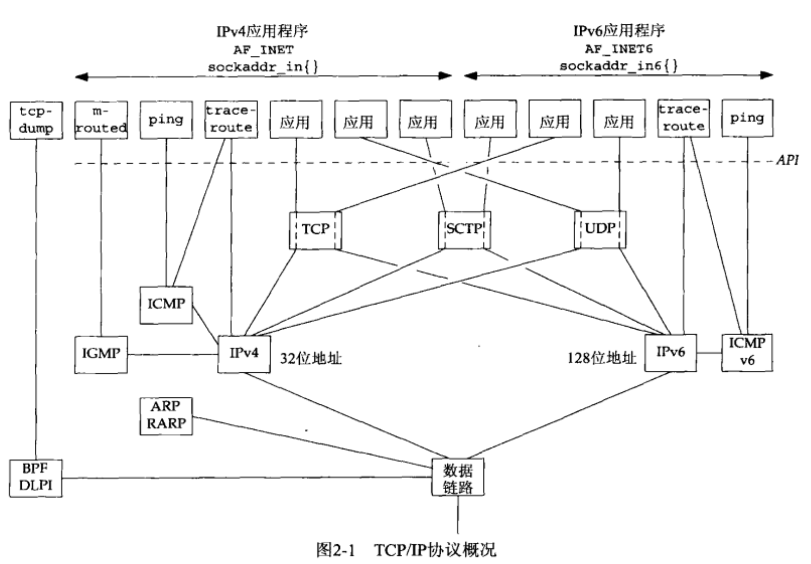
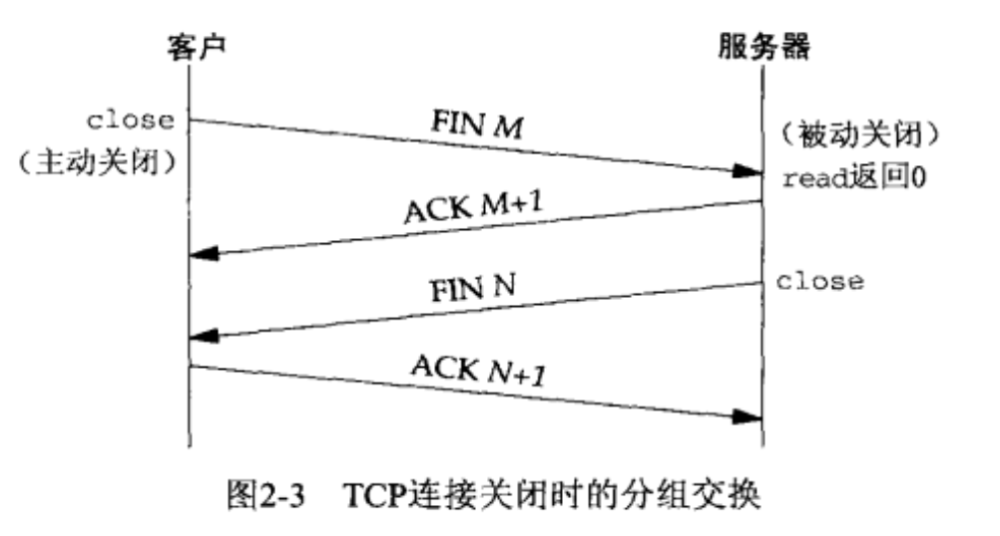
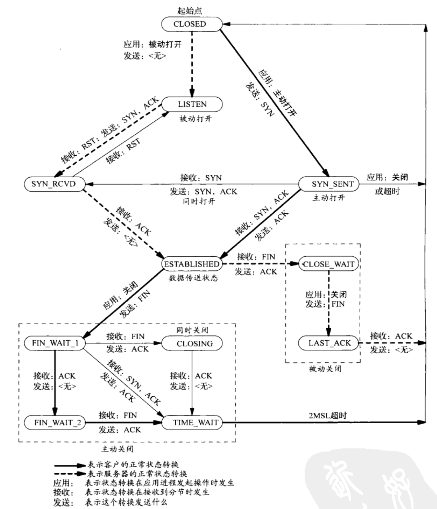
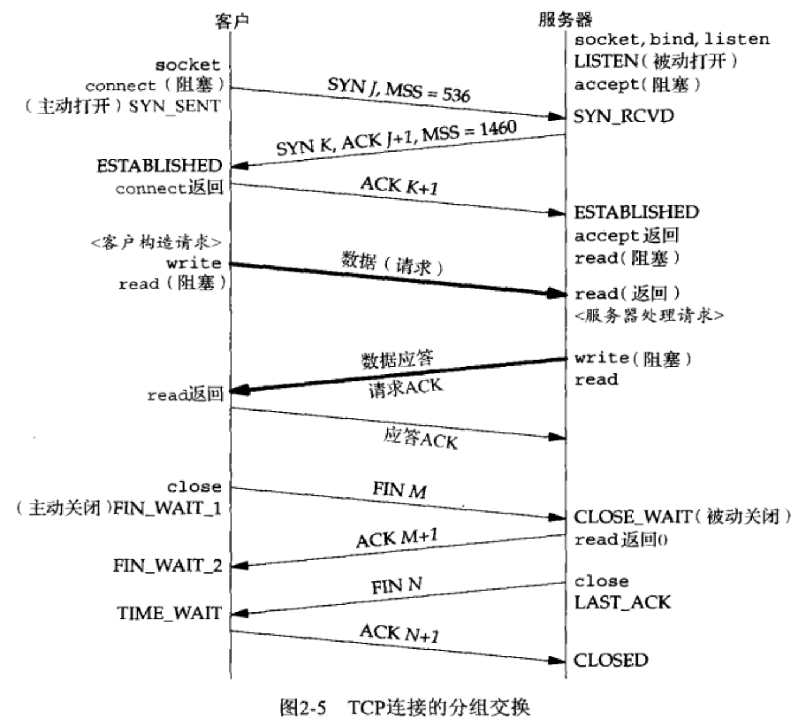
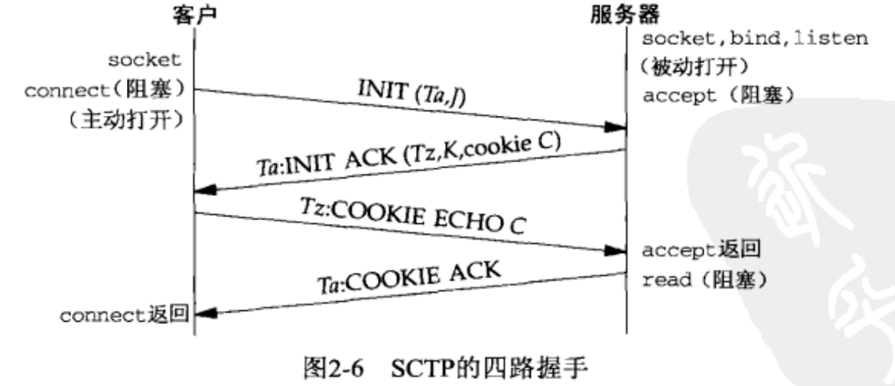
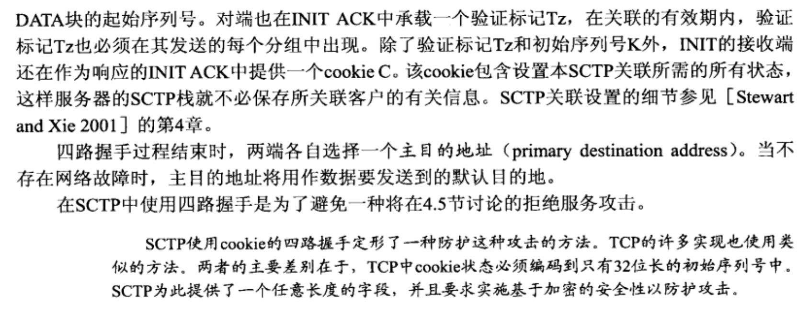
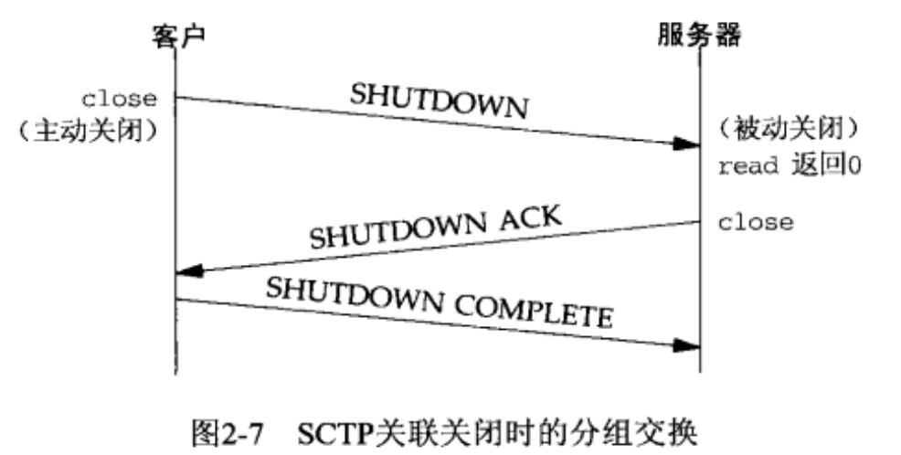
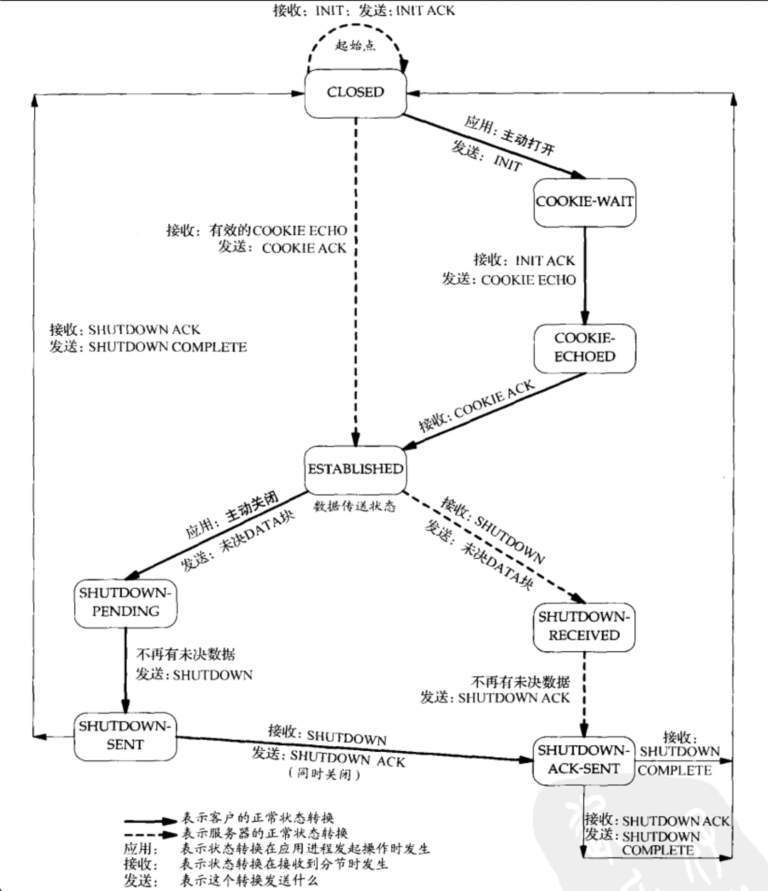
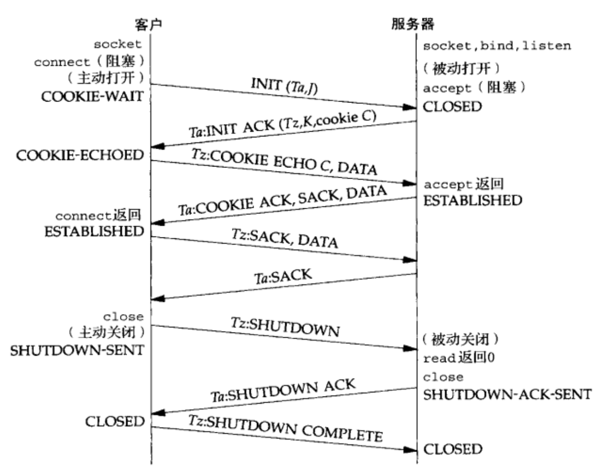

### 协议框架

**`IPv4/IPv6主机` 或 `双栈主机` 来表示同时支持 IPv4和IPv6 的主机.**

- **IPv4**
  - 网际协议版本4 ,32位地址
  - 给 TCP , UDP, SCTP , ICMP 和 IGMP 提供分组递送服务
  - 在网络层
- **IPv6**
  - 网际协议版本6,  128位地址
  - 给 TCP, UDP, SCTP 和 ICMPv6 提供分组递送服务
  - 在网络层
- **TCP**
  - 传输控制协议, 面向连接的协议,为用户进程提供可靠的全双工字节流
  - TCP 套接字是一个 **流套接字**, 没有任何记录边界
  - TCP 关心 确认,超时 和重传之类的细节
  - 提供的是 数据的可靠递送或故障的可靠通知.
  - 在运输层
- **UDP**
  - 用户数据报协议,  UDP是一个无连接协议,
  - UDP 是一种数据报套接字,  每个UDP数据报都有一个长度
  - UDP 数据报不能保证最终到达他们的目的地.
  - 一个UDP客户端可以创建一个套接字并发送一个数据报给一个给定的服务器, 然后立即用同一个套接字发送另一个数据报给另一个服务器, 同样的, 一个UDP服务器可以用同一个UDP套接字从若干个不同的客户接收数据报, 每个客户一个数据报.
  - 在运输层
- **SCTP**
  - 流控制传输协议,  提供可靠全双工 **关联** 的面向连接的协议.
    - 关联指的是  SCTP中的连接, 因为SCTP是多宿的,从而每个关联的两端均涉及一组IP地址和一个端口号
      - 多宿 就是多个IP地址
  - SCTP提供消息服务, 也就是维护来自应用层的记录边界
  - 可使用IPv4与IPv6 ,并且能够在同一个关联中同时使用它们
  - 在运输层
- **ICMP v4**
  - 网际控制消息协议,  处理在路由器和主机之间流通的错误和控制消息.
    - 这些消息投产由 TCP/IP 网络支持软件本身(而不是用户进程) 产生和处理的. 
  - ICMP v4 可用于 IPv4
  - 在网络层
- **IGMP**
  - 网际组管理协议
  - IGMP 用于多播
  - 在 IPv4 种是可选的
  - 在网络层
- **ARP**
  - 地址解析协议
  - ARP把一个 IPv4 地址映射成一个硬件地址 (以太网地址 到 mac地址)
  - ARP 用常用于 以太网,令牌环网 和 FDDI 等广播网络, 在点对点网络上并不需要
  - ARP 在 数据链路层
- **RARP**
  - 反向地址解析协议
  - 把一个硬件地址映射成IPv4 的地址, 可用作无盘节点的引导
  - 在 数据链路层
- **ICMP v6**
  - 网际控制消息协议版本6 
  - ICMP v6 综合了 ICMP v4 和 IGMP  以及 ARP 的功能
  - 使用 IPv6
  - 在网络层
- **BPF**
  - BSD分组过滤器
  - 该接口提供对于 数据链路层的访问能力, 通常在源自 Berkeley 的内核中找到
- **DLPI**
  - 数据链路提供者接口
  - 这个接口也提供对于数据链路层的访问能力, 通常随 SVR4 内核提供

### TCP三次握手

ACK J+1   表示的是 SYN占据的字节数(1字节) 加上 J 这个序列号.

**TCP选项**

- 每个 SYN 可以含有多个 TCP 选项, 下面是常用的TCP选项
  - **MSS**
    - 发送SYN的TCP 一端使用本选项通过对端它的最大分节大小,也就是本链接的每个TCP粉节中愿意接受的最大数据量.
    - 发送端 TCP 使用接收端的 MSS 值作为所发送分节的最大大小
    - 可以使用 **`TCP_MAXSEG`** 套接字选项 提取和设置这个 TCP 选项.
  - **窗口规模选项 ** (浮动窗口)
    - TCP 连接任何一端能够通告对端的最大窗口大小是 65535, 因为在 TCP 首部中相应的字段占16位.
    - 这个窗口规模是可以通过 **`SO_RCVBUF`** 套接字选项影响这个 TCP 选项的
  - **时间戳选项**
    - 这个选项对于高速网络连接是必须的, 他可以防止由 **失而复现的分组** 可能造成的数据破坏.

**高带宽 或 长延迟的网络被称为 长胖管道,  `窗口规模和时间戳`这两个选项也称为 长胖管道选项.**

### TCP 四次挥手

类似 SYN, 一个FIN 也占据1个字节的序列号空间, 因此,每个 FIN的 ACK确认号就是这个FIN 的序号加1.

**在第二步和第三步之间,从执行被动关闭一端到主动关闭一端流动数据是可能的, 这称为 半关闭.**

### TCP 状态转换图

TCP 涉及 连接建立和连接终止的操作可以用状态转换图来说明.

### TCP 分组

TCP连接所发生的实际分组交换情况, 包括连接建立, 数据传送 和 连接终止3个阶段.每个端的所经历的TCP状态.

### TCP 中的 TIME_WAIT 状态

**只有主动关闭的那端才会经历这个状态. 该端点停留在这个状态的持续时间是最长分节生命期(MSL)的两倍, 有时也称为 `2MSL`**

**MSL  是任何IP数据报能够在 因特网种存活的最长时间.**

**任何TCP实现都必须为 MSL 选择一个值, 默认是30秒到2分钟 , 也就意味着 TIME_WAIT这个状态的持续时间在1分钟到4分钟之间.**

每个数据报含有称为跳限(TTL) 的8位字段, 最大值是 255.

- TIME_WAIT 状态由两个存在的理由
  - 可靠地实现TCP 全双工的终止;
    - 为了确保被动关闭的那一端的最后一个 ACK 会收到
  - 允许老的重复分节在网络中消逝;

## SCTP 关联的建立和终止

### SCTP 四次握手

### SCTP 关联终止

SCTP 不允许出现 半关闭状态, 当一端关闭某个关联时, 另一端必须停止发送新的数据. 关联关闭请求的接收端发送完已经排队的数据后, 完成关联的关闭.

 

### SCTP 状态转换图

### SCTP 观察分组

### SCTP 选项

- 动态地址扩展
  - 允许协作的SCTP端点从已有的某个关联中动态增删IP 地址
- 不完全可靠性拓展
  - 允许协作的SCTP端点在应用进程的指导下限制数据的重传.(或是丢弃)

## 端口号

TCP , UDP, SCTP 这三种传输层协议,都使用 16位整数的端口号.(0-65535)

传输协议的代码确保了 客户使用临时端口的 唯一性.

标识每个端点的两个值( IP地址和端口号) 通常称为一个套接字.

## 缓冲区大小及限制

- **影响IP数据报大小的限制**
  - IPv4 数据报的最大 长度是65535 字节, 包括20字节到40字节的IPv4 首部, 这是因为 总长度字段占据16位.
    - IPv4 的总长度字段 包括IPv4首部
  - IPv6 数据报的最大 长度是65535 字节, 包括40字节的IPv6首部, 净荷长度字段占据16位.
    - IPv6 的净荷长度字段不包括IPv6首部.
    - IPv6 有一个特大净荷选项, 可以把净荷长度字段扩展到32位, 不过需要MTU超过65535的数据链路提供支持.  这是为了 主机到主机的内部链接而设计的
  - 许多网络有一个可由硬件规定的MTU , 以太网就是1500字节.
  - 两个主机之间的路径中最小的MTU称为路径MTU. 从发送端主机到接收端主机之间不需要分片时最大MTU的大小
  - 当一个IP 数据报从某个接口送出时, 如果他的大小超过相应链路的MTU, IPv4 和 IPv6 都将执行分片.
    - 这些片段在到达最终目的地之前通常不会被重组.
    - IPv4 路由器对其转发的数据报执行分片.
    - IPv6只有主机对其产生的数据报执行分片, IPv6 路由器不对其转发数据报执行分片.
      - 要注意区分  **`转发`** 和 **`产生`** 这两个概念
  - IPv4 首部的 **不分片** 位 (DF位) 若被设置, 那么不管发送这些数据报的主机还是转发它们的路由器,都不允许对它们进行分片.
    - **当路由器接收到一个超过其外出链路MTU大小 且设置了DF位的 IPv4数据报时, 他将产生一个 `ICMPv4 "destination unreachable, fragmentation needed but DF bit set"(目的地不可达,需要分片 但是DF位已设置`的出错消息.**
      - **当一个 IPv6的路由器收到一个超过其外出链路MTU大小的IPv6数据报时, 他将产生一个 `ICMPv6 "packet too big"(分组太大)` 出错信息**
    - **IPv4 的DF位 和 IPv6 隐含的DF位可用于 `路径MTU发现`**
  - IPv4和IPv6都定义了最小重组缓冲区大小,  它是IPv4或IPv6的任何实现都必须保证支持的最小数据报大小.
    - 其值对于IPv4为 576字节, 对于 IPv6为 1500字节.  (在使用UDP是时.应该避免产生大于这个大小的数据报. TCP 则不需要)
  - **TCP 有一个 MSS(最大分节大小), 用于向对端TCP通过对端在每个分节中能发送的最大TCP数据量.**
    - **MSS 的目的是告诉对端其重组缓冲区大小的实际值,从而试图避免切片.**
    - **MSS 经常设置成MTU减去IP和TCP首部的固定长度.**
      - **在以太网中使用IPv4的MSS值为1460,使用IPv6的MSS值为1440.(两者的TCP首部都是20个字节, 但IPv4首部是20字节,IPv6首部却是40字节)**
  - SCTP 基于到对端所有地址发现的最小路径MTU保持一个分片点.
    - 这个最小MTU大小用于把较大的用户消息分割成较小的能够以单个IP数据报发送的若干片段.
    - **`SCTP_MAXSEG` 套接字选项可以影响该值, 使得用户能够请求一个更小的分片点.**

### TCP输出 (进程写数据到一个TCP套接字中时发生的步骤)

**每一个TCP套接字有一个发送缓冲区, 可以使用`SO_SNDBUF` 套接字选项来更改该缓冲区的大小.**

**因为TCP 要保留应用程序要发送的数据副本,所以才需要发送缓冲区.**

- 当某个应用进程调用 `write` 时.
  - **内核从该应用进程的缓冲区内复制所有数据到所写套接字的发送缓冲区.**
    - 如果该套接字的发送缓冲区容不下该应用进程的所有数据 `(或是应用进程的缓冲区大于套接字的发送缓冲区, 或是套接字的发送缓冲区中已有其他数据)` 该应用进程将被投入睡眠.
      - `这里假设该套接字是阻塞的(默认设置),`
      - 内核将不从`write`系统调用返回, 直到应用进程缓冲区中的所有数据都复制到套接字发送缓冲区中, 然后再返回.
        - **这个返回也只是代表可以重新使用原来的 `应用进程缓冲区`**

- **对端TCP必须确认收到数据,并且伴随来自对端的ACK的不断到达, 本端TCP至此才能从套接字发送缓冲区中丢弃已确认的数据,   TCP必须为已发送的数据保留一个副本,直到他们对端确认为止(ACK).**

- 本端TCP以 MSS 的大小或更小的块把数据传递给IP, 同时给每个数据块安上一个TCP首部以构成TCP分节
  - 其中的MSS或是由对端通告的值, 或是536`(对端未发送一个MSS选项)`,IP给每个TCP分节安上一个IP首部以构成IP 数据报,并按照其目的IP地址传递给数据链路之前将其分片(也可能不分片).
    - `536是 IPv4最小重组缓冲区字节数576减去IPv4首部字节数20和TCP首部字节数20的结果`
  - **每个数据链路都有一个输出队列, 如果队列已满,那么新到的分组将被丢弃,并沿协议栈向上返回一个错误: 从数据链路到IP, 再从IP到TCP,  TCP将注意到这错误,并在以后某个书库重传相应的分节, `应用进程并不知道这种暂时的情况.`**

### UDP输出( 进程写数据到一个UDP套接字中时发生的步骤)

**因为UDP不需要保留应用进程的数据副本,所以不需要发送缓冲区, 有的只是`SO_SNDBUF`套接字选项 来限定可写到该套接字的UDP数据报的大小上限.**

**`如果一个应用进程写一个大于套接字发送数据报大小的上限,内核将返回该进程一个 EMSGSIZE 错误.`**

应用进程的数据在沿协议栈向下传递时,通常被复制到某种格式的一个内核缓冲区中, 然而当该数据被发送之后,这个副本就被数据链路层丢弃了.

- 这一端的UDP简单地给来自用户的数据报安上它的8字节的首部以构成UDP数据报,然后传递给IP.
  - IPv4/IPv6 给UDP 数据报安上相应的IP首部以构成IP数据报,执行路由操作确定外出接口
    - 然后或者直接把数据报加入数据链路层输出队列(如果适合于MTU),或者分片后再把每个分段加入数据链路层的输出队列.
    - 如果某个UDP应用进程发送大数据报(2000字节这样的数据报), 那么它们相比TCP应用数据更有可能被分片, 因为TCP会把应用数据划分成MSS大小的块, 而UDP却没有对等手段
- 写一个UDP套接字的write调用 成功返回表示所写的数据报或其所有片段已被加入数据链路层的输出队列
  - 如果队列已满或没有空间,那么内核会返回 **`ENOBUFS`** 错误给它的应用进程
    - 有的UDP实现并不会返回这种错误.

### SCTP输出 (进程写数据到一个SCTP套接字中时发生的步骤)

**SCTP和TC片基本相同, 也是使用 `SO_SNDBUF` 套接字选项 来更改缓冲区的大小的.**

#### 常见的因特网应用的协议使用情况

