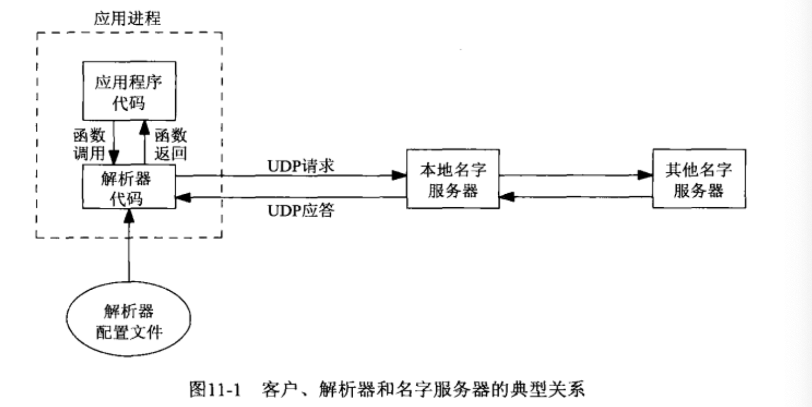
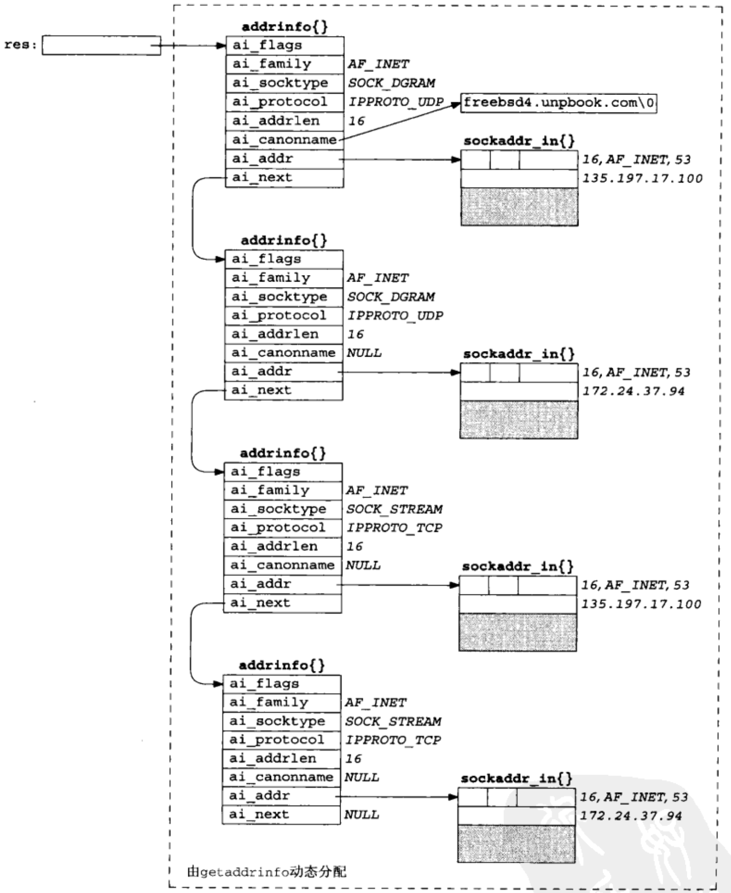

# 目录

- [域名系统](#域名系统)
  - [资源记录](#资源记录)
  - [解析器和域名服务器](#解析器和域名服务器)
  - [DNS替换方法](#DNS替换方法)
- [gethostbyname函数 通过域名找到IP](#gethostbyname函数)
- [gethostbyaddr函数 通过IP找到域名](#gethostbyaddr函数)
- [getservbyname  和  getservbyport 函数  服务和端口号之间的转换](#getservbyname和getservbyport函数)
- [getaddrinfo函数 域名到IP,服务到端口号](#getaddrinfo函数)
- [gai_strerror函数 出错信息解读](#gai_strerror函数)
- 


- ==**主机名与域名的区别:**==
  - **主机名:  主机名通常在局域网内使用，通过hosts文件，主机名就可以解析到对应的IP上.**
    - 通过命令 `hostnamectl set-hostname 新主机名` 来设置, 或修改文件 `/etc/hostname` .
    - 然后再将 `127.0.0.1 新主机名`  添加到文件 `/etc/hosts` 的开头.
  - **域名: 是在internet上使用，通过公网的DNS来解析.**
    - 在`/etc/hosts`  文件中添加.`(例如: 192.168.1.1  www.baidu.com, www.a.baidu.com)`
      - 这个时候, `ping www.baidu.com` 命令就认为这个域名就对应 `192.168.1.1` 这个IP.
  - **MacOS还区分主机名和计算机名,以及域名.**
    - 设置:`sudo scutil --set HostName 新主机名`, 获取: `sudo scutil --get HostName`
    - 设置:`sudo scutil --set ComputerName 新计算机名`, 获取:`sudo scutil --get ComputerName`
- **使用下面的命令可以查询程序使用的端口号**
  - `sudo netstat -tunlp|grep 端口号或进程名或IP`
- ==**文件 `/ect/resolv.conf` 通常包含本地  域名服务器 主机的IP地址**==
  - **对于该系统上大多数进程使用的DNS主机名解析，地址解析或DNS查询路由机制，不参考此文件。**
  - **MacOS使用 `scutil --dns` 命令 查看系统使用的DNS配置**
  - **Linux 使用 `dig` 命令查看**
- ==**解析器函数 (会先去 `/etc/hosts` 文件内匹配寻找)**==
  - `gethostbyname` 和 `gethostbyaddr` 在主机域名与IPv4地址之间进行转换.
  - `getservbyname` 和 `getservbyport` 在服务名字和端口号之间进行转换.
  - **与协议无关的转换函数**
    - `getaddrinfo`   用于主机域名和 IP地址之间转换
    - `getnameinfo`  用于服务域名和端口号之间转换
- ==服务应该通过名字来认知,而不是端口号来代指一个服务==
- ==**名字到端口号的映射关系保存在一个文件中, `/etc/services`**==
- 


## 域名系统

- **域名系统 ( Domain Name System,  DNS)**
  - **主要用于主机域名与地址之间的映射**
- **全限定域名 (Fully Qualified Domain Name,  FQDN), 也称 绝对域名**
  - **必须以 `点号` 结尾的域名才算得上 绝对域名 ( sol.upb.com. ),跟网址差不多**
  - **有时最后那个 `点号`也可以.  ( sol.upb.com )**
    - **这个 `点号` 会告知 DNS 解析器 该域名是 限定域名 的,而不必搜索解析器自己维护的可能域名列表.**

#### 资源记录

- ==DNS 中的条目称为 **资源记录 (resource record, RR)**==

  - **会用到的 RR 类型:**

    - **A**
      - A记录会把一个主机名映射成一个 32位的 IPv4 地址.
    - **AAAA**
      - 四A记录, 把一个主机名映射成 128位的 IPv6地址. (是32位地址的四倍).
    - **PTR   (指针记录)**
      - PTR记录把 IP地址映射成主机名.
        - IPv4地址:, 32位地址的4字节先反转顺序, 每个字节都转换成各自个十进制ASCII值(0~255)后, 再添加 `in-addr.arpa` , 结果字符串用于 PTR查询. (例: `254.32.106.12.in-addr.arpa`)
        - IPv6地址: 128位地址的32个4位组先反转顺序, 每个四位组都被转换成相应的十六进制ASCII值(0~9,a~f)后, 再添加 `ip6.arpa`, 结果字符串用于 PTR查询.
    - **MX**
      - MX记录 把一个主机指定作为 给定主机的 "邮件交换器", 数字越小优先级越高.
    - **CNAME (规范域名)**
      - **常见用法是为 常用的服务 (www或ftp) 指派 CNAME记录.**
        - ==使用服务名 而不是真实的主机名时, 就可以将相应的服务挪到另一个主机上,而外部也不会知晓.==

  - ```bash
    这是 unpbook.com 域中关于主机 freebsd 的DNS记录.
    	freebsd    IN   A        12.106.32.254
    	           IN   AAAA     3ffe:b80:1f8d:1:a00:20ff:fea7:686b
    	           IN   MX    5  freebsd.unpbook.com.
    	           IN   MX    10 mailhost.unpbook.com.
    	           IN   PTR      254.32.106.12.in-addr.arpa
    	           IN   PTR      b.6.8.6.7.a.e.f.f.f.0.2.0.0.a.0.1.0.0.0.b.9.f.1.0.8.b.0.e.f.f.3.ip6.arpa
      aix.ftp    IN   CNAME    linux.unpbook.com.
      aix.www    IN   CNAME    linux.unpbook.com.
      freebsd-4  IN   A        12.106.32.254
      freebsd-6  IN   AAAA     3ffe:b80:1f8d:1:a00:20ff:fea7:686b
      freebsd-6ll IN  AAAA               fe80::a00:20ff:fea7:686b   #AAAA记录+主机的链路局部地址的RR
    ```

- **这些协议给予了我们额外的应用程序协议选择控制权**


#### 解析器和域名服务器

- **域名服务器(name server), 就是 BIND程序(Berkeley Internet Name Domain).**
- 应用程序通过调用称为 **解析器(resolver)** 的函数库中的函数接触 DNS服务器.
  - 常见的 **解析器 函数** 就是 `gethostbyname` 和 `gethostbyaddr` . 前者 主机名到IPv4, 后者 IPv4到主机名
- ==解析器代码通常包含在一个系统函数库中,在构造应用程序时被 **连接** 到应用程序中.==
  - **有的系统提供一个由全体应用进程共享的集中式 解析器守护进程, 并提供向这个守护进程执行 RPC 的系统函数库代码.**
  - 无论哪种情况, 应用程序代码使用通常的函数调用来执行解析器中的代码, 典型函数就是 `gethostbyname` 和 `gethostbyaddr` . 



- **解析器代码 通过读取其系统相关配置文件确定本组织机构的 域名服务器们 的所在位置.(一个机构存在一个或多个域名服务器)**
- ==文件 `/ect/resolv.conf` 通常包含本地域名服务器主机的IP地址, 必须是IP地址 而不可以是域名.==
- **解析器使用 UDP 向本地域名服务器发出查询.**
  - **如果本地服务器不知道答案, 它通常会使用 UDP 在整个互联网上查询其他名字服务器.**
    - **如果答案太长, 超出 UDP消息的承载能力, 本地域名服务器和解析器会自动切换到 TCP**


#### DNS替换方法

- 不使用 DNS 也可能获取名字和地址信息.
- **常用的替换DNS的方法:**
  - 静态主机文件 `/etc/hosts`
  - 文件信息系统 (Network Infomation System,  NIS)
  - 轻权目录访问协议 (Lightweight Directory Access Protocol,  LDAP).
- **不使用DNS也可能获取名字和域名信息.**
- ***系统管理员* 如何配置一个主机以使用不同类型的 域名服务 是和实现相关的.**
  - `Solaris 2.x`, `HP-UX 10` , `FreeBSD 5.x` 使用文件 `/etc/nsswitch.conf`
  - `AIX` 使用文件 `/etc/netsvc.conf`
  - `BIND 9.2.2` 提供了自己的名为 **信息检索服务(IRS)** 的版本.使用文件 `/etc/irs.conf`
  - **如果使用域名服务器查找主机名, 那么所有这些系统都使用文件 `/etc/resolv.conf` 指定域名服务器的IP地址.**
    - **但是对于应用程序开发人员来说是透明的,只需要使用`gethostbyname` 和 `gethostbyaddr` 这样的 解析器函数即可. **


## gethostbyname函数

- ==**将主机域名 转换成IPv4地址,  执行的是对 A记录的查询, 只能返回 IPv4地址**==
- ==这个函数首先会查找本地 `/etc/hosts` 文件的内容,如果匹配则直接拉去过来, 否则才回去其他的地方寻找.==
- ***这个函数快要被撤销了, 应该使用`getaddrinfo` 这个函数来替换他.***
- **应用程序应该处理域名 而不是IP地址, 这样方便向 IPv6转移**
- ==查找主机名的最基本的函数`gethostbyname`, 调用成功返回一个指向 `hostent`结构的指针, 该指针包含所查找主机的所有IPv4地址==
  - **这个函数返回值局限于 IPv4, 而`getaddrinfo` 函数能同时处理IPv4和IPv6**

```c
#include <sys/types.h>
#include <netdb.h>
#include <netinet/in.h>
#include <arpa/inet.h>
struct hostent*  gethostbyname (const char* hostname);

参数:   hostname : 
返回值: 成功返回非空指针,  里面记录了搜寻到的 域名,别名列表,二进制IP地址列表.
	     出错返回NULL ,并设置 h_errno 这个值在 <netdb.h>中定义:
               HOST_NOT_FOUND     TRY_AGAIN    NO_RECOVERY     NO_ADTA(等同于NO_ADDRESS)
            使用 hstrerror 函数并将 h_errno 这个参数传入, 可以得到错误说明的字符串返回值.
          

返回值结构体 的结构:
struct hostent{
 	char*  h_name;       /* 正式主机名称,绝对域名, FQDN ,跟网址差不多(www.baidu.com) */
  char** h_aliases;    /* 指向别名 名称 的指针数组 的指针,那台主机的多个域名 */
  int    h_addrtype;   /* 主机地址类型：AF_INET (=2), 因为不支持IPv6*/
  int    h_length;     /* 地址长度: 4字节, 只能是4字节, 因为不支持IPv6 */
  char** h_addr_list;  
            /* 指向具有IPv4地址 的 in_addr结构体的 ptrs数组,也就是那个主机拥有的多个IP地址的数组 */
};
 


/* ============================================================ */
范例:
#include <stdio.h>
#include <stdlib.h>
#include <sys/errno.h>
#include <string.h>
#include <sys/types.h>
#include <netdb.h>
#include <netinet/in.h>
#include <arpa/inet.h>

/* argv 参数为:  www.baidu.com  www.google.com www.github.com  
                http://cn.bing.com  */
/* http 都可解析, 但是 https 不可解析 */
int main(int argc, const char * argv[]) {
    
    const char    *ptr;
    char          **pptr;
    char     str[INET_ADDRSTRLEN];   // INET_ADDRSTRLEN = 16 ,定义在 <netinet/in.h>
    struct hostent *hptr;

    while ( (--argc) > 0){
        ptr =  *++argv;  /* ( *( ++argv ) ) */
        if ( (hptr = gethostbyname(ptr)) == NULL ){
            fprintf(stderr, "gethostbyname error for host: %s : %s",
                    ptr, hstrerror(h_errno));
            continue;
        }
        printf("official hostname: %s\n", hptr->h_name);
        for (pptr= hptr->h_aliases; *pptr!= NULL; pptr++)
            printf("\tslisa: %s\n", *pptr);
        
        switch (hptr->h_addrtype) {
            case AF_INET:
                pptr = hptr->h_addr_list;
                for (; *pptr != NULL; pptr++)
                    printf("\taddress: %s\n", inet_ntop(hptr->h_addrtype, *pptr, str, sizeof(str)));
                break;
                
            default:
                fprintf(stderr, "unknown address type\a\n");
                break;
        }
    }
    return 0;
}

```


## gethostbyaddr函数

- ==**与`gethostbname`正好相反, 将IPv4地址 转换成 主机域名 ,  执行的是对 A记录的查询, 只能返回 IPv4地址**==
- ==这个函数首先会查找本地 `/etc/hosts` 文件的内容,如果匹配则直接拉去过来, 否则才回去其他的地方寻找.==

- `gethostbyaddr` 在 `in_addr.arpa` 域中 像一个域名服务器查询 PTR记录.

```c
#include <sys/types.h>
#include <netdb.h>
#include <netinet/in.h>
#include <arpa/inet.h>
struct hostent*  gethostbyaddr (const char* addr, socklen_t len,  int family);

参数:  addr: 这其实是一个指向 in_addr 结构的指针.二进制格式的IP地址, (struct sockaddrin a.sin_addr)
       len:  addr 指针所指向 in_ddr 结构体的长度.
    famuly:  只可以是 AF_INET,

返回值: 成功返回 非空指针, 里面记录了搜寻到的 域名,别名列表,二进制IP地址列表.
	     出错返回NULL ,并设置 h_errno 这个值在 <netdb.h>中定义:
               HOST_NOT_FOUND     TRY_AGAIN    NO_RECOVERY     NO_ADTA(等同于NO_ADDRESS)
            使用 hstrerror 函数并将 h_errno 这个参数传入, 可以得到错误说明的字符串返回值.

返回值结构体 的结构:
struct hostent{
 	char*  h_name;       /* 正式主机名称,绝对域名, FQDN ,跟网址差不多(www.baidu.com) */
  char** h_aliases;    /* 指向别名 名称 的指针数组 的指针,那台主机的多个域名 */
  int    h_addrtype;   /* 主机地址类型：AF_INET (=2), 因为不支持IPv6*/
  int    h_length;     /* 地址长度: 4字节, 只能是4字节, 因为不支持IPv6 */
  char** h_addr_list;  
            /* 指向具有IPv4地址 的 in_addr结构体的 ptrs数组,也就是那个主机拥有的多个IP地址的数组 */
};
```


## getservbyname和getservbyport函数

- 服务通常靠名字来认知.
- **应该用名字而不是端口号来代指一个服务.**
- ==**名字到端口号的映射关系保存在一个文件中, `/etc/services`**==
- ==**即使端口号发生变动,那么仅仅需修改 `/etc/service` 文件中的某一行即可, 而不需要重新编译应用程序.**==
- **这两个函数是去 `/etc/service` 这个文件中去寻找各个名字所对应的端口号的**
- **`getservbyname `  函数用于根据给定名字查找相应服务**
- `getservbyport`  函数用于
- **支持多个协议的服务往往使用相同的 TCP和UDP端口号.但也不都是这样的. 要注意区分**

```c
#include <sys/types.h>
#include <netdb.h>
#include <netinet/in.h>
#include <arpa/inet.h>
/* 根据服务名 找到对应的 端口号(网络字节序) */ 
struct servent* getservbyname (const char* servname, const char* protoname);

/* 根据端口号(网络字节序) 找到对应的服务名 */
struct servent* getservbyport (int port, const char* protoname);


参数:  servname: 服务名, (比如 http, fpt, smb)
     protoname: 所使用的互联网协议(传输层), tcp, udp, sctp 之类的, 也可以给 NULL
                 如果查找不到,会返回错误.(真的不知道的情况下,给 NULL 比较好).
 			    port: 网络字节序的 端口号 (大端表示法)

       
返回值:  错误 或者寻找不到就会 返回NULL空指针, 
             使用 hstrerror 函数并将 h_errno 这个参数传入, 可以得到错误说明的字符串返回值.
        否则返回非空的下面结构体(被静态分配的).
       
返回值结构体内容如下
struct  servent{
 char*  s_name;      /* 标准服务名称 */
 char** s_aliases;   /* 服务名称的别名列表 */
 int    s_port;      /* 端口号, 网络字节序,大端表示的 */
 char*  s_proto;     /* 使用的互联网协议(传输层), tcp, udp, sctp  之类的,绝对不要对其调用 htons() */
};


例子:
    struct servent * sptr;
       sptr = getservbyname ("domain", "udp");
       sptr = getservbyname ("http"  , "udp");
       
       sptr = getservbyport (htons(53), "udp" );
       sptr = getserbbyport (htons(21),  NULL );

/* ===================================================================== */
范例:
#include <stdio.h>
#include <stdlib.h>
#include <string.h>
#include <sys/errno.h>
#include <netinet/in.h>
#include <arpa/inet.h>
#include <netdb.h>
#include <unistd.h>
#include <sys/types.h>
#include <sys/un.h>

#define MAXLINE  2048

int    Socket (int, int , int);
char*  Sock_ntop (const struct sockaddr *sa, socklen_t salen);


/*
 * 需要两个命令行参数:  域名  服务名
 */
int
main(int argc, char* argv[]){
    int      sockfd = -1;
    ssize_t  n;
    char     recvline[MAXLINE+1] = { [0 ... MAXLINE] = 0 };
    struct   sockaddr_in  servaddr;
    struct   in_addr**  pptr;
    struct   in_addr*   inetaddrp[2];
    struct   in_addr    inetaddr;
    struct   hostent*   hp;       // 保存,域名 IP
    struct   servent*   sp;       // 保存,服务 端口号
    
    if (argc != 3 ){
        fprintf(stderr, "%d: usage: daytimecpcli1 <hostname> <service> \n",__LINE__);
        exit(errno);
    }
    
    // 用域名搜素 IP地址,别名,并给予 hp, 下面是错误处理
    if ( (hp = gethostbyname(argv[1])) == NULL ){
    
        //将点分时进制字符串转换成 网络字节序的二进制IP地址,成功返回1 ,失败返回0, 下面是错误处理
        if (inet_aton(argv[1], &inetaddr) == 0 ){
            fprintf(stderr, "%d: hostname error for %s : %s\n", __LINE__, argv[1], hstrerror(h_errno));
            exit(errno);
        }
        else{
            inetaddrp[0] = &inetaddr;     // 转换成功,将地址保存起来.
            inetaddrp[1] = NULL;
            pptr = inetaddrp;
        }
    }
    else{     // 使用域名进行搜索, 并且得到了 网络字节序的二进制IP地址
        pptr = (struct  in_addr**) hp->h_addr_list;  // 将 char**  转换成正确的 in_addr**
    }
    
    // 根据服务名找到对应的端口号
    if ( (sp = getservbyname (argv[2], NULL )) == NULL){
        fprintf(stderr, "%d:getservbyname error for %s \n",__LINE__, argv[2]);
        exit(errno);
    }
    
    for (; *pptr != NULL; pptr++){
        sockfd = Socket(AF_INET, SOCK_STREAM, 0);    // 创建套接字
        memset(&servaddr, 0, sizeof(servaddr));
        servaddr.sin_family = hp->h_addrtype;      // gethostbyname() 只能拿到IPv4地址,这么写也对
        servaddr.sin_port   = sp->s_port;   // 对方服务的端口号.
        memcpy(&servaddr.sin_addr, *pptr, sizeof(struct in_addr)); //拷贝二进制IP地址
        printf("trying %s\n", Sock_ntop ((struct sockaddr*)&servaddr, sizeof(servaddr)) );// 输出IP地址和端口号
        
        // 链接
        if (connect (sockfd, (struct sockaddr*)&servaddr, sizeof(servaddr)) == 0)
            break;      // 只要连接成功一次就退出循环
        
        fprintf(stderr, "\tconnect error  连接失败了,准备进行下一次连接\n");
        close(sockfd);    // 连接失败的套接字必须关闭,绝对不可以再用
    }
    
    // 判断 是否所有地址都已经尝试连接过, 并且全部连接失败
    if (*pptr == NULL  || sockfd < 0 ){
        fprintf(stderr, "unable to connect, 所有地址全部连接失败\n");
        exit(errno);
    }
    

    // 连接成功一个, 执行通信
    printf("连接成功, 进行通讯: \n");

//    while ( (n = read (sockfd, recvline, MAXLINE) ) > 0){      // TCP
      while ( (n = recvfrom (sockfd, recvline, MAXLINE, 0, NULL , NULL ) ) > 0){      // UDP
        recvline[n] = '\0';
        if(recvline[0] == 'p' ){
            shutdown(sockfd, SHUT_RD);
            break;
        }
        fputs(recvline, stdout);
    }
    printf("通讯结束 \n");
    return 0;
}


int
Socket(int family, int type, int flag){
    int fd  = -1;
    if ( (fd = socket(family, type, flag))  < 0){
        fprintf(stderr, "%d: Socket(error) ,return %d \n", __LINE__, fd );
        exit(errno);
    }
    return fd;
};


char*
Sock_ntop(const struct sockaddr *sa, socklen_t salen)
{
    char        portstr[8];
    static char str[128];        /* Unix domain is largest */

    switch (sa->sa_family) {
    case AF_INET: {
        struct sockaddr_in    *sin = (struct sockaddr_in *) sa;

        if (inet_ntop(AF_INET, &sin->sin_addr, str, sizeof(str)) == NULL)
            return(NULL);
        if (ntohs(sin->sin_port) != 0) {
            snprintf(portstr, sizeof(portstr), ":%d", ntohs(sin->sin_port));
            strcat(str, portstr);
        }
        return(str);
    }
/* end sock_ntop */

#ifdef    IPV6
    case AF_INET6: {
        struct sockaddr_in6    *sin6 = (struct sockaddr_in6 *) sa;

        str[0] = '[';
        if (inet_ntop(AF_INET6, &sin6->sin6_addr, str + 1, sizeof(str) - 1) == NULL)
            return(NULL);
        if (ntohs(sin6->sin6_port) != 0) {
            snprintf(portstr, sizeof(portstr), "]:%d", ntohs(sin6->sin6_port));
            strcat(str, portstr);
            return(str);
        }
        return (str + 1);
    }
#endif

#ifdef    AF_UNIX
    case AF_UNIX: {
        struct sockaddr_un    *unp = (struct sockaddr_un *) sa;

            /* OK to have no pathname bound to the socket: happens on
               every connect() unless client calls bind() first. */
        if (unp->sun_path[0] == 0)
            strcpy(str, "(no pathname bound)");
        else
            snprintf(str, sizeof(str), "%s", unp->sun_path);
        return(str);
    }
#endif

#ifdef    HAVE_SOCKADDR_DL_STRUCT
    case AF_LINK: {
        struct sockaddr_dl    *sdl = (struct sockaddr_dl *) sa;

        if (sdl->sdl_nlen > 0)
            snprintf(str, sizeof(str), "%*s (index %d)",
                     sdl->sdl_nlen, &sdl->sdl_data[0], sdl->sdl_index);
        else
            snprintf(str, sizeof(str), "AF_LINK, index=%d", sdl->sdl_index);
        return(str);
    }
#endif
    default:
        snprintf(str, sizeof(str), "sock_ntop: unknown AF_xxx: %d, len %d",
                 sa->sa_family, salen);
        return(str);
    }
    return (NULL);
}
```


## getaddrinfo函数

- ==该函数能够处理 **域名到地址** 和 **服务到端口号** 这两种, 将其转换成套接字地址结构==
  - **适应与 IPv4和IPv6, 完全将协议相关性隐藏在了这个 库函数内部.**
  - **返回值参数是 `struct addrinfo`  结构体指针. 里面存在 `struct sockaddr` 结构体,可直接使用**
    - `struct addrinfo`是个链表
- **`getnameinfo` 函数的作用 正好与这个相反.**
- ==**因为result参数是动态分配的, 所以需要使用 `freeaddrinfo` 函数来释放这块内存.**==

```c
#include <netdb.h>
int  getaddrinfo (const char* hostname,          const char* service, 
                  const struct addrinfo* hints,  struct addrinfo** result);
参数:    hostname: 主机名 或IPv6/4 字符串 , 会被转换成二进制网络字节序IP地址
         service:  服务或端口号字符串 , 会被转换成二进制网络字节序端口号
           hints:  空指针或 result返回值参数的某些信息的暗示,例如TCP或UDP的选择(某个服务都支持)
          result:  返回值参数. 里面记录了 : 二进制的IP地址,端口号,IP协议族,套接字选项.

返回值: 成功返回0, 出错返回非0(这个错误值可使用 gai_strerror函数解读)
      错误:  EAI_AGAIN  名字解析中临时失败,      EAI_BADFLAGS  ai_flags的值无效, 
            EAI_FAIL   名字解析中不可恢复地失败,  EAI_FAMILY   不支持 ai_family,
            EAI_MEMORY 内存分配失败,            EAI_NONAME   hostname或service参数未提供,或不可知
            EAI_OVERFLOW  用户参数缓冲区溢出,    EAI_SERVICE  不支持ai_socktype 类型的 service
            EAI_SOCKTYPE  不支持ai_socktype,   EAI_SYSTEM   在errno 变量中有系统错返回
            
result参数结构体 (链表)
struct  addrinfo { 
  int        ai_flags;      /* AI_PASSIVE 套接字将用于被动打开, AI_CANONNAME 返回主机的规范名字, AI_NUMERICHOST 禁止名字到地址的映射(hostname参数必须是一个地址串)*/
  int        ai_family;     /* AF_xxx ,或 PF_xxx , ipv6/4*/
  int        ai_socktype;   /* SOCK_STREAM (TCP), SOCK_DGRAM (UDP) ,或SCTP*/
  int        ai_protocol;   /* 0 或 IPPROTO_xxx , 是IPv4和IPv6套接字选项级别 */
  socklen_t  ai_addrlen;    /* 下面 sockaddr* ai_addr 结构体的长度 */
  char*      ai_canonname;  /* 主机名的规范名称 */
  struct sockaddr* ai_addr;  /* 二进制地址,端口号之类的, 可以直接给套接字使用, accept() */
  struct addrinfo* ai_next;  /* 指向该链表的下个结构体 */
};

例子:
 struct addrinfo  hints, *res;
  memset (&hints, 0 ,sizeof(hints));
  hints.ai_flags = AI_CANONNAME;      //期望返回 主机的规范名字
  hints.ai_family = AF_INET;          //期望得到 ipv4的地址
  getaddrinfo ( "www.baidu.com", "daytime", &hints, &res); 
                //www.baidu.com 是域名,  daytime 是服务

/* ======================================================= */
范例: 通过域名和服务 来进行自动 tcp 套接字连接.
int 
tcp_connect ( const char* host, const char* serv) 
{
  int     sockfd, n;
  struct  addrinfo  hints,  *res,  *ressave;
  memset( &hints, 0, sizeof(hints));
  hints.ai_family  = AF_UNSPEC;
  hins.ai_socktype = SOCK_STREAM;
  
  if ( (n = getaddrinfo (host, serv, &hints, &res)) != 0 ){ // 代表出错
  	  fprintf(stderr, "tcp_connect(): error for %s, %s, %s",host, serv, gai_strerror(n));
 	    return(-1);
  }
  ressave = res;
  do{
  	sockfd = socket (res->ai_family, res->ai_socktype, res->ai_protocol);
    if (sockfd < 0)
      continue;      // 创建套接字失败了.(可能是套接字总数超过上线,或其他问题)

    if (connect (sockfd, res->ai_addr, res->ai_addrlen) == 0)
      break;  // 连接成功. 退出循环
    
    close (sockfd);   // 关闭连接失败的套接字.
  }while ( (res = res->ai_next) != NULL );

  if (res == NULL){
  	fprintf (stderr, "tcp_connect: error for %s, %s", host, serv);
 	  return(-2);
  }
  freeaddrinfo(ressave);
  return sockfd;
} // 可对套接字使用 getpeername() 函数来获取 对端的IP地址和端口号.
```




## gai_strerror函数

- ==解读 `getaddrinfo` 返回的非0错误值的名字和含义.==
  - **`getaddrinfo` 函数的返回值,是他唯一的参数**

```c
#include <netdb.h>
const char* gai_strerror (int error);

参数:   error: getaddrinfo 函数的非0返回值
返回值: 指向错误描述消息字符串的指针.
```


## freeaddrinfo函数

- ==**用于释放 `getaddrinfo` 函数中 result 参数所分配的内存.**==

```c
#include <netdb.h>
void  freeaddrinfo (struct addrinfo* ai);

参数:   ai: 指向由getaddrinfo 函数返回的第一个addrinfo 结构体.
```


