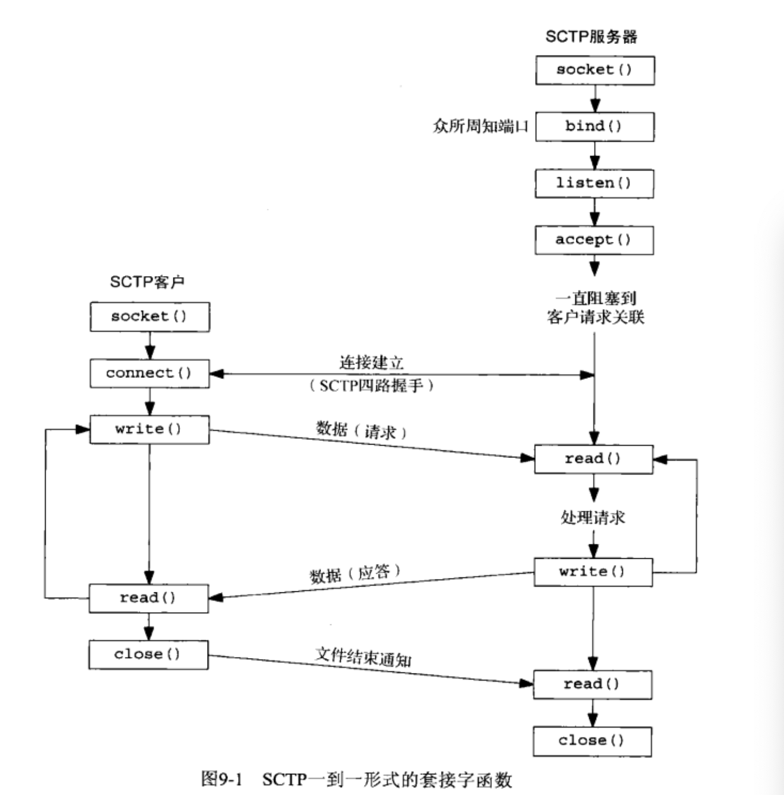
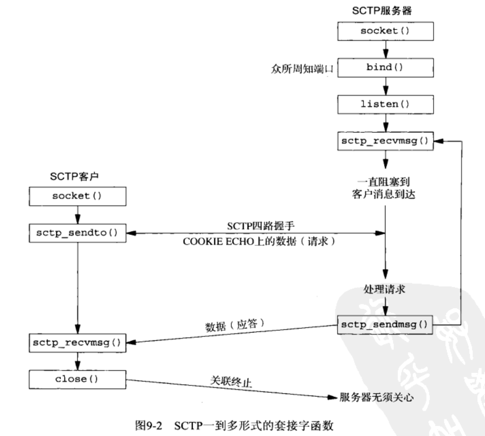
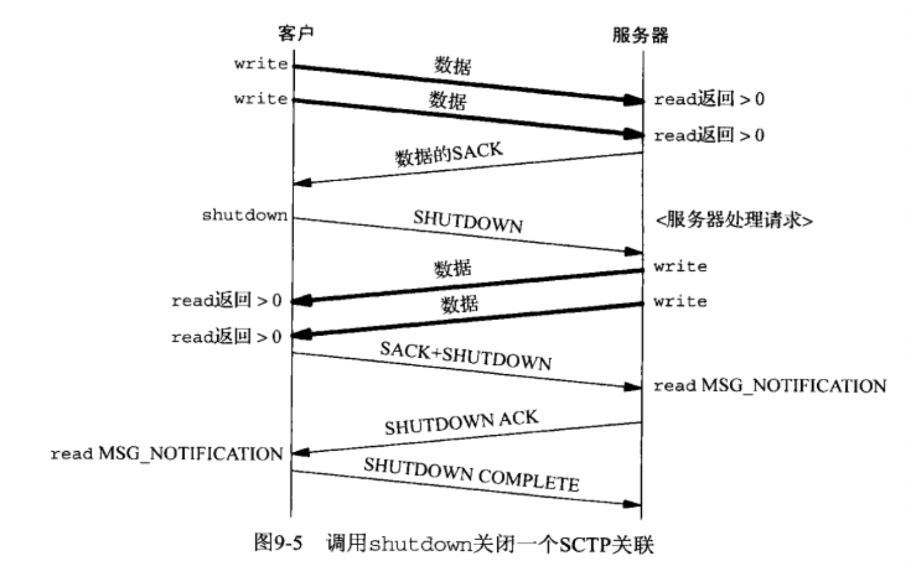

**sctp 代码编译时,必须添加 `-lsctp` 选项.**

```bash
$gcc -Wall  -o a.out a.c -lsctp
```

**sctp 主要需求的头文件有: `<sys/types> , <sys/socket.h>, <netinet/sctp.h>`**

```c
填写头文件时, 必须按照以下顺序来写,  否则会出现莫名其妙的错误.
#include <sys/socket.h>
#include <sys/types.h>
#include <arpa/inet.h>
#include <netinet/in.h> 
#include <netinet/sctp.h>
```


# 目录

- [安装和开启SCTP支持](#安装和开启SCTP支持)
- [基本SCTP套接字编程](#基本SCTP套接字编程)
  - [接口模型](#接口模型)
    - [一到一形式](#一到一形式)
    - [一到多形式](#一到多形式)
  - [sctp_bindx函数](#sctp_bindx函数)
  - [sctp_connectx函数](#sctp_connectx函数)
  - [sctp_getpaddrs函数](#sctp_getpaddrs函数)
  - [sctp_freepaddrs函数](#sctp_freepaddrs函数)
  - [sctp_getladdrs函数](#sctp_getladdrs函数)
  - [sctp_freeladdrs函数](#sctp_freeladdrs函数)
  - [sctp_sendmsg函数](#sctp_sendmsg函数)
  - [sctp_recvmsg函数](#sctp_recvmsg函数)
  - [sctp_opt_info函数](#sctp_opt_info函数)
  - [sctp_peeloff函数](#sctp_peeloff函数)
  - [shutdown函数](#shutdown函数)
- [通知](#通知)
  - [对应事件预定字段](#对应事件预定字段)
    - [SCTP_DATA_IO_EVENT 查看消息到达所在的流号](#SCTP_DATA_IO_EVENT)
    - [SCTP_ASSOC_CHANGE    关联更改事件](#SCTP_ASSOC_CHANGE关联更改事件)
    - [SCTP_PEER_ADDR_CHANGE  地址事件](#SCTP_PEER_ADDR_CHANGE地址事件)
    - [SCTP_REMOTE_ERROR   远程错误事件](#SCTP_REMOTE_ERROR远程错误事件)
    - [SCTP_SEND_FAILED  数据发送失败事件](#SCTP_SEND_FAILED数据发送失败事件)
    - [SCTP_SHUTDOWN_EVENT    关机事件](#SCTP_SHUTDOWN_EVENT关机事件)
    - [SCTP_ADAPTION_INDICATION   适应层指示参数](#SCTP_ADAPTION_INDICATION适应层指示参数)
    - [SCTP_PARTIAL_DELIVERY_EVENT  部分递送API事件](#SCTP_PARTIAL_DELIVERY_EVENT)
- [头端阻塞](#头端阻塞)
- [SCTP一到多式流分回射服务器程序](#SCTP一到多式流分回射服务器程序)
- [SCTP一到多式流分回射客户端程序](#SCTP一到多式流分回射客户端程序)
- 


- ==**SCTP 不提供半关闭状态**==
  - **SCTP 应该使用 `shutdown` 发起终止序列来关闭 关联**
- 


# 安装和开启SCTP支持

- **ubuntu  开启命令:** 

  - `sudo apt-get install libsctp-dev lksctp-tools libsctp1`

- **树莓派开启命令(64位自制版,原版和 ubuntu 相同):**

  - `sid-used sudo apt-get install libsctp-dev lksctp-tools libsctp1`

- **Fedora、RedHat、CentOS开启命令:**

  - `sudo yum install kernel-modules-extra.x86_64 lksctp-tools.x86_64`

- **macOS 需要安装内核驱动模块(`失败了`):**

  - ==**首先下载在本目录中的 `macOs-sctp-支持` 目录下的 [SCTP_NKE_ElCapitan_Install_01.dmg](SCTP_NKE_ElCapitan_Install_01.dmg) 文件到本地, 并且双击加载.**==

  - ==先备份 `socket.h ` 文件, 因为后面的步骤会覆盖它==

    ```bash
    首先关闭mac前面验证功能,因为涉及到 内核驱动模块.
    	安装电源键启动后立即按住command+r 进入recover模式
    	打开终端控制台
    	执行命令:
    		csrutil enable  --without kext
    
    
    进行下面操作之前,必须保证已经安装Xcode ,并且也是使用Xcode 进行开发, 否则另寻到 /usr/目录进行替换
    
    
    sudo cp -R /Volumes/SCTP_NKE_ElCapitan_01/SCTPSupport.kext /Library/Extensions
    sudo cp -R /Volumes/SCTP_NKE_ElCapitan_01/SCTP.kext /Library/Extensions
    
    
    sudo cp /Volumes/SCTP_NKE_ElCapitan_01/socket.h /Applications/Xcode.app/Contents/Developer/Platforms/MacOSX.platform/Developer/SDKs/MacOSX.sdk/usr/include 
    
    sudo cp /Volumes/SCTP_NKE_ElCapitan_01/sctp.h /Applications/Xcode.app/Contents/Developer/Platforms/MacOSX.platform/Developer/SDKs/MacOSX.sdk/usr/include/netinet
    
    sudo cp /Volumes/SCTP_NKE_ElCapitan_01/sctp_uio.h /Applications/Xcode.app/Contents/Developer/Platforms/MacOSX.platform/Developer/SDKs/MacOSX.sdk/usr/include/netinet
    
    sudo cp /Volumes/SCTP_NKE_ElCapitan_01/libsctp.dylib /Applications/Xcode.app/Contents/Developer/Platforms/MacOSX.platform/Developer/SDKs/MacOSX.sdk/usr/lib
    
    
    
    - 加载模块 
    	sudo kextload /Library/Extensions/SCTP.kext
    - 卸载模块
    	sudo kextunload /Library/Extensions/SCTP.kext
    ```

  - **加载模块** 

    - **`sudo kextload /Library/Extensions/SCTP.kext`**

  - **卸载模块**
  	
  	- **`sudo kextunload /Library/Extensions/SCTP.kext`**

# 基本SCTP套接字编程

**SCTP 是一个可靠的面向消息的协议,在端点之间提供多个流,并为多宿提供传输级支持.**

**SCTP 中的 *通知* ,使得一个应用进程能够知晓用户数据到达以外的重要协议事件.**


## 接口模型

- ==**SCTP 套接字分类**==
  - **一到一套接字**
    - 对应一个单独的 SCTP 关联. (SCTP的关联是 两个系统之间的一个连接)
    - 类型是 `SCOK_STREAM` , 协议为 `IPPROTO_SCTP` ,网际网套接字,协议族为`AF_INET 或 AF_INET6`
  - **一到多套接字**
    - 一个给定套接字上可以同时有多个活跃的SCTP 关联.`(类似于绑定了端口的UDP套接字 正在接收其他很多的套接字发送的数据报)`
    - 类型是 `SOCK_SEQPACKET` ,协议为 `IPPROTO_SCTP`, 网际网套接字,协议族为`AF_INET 或 AF_INET6`


### 一到一形式

- ==目的是 方便将现有的TCP应用程序移植到 SCTP上==
  - **在移植时,必须要注意与 TCP 的差异:**
    - **任何TCP套接字选项必须转化成等效的SCTP套接字选项.`(例如: TCP_NODELAT和TCP_MAXSEG ,应该应设成 SCTP_NOELAY和SCTP_MAXSEG)`**
    - **TCP保存消息边界, 因此应用层消息并非必需.**
    - **TCP应用使用半关闭(写关闭) 来告知对方数据流已经结束. 这样移植到SCTP需要额外重新应用层协议,让进程在应用数据流中告知对端传出数据流已经结束**
    - **`send`函数能够以普通方式使用, 但是`sendto` 和 `sendmsg` 函数时, 指定的任何地址都被认为是对 目的地 主地址的重写.**
- ==**一到一 类型是 `SCOK_STREAM` , 协议为 `IPPROTO_SCTP` 网际网套接字,协议族为`AF_INET 或 AF_INET6`**==



### 一到多形式

- **一到多给开发人员提供了这样的能力:**
  - **编写的服务器程序无需管理大量的套接字描述符.**
- **单个套接字描述符将代表多个关联,就像一个UDP套接字能够从多个客户接收消息那样.**
- ==**在一到多式套接字上, 用于标识单个关联的是一个 关联标识 (association identifier)**==
  - **关联标识  是一个类型为 `sctp_assoc_t` 的值, 通常是一个整数. (对开发人员不透明)**
    - ==**应用程序必须使用由内核给予的关联标识符**==
- ==**一到多套接字的用户应该掌握以下几点:**==
  - ==**当一个客户关闭其关联时, 其服务器也将自动关闭同一个关联, 服务器主机内核中不再有该关联的状态.**==
  - ==***可用于致使在四路握手的第三个或第四个分组中捎带用户数据的唯一办法就是使用一到多形式***==
  - **客户端使用 `sento, sendmsg, SCTP_sendmsg` 连接服务器,如果成功则建立一个与该地址的新关联, 这个行为的发生与执行分组的发生与服务器的应用程序是否调用过 `list`函数 无关.**
  - ==**用户必须使用 `sendto, sendmsg , sctp_sendmsg`  三个分组发送函数, 不可以使用`write , send` 这两个分组发送函数.**==
    - **除非已经使用 `sctp_peeloff` 函数从一个一到多式 套接字剥离出一个  一到一式的套接字**
  - **调用发送分组函数时, 所用的目的地址是由系统在关联建立阶段选定的  主目的地址**
    - **除非调用者在所提供的 `sctp_sndrcvinfo` 结构中设置了 `MSG_ADDR_OVER` 标志, 为了提供这个结构,调用者必须使用伴随辅助数据的 `sendmsg`	 函数或 `sctp_sendmsg` 函数 .**
  - **关联事件 可能被启用, 因此要是应用进程不希望收到这些事件, 就得使用 `SCTP_EVENTS` 套接字选项显示禁用他们.**
    - **默认情况下只有 `sctp_data_io_event` 事件会启用, 它给 `recvmsg` 和`sctp_recvmsg` 调用提供辅助数据.( 适用一到多 和 一到一)**
- ==**客户端创建完套接字并且初次调用 `sctp_sendto`函数时, 将导致隐式建立关联, 而数据请求由四路握手的第三个分组捎带到服务器**==
- ==**一到多 类型是 `SOCK_SEQPACKET` , 协议为 `IPPROTO_SCTP` 网际网套接字,协议族为`AF_INET 或 AF_INET6`**==



- **一到多 套接字 能够结合使用 `sctp_peeloff` 函数允许组合迭代服务器模型和并发服务器模型:**
  - ==**`sctp_peeloff` 函数能够将 一到多套接字剥离出某个特定关联, 独自构成一个  一到一式套接字**==
  - **剥离出来的关联所在的一到一到接字 锁后就可以遣送给自己的字线程或派生子进程.**
  - **这个时候, 主线程继续在原来的套接字上以迭代的方式处理来自任何剩余关联的消息.**

- ==**一到多 类型是 `SCOK_SEQPACKET` , 协议为 `IPPROTO_SCTP` 网际网套接字,协议族为`AF_INET 或 AF_INET6`**==


### sctp_bindx函数

**SCTP服务器可以绑定与所在主机系统相关IP地址的一个子集.(就是随意挑选主机上的哪几个IP作为捆绑)**

==**所有绑定IP时使用的端口号必须是同一个**==

==**如果对监听套接字使用,那么将来产生的关联将使用新的地址配置,已经存在的关联则不受影响**==

```c
#include <netinet/sctp.h>
int sctp_bindx (int sockfd, const struct sockaddr* addrs, int addrcnt, int flags);
	参数:
		 sockfd :已创建的套接字(socket()), 绑定或未绑定的套接字都可以使用.
     addrs  :需要与套接字绑定的IP,端口,协议 的数组. (是结构体数组 struct sockaddr_in a[10])
               这些结构体的 端口号必须全部一致,不可以出现不同的端口号.
     addrcnt: addrs地址数组的个数,也就是有多少个地址 (也就是数组中元素的个数) (10)
     flags  : 添加或删除参数addrs 中的IP地址
                SCTP_BINDX_ADD_ADDR   往套接字中添加地址
                SCTP_BINDX_REM_ADDR   从套接字中删除地址
	返回值 : 成功返回0 . 出错返回-1 , flags 两种参数同时指定时,返回错误码EINVAL
          addrs 数组中有端口号不同时,会返回错误码 EINVAL
```


### sctp_connectx函数

**用于连接到一个多宿对端主机.**(多宿主机: 拥有多个IP地址的主机)

```c
#include <netinet/sctp>
int sctp_connectx (int sockfd, const struct sockaddr* addrs, int addrcnt,
                    sctp_assoc_t*  id);
参数: 
    sockfd :已创建的套接字(socket()), 绑定或未绑定的套接字都可以使用.
     addrs :一个或多个 服务器的 IP,端口,协议 结构体数组,(一个或多个结构体)
    addrcnt: addrs地址数组的个数,也就是有多少个地址 (也就是数组中元素的个数)
	      id : 传出参数,保存的是 关联ID
 返回值: 成功返回0 .  出错返回 -1
```


### sctp_getpaddrs函数

**`getpeername` 函数不是为支持多宿概念的传输协议设计的, 当用于 SCTP时,仅仅返回主目的的地址(也就是对方的公有接口,而私有接口是无法获得的)**

==**使用 `sctp_getpaddrs` 时,可以返回对端的所有地址**==

==**使用`sctp_getpaddrs` 会分配资源, 必须使用 `sctp_freepaddrs` 函数来释放分配的资源**==

```c
#include <netinet/sctp.h>
int sctp_getpaddrs (int sockfd, sctp_assoc_t id, struct sockaddr **addrs);

参数:
      sockfd :已关联的套接字
          id :指定要查询的 关联ID (connectx获得) , 仅用于一对多, 一对一时忽略该参数.
       addrs :传出参数. 该套接字关联的对端地址的列表数组. IP,端口,协议 .数组长度是返回值
返回值:
		  成功返回 addrs 参数所传出的数组的长度, 如果此套接字上没有关联, 则返回0
	    错误返回-1  并且 addrs的值是未定义的.(也就不需要再调用 sctp_freepaddrs 函数了)
```


### sctp_freepaddrs函数

**释放由`sctp_getpaddrs` 函数分配的资源**

```c
#include <netinet/sctp.h>
void sctp_freepaddrs (struct sockaddr* addrs);

参数:
      addrs: 是 sctp_getpaddrs 所返回的地址数组的指针.
```


### sctp_getladdrs函数

**用于获取 属于某个关联的本地地址(可能是主机所有地址的一个子集)**

**一个本地端点会使用某些本地的地址(可能是个子集)**

==**使用`sctp_getladdrs` 会分配资源, 必须使用 `sctp_freeladdrs` 函数来释放分配的资源**==

```c
#include <netinet/sctp.h>
int sctp_getladdrs (int sockfd, sctp_assoc_t id, struct sockaddr** addrs);

参数:
      sockfd :已关联的套接字
          id :指定要查询的 关联ID(connectx获得) , 仅用于一对多, 一对一时忽略该参数.
       addrs :传出参数. 该套接字关联的本地地址的列表数组. IP,端口,协议 .数组长度是返回值
返回值:
	   成功返回 addrs 参数所传出的数组的长度, 如果此套接字上没有关联, 则返回0
    错误返回-1  并且 addrs的值是未定义的.(也就不需要再调用 sctp_freeladdrs 函数了)
```


### sctp_freeladdrs函数

**释放由`sctp_getladdrs` 函数分配的资源**

```c
#include <netinet/sctp.h>
void sctp_freeladdrs (struct sockaddr* addrs);

参数:
      addrs: 是 sctp_getladdrs 所返回的地址数组的指针.
```


### sctp_sendmsg函数

**发送伴随 辅助数据的函数. 这是个辅助函数库的调用(可能是系统调用), 方便应用进程使用SCTP高级特性**

- 如果实现把 `sctp_sendmsg` 函数映射成 `sendmsg` 函数,那么 `sendmsg` 的flag参数应该被设置为0.

```c
#include <netinet/sctp.h>
ssize_t sctp_sendmsg (int sockfd,  const void* msg,  size_t msgsz, 
                       const struct sockaddr* to,  socklen_t tolen,
                       uint32_t  ppid,       uint32_t flags,    uint16_t stream,
                       uint32_t  timetolive, uint32_t context);
参数:
     sockfd :套接字
        msg :发送缓冲区
      msgsz :发送缓冲区的字节长度
         to :接收数据的对端的地址结构 (应该只是一个对端,并不是群发,传入参数)
      tolen :对端地址结构的长度,to 参数的长度.(传入参数)
       ppid :指定 将随数据块传递的 净荷协议标识符.
      flags :该参数的值将传递给 SCTP栈, 用以标识任何 SCTP选项:
                  SCTP_ABORT   启动中止性的关联终止过程(仅限一对多)
                  SCTP_ADDR_OVER    指定SCTP不顾主目的地址而改用给定的地址
                  SCTP_EOF    发送完本消息后 启动正常的关联终止过程(仅限一对多)
                  SCTP_UNORDERED    指定本消息使用无序的消息传递服务
     stream :指定一个 SCTP流号
 timetolive :发送消息延迟限制时间 (毫秒).如果超过期限没有发送出去 则该消息过期,也就不会发送出去.
                设为0时将不会过期.
    context :指定可能有的用户上下文.(就是个标识符)
                 (如果该消息发送出错,该值会通过 消息通知机制与未传递的消息一起传递回上层)
返回值:
	 成功则返回所写字节数, 出错返回 -1 
```


### sctp_recvmsg函数

**接收对端发送过来的数据(`sctp_sendmsg`)**

**获取对端的地址.**

==**获取已读入消息缓冲区中的伴随所接收消息的`sctp_sndrcvinfo` 结构,(如果要使用`sctp_data_io_event`那么需要开启套接字选项`SCTP_EVENTS`,并使用 `setsockopt`函数, 参数是`sctp_event_subscribe` 结构体).**==

- 如果实现把 `sctp_recvmsg` 函数映射成 `recvmsg` 函数,那么 `recvmsg` 的flag参数应该被设置为0.

```c
#include <netinet/sctp.n>
ssize_t sctp_recvmsg (int scokfd,  void* msg,  size_t  msgsz, 
                      struct sockaddr* from,   socklen_t*  fromlen,
                      struct sctp_sndrcvinfo*  sinfo,   int* msg_flags);
参数: 
		sockfd :套接字
       msg :接收缓冲区(sctp_sendmsg)
     msgsz :接收缓存区msg的字节长度
      from :发送消息者的信息结构,包括地址,端口,协议
   fromlen :发送消息这的信息结构的字节长度
     sinfo :通知被启用时,会有与消息相关的信息来填充这个结构,传出参数,成员 .sinfo_stream 是流号
 msg_flags :存放 可能有的 消息标志(通知), 传出参数.
   
返回值:
   成功返回所读字节数, 出错返回 -1
```


### sctp_opt_info函数

**`sctp_opt_info` 函数是为了无法为SCTP使用`getsockopt` 函数的那些实现提供的.**

**获取套接字的 某个套接字选项( [套接字选项](套接字选项.md))**

```c
#include <netinet/sctp.h>
int sctp_opt_info (int sockfd,  sctp_assoc_t assoc_id,  int opt, void* arg, 
                   socklen_t* siz);
参数:
    sockfd :套接字描述符
  assoc_id :可能存在的关联标识,默认情况下可给0
       opt :是SCTP的套接字选项.
       arg :传出参数 , 已获取的选项当前值会存入这里
       siz :是arg参数的长度.( 是传入 传出参数 )
返回值:
	成功返回0,  出错返回-1
```


### sctp_peeloff函数

- **从  `一到多式套接字` 中抽取一个关联, 构成单独 的一个  `一到一式套接字`( 返回新的套接字)**
- **需要调用者使用 `一到多套接字的套接字描述符` 和 `关联标识ID` 传递给该函数调用, 该调用会返回一个新的 套接字描述符.**
- ==**整体上接收短期请求, 偶尔需要长期会话的应用系统可以利用`sctp_peeloff`来抽取一个关联.**==

```c
#include <netinet/sctp.h>
int sctp_peeloff (int sockfd, sctp_assoc_t id);

参数:
     sockfd :必须是 一到多式 套接字描述符
         di :需要抽取的某个 关联标识ID
返回值:
    成功则返回一个新的套接字描述符,他与关联ID绑定 
    出错返回 -1 
```


### shutdown函数

**[套接字函数和信号处理以及多进程](套接字函数和信号处理以及多进程.md) 这个文件包含 `shutdown` 函数的说明, 适用SCTP套接字和 UDP 以及TCP.**

- ==**SCTP 不提供半关闭状态**==
  - **任何一端发起终止序列时, 两个端点都得把已排队的任何数据发送掉, 然后关闭关联.**
- **关联主动关闭的发起端 应该使用 `shutdown` ,而不是使用 `close`**
  - **因为同一个端点可用于连接到一个新的对端 端点.(也就说明不需要重新初始化了)**



​	

## 通知

> - ==通知是由 事件产生的, 通知是本地的==
> - 通过 **通知** 可以追踪相关 关联的状态.
> - ==**通知**  传递的是传输级事件==
>   - 包括: 网络状态变得, 关联启动, 远程操作错误,  消息不可抵达.
> - ==默认情况下 除`sctp_data_io_event` 以外的所有事件都是被禁止的.==


- `SCTP_EVENTS` 套接字可以预定8个事件.  其中7个事件产生称为 **通知的额外数据**
  - **通知本身可经由普通的套接字描述符获取**
    - _当产生他们的事件发生时, 这些通知内嵌在数据中加入到套接字描述符_
    - **在预定相应通知的前提下** 读取某个套接字时,用户数据和通知将在缓冲区交错出现.
      - ==**区分对端数据和事件产生的通知:**==
        - **使用`recvmsg` 或 `sctp_recvmsg` 函数,读取时, 返回的`msg_flags`参数将含有 `MSG_NOTIFICATION` 标志, 这个标志告知进程刚刚读入的是来自本地 SCTP栈 的一个通知,而不是来自远端的数据.**
- 通知 都采用  **标签-长度-值** 格式,  前8个字节给出通知的类型和总长度.`(标签对应类型)`
- ==通知的信息将被写入 `sctp_recvmsg`函数的 `sinfo` 参数中 ,类型是 `struct sctp_sndrcvinfo`.==


> ==**通知格式如下:**==
>
> ```c
> /* 通知事件,每种通知有各自的结构, 给出在传输中发生的响应事件的具体信息 */
> union sctp_notification{
> struct sctp_tlv   sn_header;         // 首部,可以获得很多信息,但并不是全部.
> struct sctp_assoc_change   sn_assoc_change;    
> struct sctp_paddr_change   sn_paddr_change;   
> struct sctp_remote_error   sn_remote_error;
> struct sctp_send_failed    sn_send_failed;
> struct sctp_shutdown_event sn_shutdown_event;
> struct sctp_adaption_event sn_adaption_event;
> struct sctp_pdapi_event    sn_pdapi_vevnt;
> };
> 
> /* 该结构体用于解释类型值, 以便译解出所处理的实际消息. 是8个字节的首部 */
> struct sctp_tlv{
> u_int16_t   sn_type;       // 类型,可以对应事件预定字段.用于确定下面的 对应事件预定字段
> u_int16_t   sn_flags;      // 标志
> u_int32_t   sn_length;     // 长度
> };
> 
> struct sctp_tlv.sn_type;  这个值可以有如下对应关系:
> sctp_tlv.sn_type = SCTP_ASOC_CHANGE;      /* 预定字段: sctp_association_event */
> sctp_tlv.sn_type = SCTP_PEER_ADDR_CHANGE;   /* 预定字段: sctp_address_event */
> sctp_tlv.sn_type = SCTP_REMOTE_ERROR;       /* 预定字段: sctp_peer_error_event */
> sctp_tlv.sn_type = SCTP_SEND_FAILED;      /* 预定字段: sctp_send_failure_event */
> sctp_tlv.sn_type = SCTP_SHUTDOWN_EVENT;     /* 预定字段: sctp_shutdown_event */
> sctp_tlv.sn_type = SCTP_ADAPTION_INDEICATION; 
>                                 // 预定字段: sctp_adaption_layer_event
> sctp_tlv.sn_type = SCTP_PARTIAL_DELIVERY_EVENT;  
>                                // 预定字段: sctp_partial_delivery_event
> sctp_tlv.sn_type = SCTP_ASOC_CHANGE;  // 预定字段: sctp_association_event
> 
> 
> // 下面是预定字段,  某个成员为1时开启 对应的通知事件
> struct sctp_event_subscribe {
> 	uint8_t sctp_data_io_event;
> 	uint8_t sctp_association_event;    
> 	uint8_t sctp_address_event;
> 	uint8_t sctp_send_failure_event;
> 	uint8_t sctp_peer_error_event;
> 	uint8_t sctp_shutdown_event;
> 	uint8_t sctp_partial_delivery_event;
> 	uint8_t sctp_adaptation_layer_event;
> 	uint8_t sctp_authentication_event;
> 	uint8_t sctp_sender_dry_event;
> 	uint8_t sctp_stream_reset_event;
> };
> 
> 
> 
> struct sctp_sndrcvinfo {
> 	uint16_t sinfo_stream;        // 流号
> 	uint16_t sinfo_ssn;  
> 	uint16_t sinfo_flags;         // SCTP选项
> #if defined(__FreeBSD__) && __FreeBSD_version < 800000
> 	uint16_t sinfo_pr_policy;
> #endif
> 	uint32_t sinfo_ppid;         // 净荷长度
> 	uint32_t sinfo_context;
> 	uint32_t sinfo_timetolive;
> 	uint32_t sinfo_tsn;
> 	uint32_t sinfo_cumtsn;
> 	sctp_assoc_t sinfo_assoc_id;
> 	uint16_t sinfo_keynumber;
> 	uint16_t sinfo_keynumber_valid;
> 	uint8_t  __reserve_pad[SCTP_ALIGN_RESV_PAD];
> };
> ```

### 对应事件预定字段

#### SCTP_DATA_IO_EVENT

==允许服务器查看 `sctp_sndrcvinfo` 结构, 服务器可以从该结构确定 消息到达所在的流号==

**启用`sctp_data_io_event`事件将导致在每次读取用户数据时接收到`sctp_sndrcvinfo`结构**

**通常使用`recvmsg`调用在辅助数据中接收此信息。 应用程序还可以使用`sctp_recvmsg`调用，该调用将使用此信息填充指向`sctp_sndrcvinfo`结构的指针.**

```c
使用下面的格式来开启事件的通知 :

struct sctp_event_subscribe     evnts;
evnts.sctp_data_io_event = 1;
setsockopt(sock_fd, IPPROTO_SCTP, SCTP_EVENTS, &evnts, sizeof(evnts));
```


#### SCTP_ASSOC_CHANGE关联更改事件

==**本通知告知 应用进程 关联本身发生的 变动事件**==

**本通知告知 应用进程 关联本身发生变动; 或者已开始一个新的关联, 或者已结束一个现有的关联.**

```c
通知格式如下:
struct sctp_assoc_change{
	uint16_t sac_type;       /*该值等于  SCTP_ASOC_CHANGE 表示是 本事件发生 */
	uint16_t sac_flags;
	uint32_t sac_length;     /* 上面这三个是 解释类型值 ,是通用格式*/
	uint16_t sac_state;      /* 给出关联上发生的事件类型. 写在下面了 */
	uint16_t sac_error;      /* 导致本关联变动的SCTP 协议储物起因代码 */
	uint16_t sac_outbound_streams;  /* 本端输出流的协定的流数目 */
	uint16_t sac_inbound_streams;   /* 本端输入流的协定的流数目 */
	sctp_assoc_t sac_assoc_id;      /* 存放本关联的其他信息(比如:对端的某个自定义错误导致的终止) */
	uint8_t sac_info[0];         /* 0数组, 可以提供越界访问. 可以当作普通数组来进行使用. */
};

成员所代表的含义
	sac_state :  给出关联上发生的事件类型, 取下面值之一:
     SCTP_COMM_UP     某个新的关联刚刚启动.
     SCTP_COMM_LOST   关联标识字段给出的关联已经关闭,(对端不可达,或对端中止性关闭)
     SCTP_RESTART     对端主机崩溃 并已重启,(应该验证每个方向流的数目,重启后会发生变动)
     SCTP_SHUTDOWN_COMP   本地端点激发的关联终止过程已结束(调用shutdown或SCTP_EOF) 可建立新的连接了
     SCTP_CANT_STR_ASSOC  对端 对于本端的关联建立尝试(INT消息) 未曾给出相应
```


#### SCTP_PEER_ADDR_CHANGE地址事件

==**本通知告知 对端的某个地址 经历了状态变动**==

- 失败性质变动  (目的地不对所发送的消息作出相应). 
- 恢复性质  (早先处于故障状态的某个目的地恢复正常)

```c
通知格式如下:
struct  sctp_paddr_change{
	uint16_t spc_type;           /* 该值要等于 SCTP_PEER_ADDR_CHANGE */
	uint16_t spc_flags;
	uint32_t spc_length;
	struct sockaddr_storage spc_aaddr;   /* 本事件所影响的对端地址 */
	uint32_t spc_state;      /* SCTP对端地址状态通知, 列表放在下面 */
	uint32_t spc_error;      /* 用于提供关于事件更详细信息的通知错误代码 */
	sctp_assoc_t spc_assoc_id;   /* 存放关联标识 */
};

对端地址状态通知列表
	spc_state:  会成为下面的值之一:
     SCTP_ADDR_ADDED      地址现已加入关联 (仅用于支持动态地址选项的SCTP实现)
     SCTP_ADDR_AVAILABLE  地址现已可达
     SCTP_ADDR_CONFIRMED  地址现已证实有效
     SCTP_ADDR_MADE_PRIM  地址现已成为主目的地址
     SCTP_ADDR_REMOVED    地址不再属于关联 (仅用于支持动态地址选项的SCTP实现)
     SCTP_ADDR_UNREACHABLE  地址不再可达,重新路由到候选地址  (仅用于支持动态地址选项的SCTP实现)
```


#### SCTP_REMOTE_ERROR远程错误事件

==**远程端点可能给本地端点发送一个操作性错误消息**==

- 这些消息可以指出  **当前关联的各种出错条件.**
- **开启本通知时, 整个错误块(error chunk) 将以内嵌格式传递给应用进程**

```c
通知格式如下:
struct sctp_remote_error {
	uint16_t sre_type;      /* 该值要等于 SCTP_REMOTE_ERROR */
	uint16_t sre_flags;
	uint32_t sre_length;
	uint16_t sre_error;     /* SCTP协议错误起因代码 */
	sctp_assoc_t sre_assoc_id;    /* 关联标识 */
	uint8_t sre_data[0];    /* 内嵌格式存放完整的错误 */
};
```


#### SCTP_SEND_FAILED数据发送失败事件

==**无法递送到对端的消息通过本通知送回用户,   马上还会有一个 关联故障通知 到达.(该事件不建议使用)**==

- **大多数情况下 一个消息不能被递送的唯一原因是  *==关联已经失效==.***
- **关联有效前提下  消息递送失败的唯一情况是  ==*使用了SCTP的部分可靠性扩展*==**

```c
通知格式如下:
struct sctp_send_failed {
	uint16_t ssf_type;      /* 该值要等于 SCTP_SEND_FAILED */
	uint16_t ssf_flags;     /* 有两个取值 SCTP_DATA_UNSENT , SCTP_DATA_SENT  说明在下面 */
	uint32_t ssf_length;
	uint32_t ssf_error;    /* 不为0时:存放一个特定于本通知的错误代码 */
	struct sctp_sndrcvinfo ssf_info;   /* 发送数据时传递给内核的信息(流数目,上下文等) */
	sctp_assoc_t ssf_assoc_id;   /* 关联标识 */
	uint8_t ssf_data[0];     /* 存放未能递送的消息本身 */
};


ssf_flags:  会成为下面的值之一:
   SCTP_ADTA_UNSENT  指示相应消息无法发送到对端(例如生命周期短),因此对端永远无法收到消息.
   SCTP_DATA_SENT    指示相应消息以及至少发送到对端一次,而对端一直没有确认.(可能对端无法给出确认)
```


#### SCTP_SHUTDOWN_EVENT关机事件

==**对端 发送一个SHUTDOWN块到本地端点时,本通知被传递给应用进程**==

**本通知告知应用进程在相关套接字上不再接受新的数据.**

> - 所有当前已排队的数据将被发送出去,  发送完毕后相应关联就被终止.

```c
通知格式如下:
struct sctp_shutdown_event {
	uint16_t sse_type;       /* SCTP_SHUTDOWN_EVENT */
	uint16_t sse_flags;
	uint32_t sse_length;
	sctp_assoc_t sse_assoc_id;  /* 正在关闭中,不再接受数据的那个关联的 关联标识 */
};
```


#### SCTP_ADAPTION_INDICATION适应层指示参数

==**适应层指示参数,  该参数在 INIT和INIT-ACK 中交换, 用于通知对端执行什么类型的应用适应行为.**==

(直接内存访问/直接数据放置)

```c
struct sctp_adaption_event {
	uint16_t sai_type;      /* SCTP_ADAPTION_INDICATION */
	uint16_t sai_flags;
	uint32_t sai_length;
	uint32_t sai_adaption_ind;   /* 对端在INIT或INIT-ACK消息中传递给本地主机的32位整数 */
	sctp_assoc_t sai_assoc_id;   /* 本适应层通知的关联标识 */
};
```


#### SCTP_PARTIAL_DELIVERY_EVENT

==**部分递送应用程序接口,  部分递送API事件**==

>  对端发送非常大的一个消息, 本地接收时需要使用 `recvmsg`或 `sctp_recvmsg` 来进行.
>
> 而且部分递送API需要想应用进程传递状态信息. 也就是 SCTP_PARTAL_DELIVERY_EVENT 通知.

```c
struct sctp_pdapi_event {
	uint16_t pdapi_type;     /* SCTP_PARTIAL_DELIVERY_EVENT */
	uint16_t pdapi_flags;
	uint32_t pdapi_length;
	uint32_t pdapi_indication;  /* 存放发生的事件 */
	uint16_t pdapi_stream;      /* 未知, 应该是流信息 */
	uint16_t pdapi_seq;         /* 未知 , 应该是流数目 */
	sctp_assoc_t pdapi_assoc_id;  /* 部分递送API事件发生的关联标识,该字段唯一有效值是
                                SCTP_PARTIAL_DELIVERY_ABORTED, 指出当前活跃的部分递送已被终止*/
};
```


## 头端阻塞

> **SCTP中的流 (stream) 不同于 TCP 中的字节流, 它是关联内部具有先后顺序的一个消息序列.**
>
> ==**这样可以尽可能的减少头端阻塞**==

**这种以 流 本身而不是以流所在关联为单位进行消息排序的做法 用于避免使用单个 TCP 字节流到值的头端阻塞现象.**

> ==**头端阻塞 发生在一个 TCP分节丢失, 导致其后续分节不按序到达接收端的时候, 后续分节将被延迟递送, 等待那个丢失的TCP分节重传过来, 然后再向应用进程传递.**==
>
> **头端阻塞 保证了 应用进程可以按顺序接收数据.**

- **[SCTP一到多式流分回射客户端程序](#SCTP一到多式流分回射客户端程序) 内的 `sctpstr_cli_echoall` 函数 就将头端阻塞减少到最小.**


# SCTP一到多式流分回射服务器程序

- **编译时需要添加 -lsctp 参数.**

```c
/*
 * 本服务器不希望收到来自 sri结构的净荷协议ID,标志,以及可能改动过的流号发送回消息本身.
 * 服务器依赖于 sctp_sendrcvinfo 结构中的信息和 cliaddr 中返回的地址定位对端的关联地址并反送回射消息.
 */

#include <stdio.h>
#include <stdlib.h>
#include <string.h>
#include <sys/errno.h>
#include <sys/socket.h>
#include <sys/types.h>
#include <arpa/inet.h>
#include <unistd.h>
#include <netinet/in.h>
#include <netinet/sctp.h>


#ifndef BUFFSIZE
#define BUFFSIZE 8192
#endif

#ifndef SERV_PORT
#define SERV_PORT 9877
#endif

#ifndef LISTENQ
#define LISTENQ 1024
#endif


/*-----------------------------------------------*/
int
sctp_get_no_strms(int sock_fd,struct sockaddr *to, socklen_t tolen);

sctp_assoc_t
sctp_address_to_associd(int sock_fd, struct sockaddr *sa, socklen_t salen);

ssize_t
Sctp_recvmsg(int s, void *msg, size_t len,
         struct sockaddr *from, socklen_t *fromlen,
         struct sctp_sndrcvinfo *sinfo,
             int *msg_flags);


ssize_t
Sctp_sendmsg (int s, void *data, size_t len, struct sockaddr *to,
          socklen_t tolen, uint32_t ppid, uint32_t flags,
              uint16_t stream_no, uint32_t timetolive, uint32_t context);

ssize_t
Sctp_bindx(int sock_fd,struct sockaddr_storage *at,int num,int op);


void
Getsockopt(int fd, int level, int optname, void *optval, socklen_t *optlenptr);
/*-----------------------------------------------*/


int          // 2
main(int argc, char* argv[]){
    int        sock_fd,  msg_flags;
    char       readbuf[BUFFSIZE]={ [0 ... BUFFSIZE-1]=0 };   // BUFFSIZE = 8192
    struct sockaddr_in       servaddr, cliaddr;
    struct sctp_sndrcvinfo   sri;
    struct sctp_event_subscribe     evnts;
    int        stream_increment=1;
    socklen_t  len;
    size_t    rd_sz;  // x86-64系统时是8字节, x86系统时是4字节
    
    if (argc == 2)
        stream_increment = atoi(argv[1]);   // 决定是否增长外来消息的 流号, >1 ON ,  <1 OFF
    sock_fd = socket(AF_INET, SOCK_SEQPACKET, IPPROTO_SCTP);      //15, SCTP 一到多套接字
    
    memset(&servaddr, 0, sizeof(servaddr)); memset(&cliaddr,  0, sizeof(cliaddr ));
    servaddr.sin_family = AF_INET;
    servaddr.sin_port   = htons(SERV_PORT);   //9877
    servaddr.sin_addr.s_addr   = htonl(INADDR_ANY); // 告知系统 在关联中使用所有可用的本地 地址
    bind(sock_fd, (struct sockaddr*)&servaddr, sizeof(servaddr));     //20
    
    evnts.sctp_data_io_event = 1;   // 开启某个事件的通知
    setsockopt(sock_fd, IPPROTO_SCTP, SCTP_EVENTS, &evnts, sizeof(evnts));
    listen(sock_fd, LISTENQ);      //1024  , 开启外来关联
    for (;;){
        len  = sizeof(struct sockaddr_in);         // 26, 服务器初始化客户套接字地址结构大小
        rd_sz =sctp_recvmsg(sock_fd, readbuf, sizeof(readbuf),          /* 这里会发生阻塞. 等待任何一个远程对端的消息 */
                            (struct sockaddr*)&servaddr, &len, &sri,
                            &msg_flags);
        if (stream_increment){           //29 ,  是否手动的将 每次回复消息的 流号+1 并反送
            sri.sinfo_stream++;
            if (sri.sinfo_stream >=
                   sctp_get_no_strms(sock_fd,(struct sockaddr*)&cliaddr,len))
                sri.sinfo_stream = 0;
        }
        Sctp_sendmsg(sock_fd, readbuf, rd_sz, (struct sockaddr*)&cliaddr, len, sri.sinfo_ppid, sri.sinfo_flags, sri.sinfo_stream, 0, 0);    //35, 发送回相应
    }
}


int
sctp_get_no_strms(int sock_fd,struct sockaddr *to, socklen_t tolen)
{
    socklen_t retsz;
    struct sctp_status status;
    retsz = sizeof(status);
    memset(&status, 0, sizeof(status));

    status.sstat_assoc_id = sctp_address_to_associd(sock_fd,to,tolen);
    Getsockopt(sock_fd,IPPROTO_SCTP, SCTP_STATUS,
           &status, &retsz);
    return(status.sstat_outstrms);
}


void
Getsockopt(int fd, int level, int optname, void *optval, socklen_t *optlenptr)
{
    if (getsockopt(fd, level, optname, optval, optlenptr) < 0)
        fprintf(stderr, "%s",strerror(errno));
        exit(1);
}

sctp_assoc_t
sctp_address_to_associd(int sock_fd, struct sockaddr *sa, socklen_t salen)
{
    struct sctp_paddrparams sp;
    unsigned int siz;

    siz = sizeof(struct sctp_paddrparams);
    memset(&sp, 0, siz);
    memcpy(&sp.spp_address,sa,salen);
    sctp_opt_info(sock_fd,0,
           SCTP_PEER_ADDR_PARAMS, &sp, &siz);  // 获得客户端 地址
    return(sp.spp_assoc_id);
}

ssize_t
Sctp_recvmsg(int s, void *msg, size_t len,
         struct sockaddr *from, socklen_t *fromlen,
         struct sctp_sndrcvinfo *sinfo,
         int *msg_flags)
{
    ssize_t ret;
    ret = sctp_recvmsg(s,msg,len,from,fromlen,sinfo,msg_flags);
    if(ret < 0){
        fprintf(stderr, "sctp_recvmsg: %s",strerror(errno));
        exit(1);
    }
    return(ret);
}


ssize_t
Sctp_sendmsg (int s, void *data, size_t len, struct sockaddr *to,
          socklen_t tolen, uint32_t ppid, uint32_t flags,
          uint16_t stream_no, uint32_t timetolive, uint32_t context)
{
    ssize_t ret;
    ret = sctp_sendmsg(s,data,len,to,tolen,ppid,flags,stream_no,
              timetolive,context);
    if(ret < 0){
        fprintf(stderr, "sctp_sendmsg: %s",strerror(errno));
        exit(1);
    }
    return(ret);
}

ssize_t
Sctp_bindx(int sock_fd,struct sockaddr_storage *at,int num,int op)
{
    ssize_t ret;
    ret = sctp_bindx(sock_fd,(struct sockaddr*)&at,num,op);
    if(ret < 0){
        fprintf(stderr, "sctp_bindx : %s",strerror(errno));
        exit(1);
    }
    return(ret);
}

```


# SCTP一到多式流分回射客户端程序

```c

#include <stdio.h>
#include <stdlib.h>
#include <unistd.h>
#include <errno.h>
#include <arpa/inet.h>
#include <sys/socket.h>
#include <netinet/in.h>
#include <netinet/sctp.h>
#include <sys/types.h>
#include <string.h>

#ifndef BUFFSIZE
#define BUFFSIZE 8192
#endif
#ifndef SERV_PORT
#define SERV_PORT 9877
#endif
#ifndef LISTENQ
#define LISTENQ 1024
#endif
#ifndef  MAXLINE
#define  MAXLINE 2048
#endif
#ifndef  SCTP_MAXLINE
#define  SCTP_MAXLINE  800
#endif

#define SERV_MAX_SCTP_STRM    10    /* 正常最大流 */


void
sctpstr_cli(FILE* fp, int sock_fd, struct sockaddr* to, socklen_t tolen);

void
sctpstr_cli_echoall (FILE* fp, int sock_fd, struct sockaddr* to, socklen_t tolen);

int
main(int argc, const char * argv[]) {
    int      sock_fd;
    struct sockaddr_in           servaddr;
    struct sctp_event_subscribe  evnts;
    int echo_to_all = 0;
    
    
    if (argc < 2)
        printf("Mising host argument - use ' %s host [echo]' \n", argv[0]);
                  // 缺少主机参数, 就是服务器IPv4地址
    if (argc > 2){
         printf ("Echoing mesages to all streams\n" );   // 向所有流回送消息
         echo_to_all = 1;
    }
    sock_fd = socket(AF_INET, SOCK_SEQPACKET, IPPROTO_SCTP );   // 创建 sctp一到多套接字
    memset(&servaddr, 0, sizeof(struct sockaddr_in));
    servaddr.sin_family  = AF_INET;
    servaddr.sin_port    = htons(SERV_PORT);
    inet_pton(servaddr.sin_family, argv[1], &servaddr.sin_addr); // 填写服务器IP

    memset(&evnts, 0, sizeof(struct sctp_event_subscribe));
    evnts.sctp_data_io_event = 1;     // 开启事件,每次收到数据都会得到 sctp_sndrcvinfo 结构的指针, 客户端不希望得到 自本地SCTP栈的通知
    setsockopt(sock_fd, IPPROTO_SCTP, SCTP_EVENTS, &evnts, sizeof(evnts));
    if (echo_to_all == 0)
        sctpstr_cli (stdin, sock_fd, (struct sockaddr*)&servaddr, sizeof(servaddr));
          //
    else
        sctpstr_cli_echoall (stdin, sock_fd, (struct sockaddr*)&servaddr, sizeof(servaddr));
          //
    shutdown(sock_fd,SHUT_RDWR );
    return 0;
}


/*
 * 默认客户端处理函数, 要求用户输出 0x12 数字或 123 这种十进制或八进制数字
 */
void
sctpstr_cli(FILE* fp, int sock_fd, struct sockaddr* to, socklen_t tolen){
    struct sockaddr_in      peeraddr;
    struct sctp_sndrcvinfo  sri;
    char   sendline[MAXLINE], recvline[MAXLINE];
    socklen_t  len;
    size_t     out_sz;
    ssize_t    rd_sz;
    int        msg_flags;
    
    memset(&sri, 0, sizeof(sri));
    while ( fgets(sendline, MAXLINE, fp) != NULL){
        if (sendline[0] != '[' ){
            fprintf (stderr ,"Error, line must be of the from '[streamnum] text'");
            continue;
        }
        sri.sinfo_stream = strtol(&sendline[1], NULL, 0);  // 流号
        out_sz = strlen(sendline);
        sctp_sendmsg(sock_fd, sendline, out_sz, to, tolen, 0, 0, sri.sinfo_stream, 0, 0 );
        len = sizeof(peeraddr);
        rd_sz = sctp_recvmsg(sock_fd, recvline, sizeof(recvline), (struct sockaddr*)&peeraddr, &len, &sri, &msg_flags);
        printf("From str:%d seq:%d (assoc: 0x%x):", sri.sinfo_stream, sri.sinfo_ssn, (u_int)sri.sinfo_assoc_id);
        printf("%.*s",rd_sz, recvline); //按照rd_sz 表示的数值 来输出 recvline中多少个字符.
                                        //如果 rd_sz =5 ,那么就输出 recvline中的5个字符串.
    }
}

void
sctpstr_cli_echoall (FILE* fp, int sock_fd, struct sockaddr* to, socklen_t tolen){
    struct     sockaddr_in         peeraddr;
    struct     sctp_sndrcvinfo     sri;
    char       recvline[SCTP_MAXLINE],sendline[SCTP_MAXLINE] = { [0 ... SCTP_MAXLINE-1]= 0};;
    socklen_t  len;
    int        i, strsz;
    long       rd_sz;
    int        msg_flags;
    
    memset(&sri, 0, sizeof(sri));
    while ( fgets(sendline, SCTP_MAXLINE -9 , fp) != NULL ){
        strsz =  strlen(sendline);
        if ( sendline[strsz -1] == '\n' ){   // 删除 fp 输入的最后换行符.修改为 \0 并修改长度
            sendline[strsz- 1] = '\0';
            strsz--;
        }
        for (i=0; i<SERV_MAX_SCTP_STRM; i++){  // 正常的最大流 , i是指定的流号
            snprintf(sendline+strsz, sizeof(sendline)-strsz, ".msg.%d", i);
            sctp_sendmsg(sock_fd, sendline, strlen(sendline)+1, to, tolen, 0, 0, i, 0, 0);
        }
        for (i=0; i<SERV_MAX_SCTP_STRM; i++){
            len = sizeof(peeraddr);
            rd_sz = sctp_recvmsg(sock_fd, recvline, sizeof(recvline), (struct sockaddr*)&peeraddr, &len, &sri, &msg_flags);
            printf( "From str:%d seq:%d (assoc:0x%x):" ,sri.sinfo_stream, sri.sinfo_ssn,(u_int)sri.sinfo_assoc_id  );
            printf("%.*s\n", (int)rd_sz, recvline);
        }
    }
}

```

