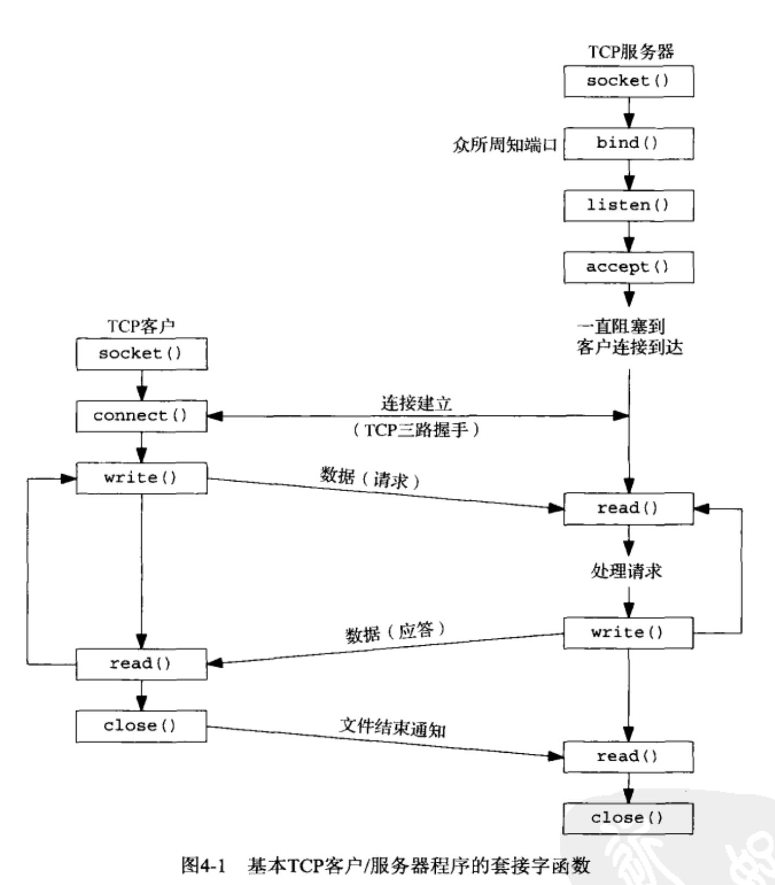

# 目录

- [基本TCP套接字编程](#基本TCP套接字编程)
  - [socket函数](#socket函数)
  - [connect函数](#connect函数)
  - [bind函数](#bind函数)
  - [listen函数](#listen函数)
  - [accept函数](#accept函数)
  - [close函数](#close函数)


# 基本TCP套接字编程

**`long  open_max = sysconf(_SC_OPEN_MAX);`  获取当前系统描述符的最大数目.**

**通过 `getrlimit和 setrlimit` 两个函数来获取和调整 进程打开描述符的上限.**

## socket函数

**为了执行网络 I/O ,一个进程必须做的第一件事情就是调用 socket 函数, 指定期望的通信协议类型 (使用 IPv4的 TCP, 使用 IPv6 的UDP, Unix 域字节流协议等).**

```c
#include <sys/types.h>
#include <sys/socket.h>

int socket(int family, int type, int protocol);

      family 参数:  协议族   AF_INET        ipv4网域  
                           AF_INET6       ipv6网域
			   	                 AF_LOCAL       Unix域协议(本地套接字),取代了AF_UNIX
			   	                 AF_ROUTE       路由套接字
			   	                 AF_KEY         密钥套接字
      type  参数:  指定采用的哪种协议,也就是套接字的类型.
      								SOCK_STREAM   字节流套接字, TCP 会采用
      								SOCK_DGRAM    数据报套接字, UDP 会采用
                      SOCK_SEQPACKET     有序分组套接字, SCTP 会采用
      								SOCK_RAW      原始套接字, 允许对底层协议的直接访问, 用于新网络协议测试
      protocol  参数: 给0 就好了, 表示按给定的域和套接字类型选择默认协议. 下面都是0表示的常值.
                         IPPROTO_TCP   TCP传输协议,
                         IPPROTO_UDP   UDP传输协议
                         IPPROTO_SCTP  SCTP传输协议
	 返回值:  是一个文件描述符, (就是个套接字)可以使用IO 文件操作来进行读写.  否则-1
           创建出来的返回值就是套接字.

famil和type参数组合规则:
	SOCK_STREAM 可以和: AF_INET, AF_INET6, AF_LOCAL 组合,表示TCP/SCTP使用IPv4/v6以及本地套接字
	SOCK_DGRAM  可以和: AF_INET, AF_INET6, AF_LOCAL 组合,表示UDP使用IPv4/v6 以及本地套接字
  SOCK_SEQPACKET 可以和: AF_INET, AF_INET6, AF_LOCAL 组合,表示SCTP使用IPv4/v6 以及本地套接字
  SOCK_RAW 可以和: AF_INET, AF_INET6, AF_ROUTE, AF_KEY 组合,表示直接使用IPv4/v6的底层协议套接字.

/************************************************************/    
范例:  int lfd = socket(AF_INET, SOCK_STREAM, 0);
```



## connect函数

**TCP客户用`connect` 函数来建立与 TCP 服务器的连接.**

```c
#include<sys/socket.h>

创建与指定外部端口的连接 (一般是客户端用来连接服务端的函数)
   (当connect 出现任何错误时, 必须用 close 关闭 sockfd 套接字 )
int connect(int sockfd, const struct sockaddr* servaddr, socklen_t addrlen);
                sockfd  参数: 套接字,是socket函数返回的套接字描述符
                servaddr参数: 服务器端的IP和端口的结构体,struct sockaddr 
                addrlen 参数: 第二个参数的长度
        返回值: 成功返回0 ,否则-1, 并且把error设置一个值.
          	 - 若TCP客户端没有收到 SYN分节的相遇,则返回 ETIMEDOUT错误.(73秒后才会出错)
             - 若对客户端的SYN的响应时RST(复位),表明该服务器主机在指定的端口上没有进程在等待与之
                  连接(服务器进程没有运行),这是一种硬错误,客户收到RST立刻返回 ECONNREFUSED错误.
             - 某个路由引发ICMP错误,进程会把ICMP错误作为 EHOSTUNREACH 或 ENETUNREACH 返回. 

    范例:    struct sockaddr_in server;
            connect(lfd, (struct sockaddr*)&server, sizeof(server));
```

## bind函数

**bind函数把一个 `本地协议地址` 赋予一个套接字.**

**`协议地址`是 32位的IPv4地址或128位的IPv6地址 与16位TCP或UDP端口号的组合.**

- TCP 服务器端 (可以指定全部端口和IP,也可以都不指定)
  - IP
    - 指定IP :  只接收目的地为指定IP地址的客户端连接(这个IP必须是主机的网络接口之一)
    - 不指定IP:  表示接收所有到该主机的任何一个网络接口的客户端连接
  - 端口
    - 指定端口  : 只接受来自这个端口的连接信息(SYN)
    - 不指定端口: 内核会为相应的套接字选择一个临时端口, 通常是不可预测的.(`只有RPC(远程过程调用)服务器会用`)
      - 可以使用 `getsockname` 函数 ,来得到内核所选择临时端口值,也就是返回 **协议地址**.

```c
#include<sys/socket.h>
将本地的IP 和端口 与创建出的套接字绑定 (客户端不需要绑定, 只有服务端需要)
int bind( int scokfd, const struct sockaddr* myaddr, socklen_t addrlen);
    sockfd  参数: 创建出的文件描述符
    myaddr  参数: 端口和IP  (是个结构体),可以使用 sockaddr_in 强转 sockaddr 来使用.
      					 如果端口参数为0,则内核会临时指定一个端口.
                 如果地址为通配地址,那么内核等到套接字已连接(TCP),或发送数据,才选择一个本地IP地址
                    IPv4通配地址由 INADDR_ANY 指定(值),serv.sin_addr.s_addr=htonl(INADDR_ANY);
                    IPv6通配地址由 in6addr_any 指定(结构),serv.sin6_addr=in6addr_any;
    addrlen 参数: sockaddr 结构体的长度.
 返回值: 成功返回 0
        失败返回-1, 并且把error设置一个值
         常见的错误返回值是 EADDRINUSE 地址已使用(用端口复用即可解决)
        
 范例:   struct sockaddr_in server;  
         bind(lfd, (struct sockaddr*)&server, sizeof(server)); 
```


## listen函数

listen 仅由 TCP 服务器调用. 他做两件事情

- 将默认的主动套接字转换成一个被动套接字, 指示内核应该接收指向该套接字的连接请求.
  - 会导致套接字从 CLOSED 状态转换到 LISTEN 状态
- 该函数的第二个参数规定了内核应该为该套接字排队的最大连接个数.
  - **这个最大个数是 `未完成连接队列`和`已完成连接队列` 之和**
    - `未完成连接队列` : SYN分节请求已到达服务器,但是服务器正在等待完成相应的TCP三次握手过程, 这些套接字处于 SYN_RCVD 状态
      - 三路握手正常完成的前提下, 未完成队列中的任何一项在其中的存留时间就是一个RTT (也就是187ms)
    - `已完成连接队列`: 每个已完成TCP三次握手的客户对应其中一项, 这些套接字处于 ESTABLISHED 状态 
  - **当这两个队列已满后,又来了一个新的SYN,那么TCP会忽略他,并不会返回 RST分节.(绝对不要返回RST分节).**
  - **在三次握手之后,但在服务器调用 `accept`之前 到达的数据应该由服务器TCP排队,最大数据量为相应已连接套接字的接收缓冲区大小.**
- ==**监听套接字也许有一个套接字接收缓冲区大小,但他绝对不会接收数据.**==

```c
#include<sys/socket.h>
设置监听同时连接到服务器的客户端的个数
 int listen(int sockfd, int backlog);
                sockfd  参数: socket函数创建出来的文件描述符
                backlong参数: 连接个数,是 未完成连接队列和已完成连接队列 之和,也就是 128
        返回值: 成功返回 0
               失败返回-1, 并且把error设置一个值

    范例:   listen(fd, 20);
```


## accept函数

**accept 由TCP服务器调用, 用于从已完成连接队列 队头返回下一个已完成的连接. 如果已完成队列为空,那么进程被投入睡眠.(默认套接字是阻塞方式)**

**`accept`会对客户端引起一个已建立连接的非致命中断返回,`errno`的值会被设置为`ECONNABORTED`, 处理方法 : 重新调用 `accept`即可.**

```c
#include <sys/socketc.h>
阻塞等待客户端连接请求,并接受连接 (阻塞函数)
int accept(int sockfd, struct sockaddr *cliaddr, socklen_t* addrlen);
         sockfd  参数: 文件描述符, 使用socket 创建出的 监听套接字描述符                      
         cliaddr 参数: 存储客户端的端口和IP, 传出参数.协议地址
         addrlen 参数: 传入传出参数. (是cliaddr 的字节数大小),必须另行指定.

        返回值: 返回的是一个全新的套接字描述符, 对应客户端TCP连接的已连接描述符
                服务器端与客户端进程通信使用 accept 的返回值对应的套接字.
              如果失败则返回 -1 ,并且把errno 设置一个值.
            
* 如果该函数等待连接阻塞时,被信号中断了,那么errno会被设置成 EINTR ,并且返回 -1.那么解决方式是:
   int ffd = accept(lfd, (struct sockaddr*)&client, &len);   // 出现信号,然后去处理,回来之后就解除阻塞了
   while(ffd == -1 && errno == EINTR ){
        ffd = accept(lfd, (struct sockaddr*)&client, &len);   // 再来一次就可以了,
    }                                                         // 如果再次被信号中断,那也出不去循环.
    范例:    struct sockaddr_in client;
            socklen_t  len = sizeof(client);
            int cfd = accept(lfd,(struct sockaddr*)&client, &len);
```


## close函数

```c
#include <unistd.h>
int  close (int sockfd);
     关闭一个 TCP 套接字的默认行为是把该套接字标记成已关闭,然后立即返回到调用进程.
     当套接字的引用计数大于1的时候,是不会发送FIN结束标志给TCP连接的,可以使用 shutdown 函数来进行强制关闭.
     多并发服务器中, 子进程或子线程使用 shutdown 函数来关闭套接字会更加合适.不会出现描述符耗尽问题.
```


