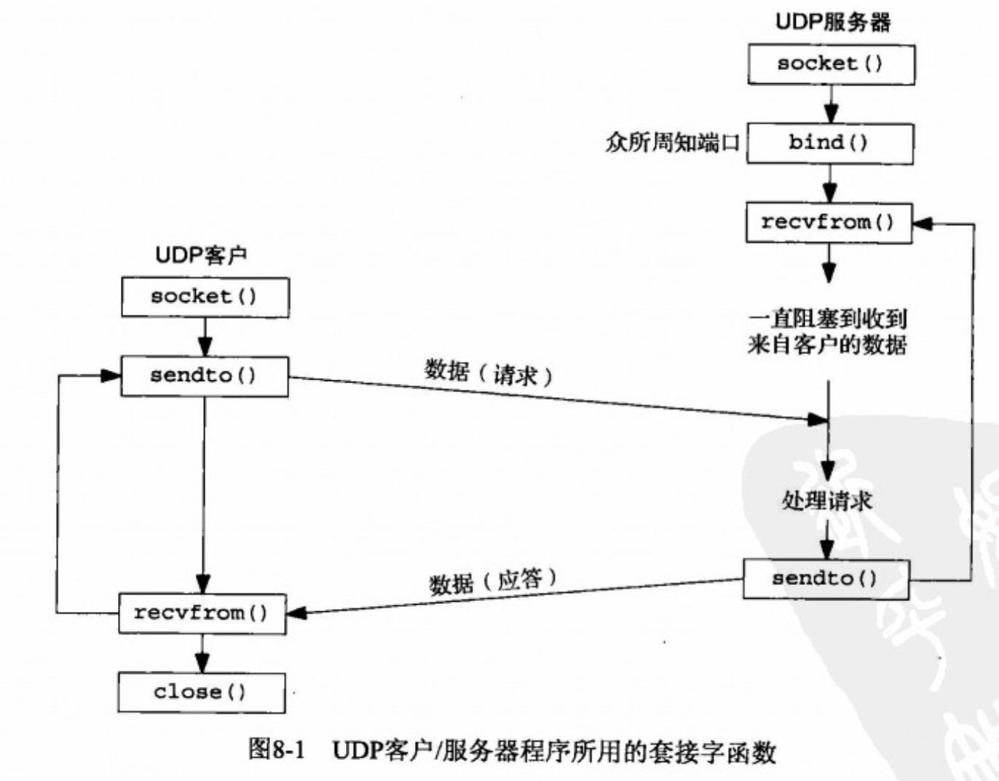

# 目录

- [基本UDP套接字编程](#基本UDP套接字编程)
- [recvfrom函数和sendto函数](#recvfrom函数和sendto函数)
- [UDP的connect函数](#UDP的connect函数)
  - [给一个UDP套接字多次调用connect](#给一个UDP套接字多次调用connect)
- [使用select函数的TCP和UDP回射服务器程序](#使用select函数的TCP和UDP回射服务器程序)
- [小结](#小结)
- [简单UDP通讯服务器端](#简单UDP通讯服务器端)
- [简单UDP通讯客户端](#简单UDP通讯客户端)


- ==**`/etc/resolv.conf`  文件保存了DNS服务器主机的IP地址.**==
  - **当客户端只设置了一个DNS 服务器IP时,会默认调用 已连接套接字来进行通信, 设置了多个DNS服务器IP时, 就要使用 未连接套接字来进行通信了.**
  - **NDS服务器是不可以调用 `connect` 来设置UDP套接字的**
- ==**MAXOS 最大的UDP接收缓冲区是7Mb**==
  - **虽然可以设置还这么大的值, 但还是会被发送端的UDP数据报淹没, 也就是说会丢包.**
- ==**MAXOS 最大的UDP一次性发送的字段长度为 65507字节,一次性接收也是这么多**==
  - **IPv4的数据报最大为65535字节, (16位总长度字段限定), IPv4首部需要20字节, UDP首部需要8字节**
    - ==**留给UDP用户数据最大为 65507字节.**==
  - **IPv6没有任何拓展首部, 扣除IPv6首部的净荷字段后最大为65535字节,在扣除8字节UDP首部.**
    - ==**留给UDP用户数据最大为 65527字节.**==
  - ==虽然可以发送这么大的数据报,但是在经过路由的时候,可能会发生分片或者直接丢弃, IP支持的重组缓冲区大小只有576字节.==
- ==**使用 `sudo netstat -s` 可以查看收到的数据报的数量和详细信息**==
  - **在这个命令的输出中寻找 `dropped due to full socket buffers`  ,代表的是 因套接字缓冲区满而丢弃的计数器的值**

# 基本UDP套接字编程

UDP是无连接不可靠的数据报协议.

UDP编程的常见应用程序有 : DNS(域名系统), NFS(网络文件系统), SNMP(简单网络管理协议)

- ==**客户端使用 `endto` 函数给服务器发送数据报. 必须指定目的地(服务器)**==
- **服务器使用 `recvfrom` 函数, 等待来自某个客户的数据到达, 然后使用`sendto` 将与所接受的数据报一道返回客户的协议地址.**
- **UDP 不存在EOF之类的内容**
- **UDP 接收缓冲区会依照 FIFO(先进先出) 规则来顺序返回进程,可使用`SO_RCVBUF`套接字选项增大缓冲区**
- **基本原则:**
  - **对于一个UDP套接字, 由它引发的异步错误并不返回给它, 除非它已连接.(`connect`)**
  - **给UDP套接字调用 `connect` 的结果是, 内核检查是否存在立即可知的错误(例如 ICMP), 记录对端的IP地址和端口号(套接字结构体),然后立即返回到调用进程.**
- ==**客户端的临时端口是在第一次调用 `sendto` 时由内核一次性指定的.**==
  - ==**如果客户捆绑了一个IP在其套接字上, 但是内核决定外出数据报必须从另一个数据链路发出, 这个时候IP数据报将包含一个不同于外出链路IP地址的源IP地址.**==
- **如果客户端连接的服务器并未运行UDP服务器程序.那么将返回 ICMP(端口不可达错误). 必须使用一个已连接的UDP套接字来接受错误.**
- ==**只有已连接的套接字才会返回 异步错误.**==
  - ==**异步错误: 就是ICMP(端口不可达) 错误, 这个错误无法通过无连接套接字返回和接收.**==



## recvfrom函数和sendto函数

**这两个函数类似于 `read`和 `write` 函数, 只不过是需要三个额外参数.**

==**无论应用请求多大的缓冲区`(nbytes参数)` ,`recvfrom` 绝不会返回多于1个数据报的数据**==

```c
#include <sys/socket.h>
ssize_t recvfrom( int sockfd, void* buff, size_t nbytes, int flags,
                 struct sockaddr* from, socklen_t* addrlen);
ssize_t sendto  ( int sockfd, const void* buff, size_t nbytes, int flags,
                 const struct sockaddr* to, socklen_t addrlen);

	参数:  sockfd : UDP套接字
         buff  : 发送或接收数据的缓冲区的指针
         nbytes: 读写字节数,不会超过buff缓冲区大小
         flags :   MSG_OOB   处理 外带数据
                   MSG_PEEK  偷看传入的消息
                   MSG_WAITALL  等待完整的请求或错误
                   一般这个参数给0即可.
         from  : 传出参数, 数据报发送者的协议地址和端口号.
                (该参数可以为空指针,但是addrlen也必须为空指针,表示不关心数据发送者的协议地址,但有风险)
         to    : 指向一个含有数据报 接收者的协议地址(地址及端口号)的套接字地址结构.(传入参数)
         addrlen: 指定from和to 的地址结构长度.(recvfrom是传出指针参数, sendto是传入普通参数)

 返回值: 允许发送空的UDP数据报,也就是说返回0 是正常的. 
        对于TCP套接字，返回值0表示对等方已关闭其连接的一半。
        出错返回 -1 
        TCP和UDP已连接套接字使用sendto发送数据报时 不可以指定地址(to)和长度(addrlen),否则返回 EISCONN 错误
        sendto 应该返回已发送的字节数. 否则出错
        recvfrom 应该返回已接收到的字节数
```

==**可使用 `sudo tcpdump -i lo0 -v` 命令来监视和查看UDP/TCP 数据报内容. (lo0  是回环网卡,也就是接口)**==

- 使用 `recvfrom` 可以获得 来自客户的IP数据报中的  源IP地址和源端口号 (客户端的IP地址和端口号)
- 使用 `recvmsg` 可以获得 来自客户的IP数据报中的 目的IP地址.   (服务器的IP地址)
- 使用 `getsockname` 可以获得 来自客户的IP数据报中的 目的端口号.(服务器的端口号)


## UDP的connect函数

==**给UDP套接字调用 `connect` 的结果是:  内核检查是否存在立即可知的错误(例如 ICMP), 记录对端的IP地址和端口号(放入套接字结构体),然后立即返回到调用进程.**==


- **未连接 UDP套接字, 新创建UDP套接字默认如此**
- **已连接 UDP套接字, 对UDP套接字调用 `connect` 的结果**
  - **只有已连接套接字才会返回异步错误.**
- ==**还可用来确定某个特定目的地的外出接口**==
- **已连接UDP套接字 与 未连接UDP套接字的变化:**
  - **不可以给输出操作指定目的IP地址和端口号, 也就是可以不使用 `sendto` 函数了, 而改用 `write`或`send` 函数, 写到已连接UDP套接字上的任何内容都自动发送到由 `connect` 函数指定的协议地址.**
  - **不必使用`recvfrom` 获取数据报的发送者, 而改用 `read, recv, recvmsg` . 一个已连接UDP套接字 仅仅能与一个 IP地址交换数据报(包括多播或广播地址)**
  - **由已连接UDP套接字引发的异步错误 会返回给他们所在的进程,而未连接UDP套接字不接受任何异步错误**
  - ==**未连接DUP套接字不可以使用 `write`或`send`, 以及不指定目的地址的`sendto`, 否则返回 EDESTADDREQ 错误**==
  - **`connect` 只是一个本地操作, 只是保存对端的IP地址和端口号. 并不会向对端发送任何信息.**
    - ==**未绑定本地端口号和地址的套接字`(没有调用过bind)`在调用`connect`之后 内核就会给套接字指派一个临时的IP和端口.**==
  - **TCP和UDP已连接套接字使用`sendto`发送数据报时 不可以指定地址和长度,否则返回 EISCONN 错误**
- **客户端应用进程首先调用`connect` 指定对端的IP和端口号, 然后使用 `read` 和 `write` 与对端进程交换数据**
  - **服务器与客户端都可以使用 `connect` 来指定对端并进行长时间通信.(TFTP 就是这样的).**
- **当客户端只设置了一个DNS 服务器IP时,会默认调用 已连接套接字来进行通信, 设置了多个DNS服务器IP时, 就要使用 未连接套接字来进行通信了.**
- **已连接套接字的性能比未连接套接字的性能会提高三分之一.**
  - 当未连接套接字使用`sendto` 时, 内核会复制两次含有目的地IP地址和端口号的套接字地址结构到内核.
  - 已连接套接字使用 `write` 时, 内核仅仅复制一次IP地址和端口的套接字地址结构到内核.
- ==***如果客户端的已连接套接字给服务器端发送了一条数据,但是服务器并没有启动服务程序, 那么客户端会在 `write` 函数调用之后收到 服务器返回的一个 ICMP 错误.(`TCP也是一样, RST分节`) ECONNREFUSED***==


#### 给一个UDP套接字多次调用connect

- 可以对已连接的套接字再次调用`connect` 函数, 从而达到以下两种目的
  - 指定新的IP地址和端口号
  - 断开套接字
    - 将地址结构清0, 并把参数中的 `sin_family` 修改为 AF_UNSPEC, 即可断开套接字
      - 这样做会导致返回一个 EAFNOSUPPORT错误, 可以忽略.

```c
/* 客户端 */
#include <stdio.h>
#include <string.h>
#include <sys/socket.h>
#include <netinet/in.h>
#include <strings.h>
#include <stdlib.h>
#include <arpa/inet.h>
#include <sys/types.h>
#include <sys/errno.h>
#define  SERV_PORT  9987

int
main(int argc, char* argv[]){
    int        sockfd;
    socklen_t  len;
    struct sockaddr_in  cliaddr, servaddr;
        
    char strl[46] = { [0 ... 45] = 0 };
    if (argc != 2){
        fprintf(stderr,"uasge: udpcli <IPaddress>");
        exit(1);
    }
    sockfd = socket(AF_INET, SOCK_DGRAM, 0);
    memset(&servaddr, 0, sizeof(struct sockaddr_in));
    servaddr.sin_family = AF_INET;
    servaddr.sin_port = htons(SERV_PORT);
    inet_pton(AF_INET, argv[1], &servaddr.sin_addr);
    connect(sockfd, (struct sockaddr*)&servaddr, sizeof(servaddr));
    
    len = sizeof(cliaddr);
    getsockname(sockfd, (struct sockaddr*)&cliaddr, &len);
    printf("local address %s:%d\n", 
           inet_ntop(AF_INET, &cliaddr.sin_addr, strl, 46),ntohs(cliaddr.sin_port));
    exit(0);
}
```


### 使用select函数的TCP和UDP回射服务器程序

```c
#include "unp.h"
int
main(int argc, char* argv[])
{
    int      listenfd, connfd, udpfd, nready, maxfdp1;
    char     mesg[MAXLINE] = { [ 0 ... MAXLINE-1] = 0 };
    pid_t    childpid;    // 子进程
    fd_set   rset;        // 信号
    ssize_t  n;
    socklen_t  len;
    const int on = 1;
    struct sockaddr_in cliaddr, servaddr;
    void sig_chld(int);     // 非阻塞 回收已终止的子进程
        /* 创建TCP套接字并绑定 */
    listenfd = socket(AF_INET, SOCK_STREAM, 0  );
    memset(&servaddr, 0, sizeof(struct sockaddr_in));
    servaddr.sin_family = AF_INET;
    servaddr.sin_port   = htons(SERV_PORT);     //SERV_PORT 9877
    servaddr.sin_addr.s_addr = htonl(INADDR_ANY);
    Setsockopt(listenfd, SOL_SOCKET, SO_REUSEADDR, &on, sizeof(on)); // 端口复用,防止该端口上已有连接存在
    Bind(listenfd, (struct sockaddr*)&servaddr, sizeof(servaddr));
    Listen(listenfd, LISTENQ);  // LISTENQ        1024
        /* 创建UDP套接字 */
    udpfd = Socket(AF_INET, SOCK_DGRAM, 0);
    memset(&servaddr, 0, sizeof(struct sockaddr_in));
    servaddr.sin_family = AF_INET;
    servaddr.sin_port   = htons(SERV_PORT);     //SERV_PORT 9877
    servaddr.sin_addr.s_addr = htonl(INADDR_ANY);
    Bind(udpfd, (struct sockaddr*)&servaddr, sizeof(servaddr));  //绑定UDP套接字
    
    Signal(SIGCHLD, sig_chld);   // 必须调用 waitpid() 函数
    FD_ZERO(&rset);
    maxfdp1 = max(listenfd, udpfd) +1 ; // 最大描述符 +1
    for (;;){
        FD_SET(listenfd, &rset);
        FD_SET(udpfd, &rset);
        if ( (nready = select(maxfdp1, &rset, NULL, NULL, NULL)) < 0) {// 轮询, 无阻塞
            if (errno == EINTR)
                continue;
            else
                err_sys("select error");
        }
        if (FD_ISSET(listenfd, &rset)){ // 是否来了新TCP的连接
            len = sizeof(cliaddr);
            connfd = Accept(listenfd, (struct sockaddr*)&cliaddr, &len);
            if ( (childpid = Fork()) == 0){  // 进入子进程.
                Close(listenfd);
                str_echo(connfd);
                exit(0);
            }
            Close(connfd);
        }
        if (FD_ISSET(udpfd, &rset)){
            len = sizeof(cliaddr);
            n = Recvfrom(udpfd, mesg, MAXLINE, 0, (struct sockaddr*)&cliaddr, &len);
            printf("n = %ld\n ",n);
            Sendto(udpfd, mesg, n, 0,(struct sockaddr*)&cliaddr, len);
        }
    }
}
```


## 小结

- UDP套接字可能产生异步错误, 必须是已连接的UDP套接字才可以接受到这些错误.
- UDP没有流量控制, 很容易淹没 发送缓冲区和接收缓冲区
- ==`ping` 命令可以通过参数来获得ICMP消息==
  - -v 参数就可以获得 ICMP消息.
  - `-i  60` 可以指定每60秒就发送一次发组. 也就是发送分组的频率


## 简单UDP通讯服务器端

```c
#include <stdio.h>
#include <stdlib.h>
#include <string.h>
#include <sys/types.h>
#include <sys/socket.h>
#include <sys/syslimits.h>
#include <arpa/inet.h>
#include <sys/errno.h>
#include <netinet/in.h>

#define S_UDP_PORT  8890
#define MAXLIEN     7340032
int
main(void){
    int     udpfd, n, rcvlen;
    char    buf[MAXLIEN];
    char    clip[40] = { [ 0 ... 39] = 0 };
    socklen_t  len, flag;
    struct sockaddr_in  server,client;
    ssize_t  red;
    
    rcvlen = MAXLIEN;
    n = 1;
    
    memset(&server, 0, sizeof(struct sockaddr_in));
    memset(&client, 0, sizeof(struct sockaddr_in));

    // UDP服务器IP 192.168.0.230  端口 8890
    if ( inet_pton(AF_INET, "192.168.0.230", &server.sin_addr.s_addr) <= 0){
        fprintf(stderr, "FUNCTION: inet_pton(127.0.0.1) error line = %d; errno = %s,\n", __LINE__ ,strerror(errno) );
        exit(errno);
    }
    
    // 本服务器监听 8890端口
    server.sin_port = htons(S_UDP_PORT);  // 8890
    server.sin_family = AF_INET;
    
    if ( (udpfd = socket(AF_INET, SOCK_DGRAM, 0)) < 0){
        fprintf(stderr, "FUNCTION: socket error line = %d; errno = %s,\n", __LINE__ ,strerror(errno));
        exit(errno);
    }
    
    if ( setsockopt(udpfd, SOL_SOCKET, SO_REUSEADDR , &n, sizeof(n)) < 0){
        fprintf(stderr, "FUNCTION: setsockopt(SO_REUSEADDR  ) error line = %d; errno = %s,\n", __LINE__ ,strerror(errno));
        shutdown(udpfd, SHUT_RDWR);
        exit(errno);
    }
    
    if ( setsockopt(udpfd, SOL_SOCKET, SO_REUSEPORT, &n, sizeof(n)) < 0){
        fprintf(stderr, "FUNCTION: setsockopt(SO_REUSEPORT ) error line = %d; errno = %s,\n", __LINE__ ,strerror(errno));
        shutdown(udpfd, SHUT_RDWR);
        exit(errno);
    }
    
    if ( setsockopt(udpfd, SOL_SOCKET, SO_RCVBUF, &rcvlen, sizeof(rcvlen)) < 0){
        fprintf(stderr, "FUNCTION: setsockopt(SO_RCVBUF) error line = %d; errno = %s,\n", __LINE__ ,strerror(errno));
        shutdown(udpfd, SHUT_RDWR);
        exit(errno);
    }

    
    if ( getsockopt(udpfd, SOL_SOCKET, SO_RCVBUF, &rcvlen, &flag ) < 0 ){
        fprintf(stderr, "FUNCTION: getsockopt(SO_SNDBUF) error line = %d; errno = %s,\n", __LINE__ ,strerror(errno) );
        shutdown(udpfd, SHUT_RDWR);
        exit(errno);
    }
    else
        fprintf(stdout ,"当前套接字接收缓冲区为 %d \n", rcvlen);
    
    if ( bind(udpfd, (struct sockaddr*)&server, sizeof(struct sockaddr)) < 0 ){
        fprintf(stderr, "FUNCTION: bind(server) error line = %d; errno = %s,\n", __LINE__ ,strerror(errno) );
        shutdown(udpfd, SHUT_RDWR);
        exit(errno);
    }
    
    int pp = 1 ;
    for ( ;; ){
        printf("\t已启动\n");
        len = sizeof(client);
        red = recvfrom(udpfd, buf, MAXLIEN, 0, (struct sockaddr*)&client, &len);
        if ( inet_ntop(AF_INET, &client.sin_addr, clip, 40)  == NULL )
            fprintf(stderr, "错误,没有读取到客户端的IP地址\n");
        else
            printf("客户端IP : %s, 端口号: %d\n", clip, ntohs(client.sin_port));
        printf("\t\t收到的数据长度为: %ld 字节, %.5s \n",red,buf);
        printf("\n\t进入下次循环 %d \n", pp++);
    }
    
    return 0;
}
```


## 简单UDP通讯客户端

```c
#include <stdio.h>
#include <string.h>
#include <sys/socket.h>
#include <sys/types.h>
#include <stdlib.h>
#include <arpa/inet.h>
#include <netinet/in.h>
#include <unistd.h>
#include <sys/errno.h>
#include <limits.h>
#include <sys/syslimits.h>

#define  C_UDP_PORT    8891
#define  S_UDP_PORT    8890

#define  MAXLEN        65507

int main(void){
    int        udpfd, n, senbuf, resenbuf;
    char       buf[MAXLEN]= { [0 ... MAXLEN-2]='a','\0' };
    ssize_t    len ;
    socklen_t  flag, l;
    
    struct sockaddr_in  client, server;
    
    senbuf = MAXLEN;
    resenbuf = 0;
    l = sizeof(resenbuf);
    memset(&client, 0, sizeof(struct sockaddr_in));
    memset(&server, 0, sizeof(struct sockaddr_in));
    
    // UDP本地IP 192.168.0.230 端口 8891
    if ( inet_pton(AF_INET, "192.168.0.230", &client.sin_addr.s_addr) <= 0){
        fprintf(stderr, "FUNCTION: inet_pton(127.0.0.1) error line = %d; errno = %s,\n", __LINE__ ,strerror(errno) );
        exit(errno);
    }
    // UDP服务器IP 192.168.0.230 端口 8890
    if ( inet_pton(AF_INET, "192.168.0.230", &server.sin_addr.s_addr) <= 0){
        fprintf(stderr, "FUNCTION: inet_pton(192.168.0.228) error line = %d; errno = %s,\n", __LINE__ ,strerror(errno) );
        exit(errno);
    }
    server.sin_port = htons(S_UDP_PORT);  // 8890
    server.sin_family = AF_INET;
    
    client.sin_family = AF_INET;
    client.sin_port   = htons(C_UDP_PORT);  // 8891
    
    
    if ( (udpfd = socket(AF_INET, SOCK_DGRAM, 0)) < 0){
        fprintf(stderr, "FUNCTION: socket error line = %d; errno = %s,\n", __LINE__ ,strerror(errno));
        exit(errno);
    }
    
    n = 1;
    if ( setsockopt(udpfd, SOL_SOCKET, SO_REUSEADDR , &n, sizeof(n)) < 0){
        fprintf(stderr, "FUNCTION: setsockopt(SO_REUSEADDR ) error line = %d; errno = %s,\n", __LINE__ ,strerror(errno));
        shutdown(udpfd, SHUT_RDWR);
        exit(errno);
    }
    if ( setsockopt(udpfd, SOL_SOCKET,  SO_REUSEPORT, &n, sizeof(n)) < 0){
        fprintf(stderr, "FUNCTION: setsockopt( SO_REUSEPORT) error line = %d; errno = %s,\n", __LINE__ ,strerror(errno));
        shutdown(udpfd, SHUT_RDWR);
        exit(errno);
    }
    
    if ( setsockopt(udpfd, SOL_SOCKET, SO_SNDBUF, &senbuf, sizeof(senbuf)) < 0){
        fprintf(stderr, "FUNCTION: setsockopt(SO_SNDBUF) error line = %d; errno = %s,\n", __LINE__ ,strerror(errno) );
        shutdown(udpfd, SHUT_RDWR);
        exit(errno);
    }
        
    if ( getsockopt(udpfd, SOL_SOCKET, SO_SNDBUF, &resenbuf, &flag ) < 0 ){
        fprintf(stderr, "FUNCTION: getsockopt(SO_SNDBUF) error line = %d; errno = %s,\n", __LINE__ ,strerror(errno) );
        shutdown(udpfd, SHUT_RDWR);
        exit(errno);
    }
    else
        fprintf(stdout ,"当前套接字发送缓冲区为 %d \n", resenbuf);
    
    if ( bind(udpfd, (struct sockaddr*)&client, sizeof(struct sockaddr)) < 0 ){
        fprintf(stderr, "FUNCTION: bind(client) error line = %d; errno = %s,\n", __LINE__ ,strerror(errno) );
        shutdown(udpfd, SHUT_RDWR);
        exit(errno);
        
    }
    
    if ( connect(udpfd, (struct sockaddr*)&server, sizeof(struct sockaddr)) < 0){
        fprintf(stderr, "FUNCTION: connect(server) error line = %d; errno = %s,\n", __LINE__ ,strerror(errno) );
        shutdown(udpfd, SHUT_RDWR);
        exit(errno);
    }
    
    // 用本地绑定的 127.0.0.1 ,向服务器 192.168.0.230发送数据.
    for ( ;; ){
        
        printf("没有出错, 开始发送长度为 %lu 的数据报\n",strlen(buf));
        if( (len = write(udpfd, buf, MAXLEN) ) < 0){
            if( errno == EINTR && len == -1 ){
                sleep(10);
                continue;
            }
            else{
                shutdown(udpfd, SHUT_RDWR);
                exit(errno);
            }
        }
        sleep(3);
    }
}
```

