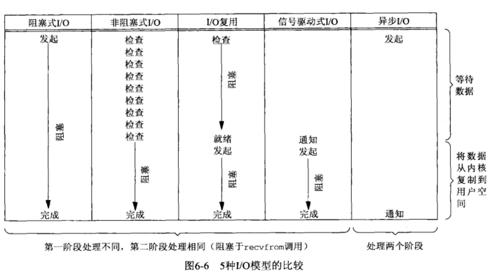

# 目录

- [套接字编程](#套接字编程)
  - [套接字地址结构](#套接字地址结构)
  - [IPv4 套接字地址结构](#IPv4套接字地址结构)
  - [IPv6 套接字地址结构](#IPv6套接字地址结构)
  - [通用套接字地址结构 (很有用,函数都是需要这个类型的参数)](#通用套接字地址结构(很有用,函数都是需要这个类型的参数))
    - [旧的](#旧的)
    - [新的(可以承载系统支持的任何套接字地址结构)](#新的(可以承载系统支持的任何套接字地址结构))
  - [值- 结果参数](#值-结果参数)
  - [字节排序函数(端口和地址进行网络字节序和本地字节序转换)](#字节排序函数(端口和地址进行网络字节序和本地字节序转换))
  - [字节操纵函数(对套接字地址结构体进行处理)](#字节操纵函数(对套接字地址结构体进行处理))
  - [IP地址转换函数(ASCII地址字符串和网络字节序互转)](#IP地址转换函数(ASCII地址字符串和网络字节序互转))
  - [I/O复用:select和poll函数](#I/O复用:select和poll函数)
    - [I/O 模型](#I/O模型)
    - [同步I/O和异步I/O对比](#同步I/O和异步I/O对比)
    - [select 函数和 pselect 函数(I/O复用)](#select函数和pselect函数(I/O复用))
    - [poll 函数](#poll函数)
    - [shutdown函数](#shutdown函数)
    - [使用poll函数的TCP回射服务器](#使用poll函数的TCP回射服务器)
- [多进程的fork和exec函数](#多进程的fork和exec函数)
- [获得已连接套接字的IP和端口信息](#获得已连接套接字的IP和端口信息)
  - [getsockname  和 getpeername 函数](#getsockname和getpeername函数)
- [POSIX 信号处理](#POSIX信号处理)
  - [signal,   sigmptyset,  sigaddset,  sigdelset,  sigismember,  sigprocmask,  sigpending,  sigaction](#signal,sigmptyset,sigaddset,sigdelset,sigismember,sigprocmask,sigpending,sigaction)
  - [处理 SIGCHLD 信号( 回收子进程)](#处理SIGCHLD信号(回收子进程))
  - [SIGPIPE信号(写在没有人读的管道上,可被捕获)](#SIGPIPE信号(写在没有人读的管道上,可被捕获))
- [处理僵死进程](#处理僵死进程)
  - [wait和waitpid函数](#wait和waitpid函数)
- [处理被中断的系统调用](#处理被中断的系统调用)
  - [errno==EINTR](#errno==EINTR)
- [服务器或客户端可能出现问题的状态和解决方式](#服务器或客户端可能出现问题的状态和解决方式)
  - [服务器进程终止(与客户端通信的子进程)](#服务器进程终止(与客户端通信的子进程))
  - [SIGPIPE信号(写在没有人读的管道上,可被捕获)](#SIGPIPE信号(写在没有人读的管道上,可被捕获))
  - [服务器主机崩溃](#服务器主机崩溃)
  - [服务器不可达](#服务器不可达)
  - [服务器主机崩溃后重启](#服务器主机崩溃后重启)
  - [服务器主机关机](#服务器主机关机)
- [数据格式](#数据格式)
- [小结](#小结)


- ==**连接失败的套接字必须关闭,绝对不可以再用**==
- ==**监听套接字也许有一个套接字接收缓冲区大小,但他绝对不会接收数据.**==

# 套接字编程

平台是 MACos10.15.2

## 套接字地址结构

地址转换函数在地址的文本表达和他们存放在套接字地址结构中的二进制之间进行转换. `inet_pton , iner_ntop`

**大多数套接字函数都需要一个指向套接字地址结构的指针作为参数,每个协议族都定义它自己的套接字地址结构. 这些结构的名字均以 `sockaddr_` 开头**

#### IPv4套接字地址结构

**以`sockaddr_in` 命名, 定义在 `<netinet/in.h>` 头文件中.(POSIX标准)**

```c
#include <netinet/in.h>      /* 或者  <arpa/inet.h> */
struct  in_addr{           
  	in_addr_t    s_addr;	  /* 32bit IPv4 地址 , 网络字节序, 大端法*/
};

struct sockaddr_in {      /* 保存套接字地址(网络字节序)*/
	__uint8_t       sin_len;      /* 结构长度 (unsigned char 1字节) */
	sa_family_t     sin_family;   /* IP协议族,IP4给 AF_INET, IP6给AF_INET6 */
	in_port_t       sin_port;     /* 2字节的 UDP或TCP 端口号 (网络字节序),0-65535 */
	struct in_addr  sin_addr;     /* 用来存储IPv4地址的结构体(网络字节序),定义在上面*/
	char            sin_zero[8];  /* 填充段,将结构长度垫到 sizeof（struct sockaddr）相同 */
};
```

| 数据类型    | 说明                                   | 头文件         |
| ----------- | -------------------------------------- | -------------- |
| int8_t      | 带符号的8位整数                        | <sys/types.h>  |
| uint8_t     | 无符号的8位整数                        | <sys/types.h>  |
| int16_t     | 带符号的16位整数                       | <sys/types.h>  |
| uint16_t    | 无符号的16位整数                       | <sys/types.h>  |
| int32_t     | 带符号的32位整数                       | <sys/types.h>  |
| uint32_t    | 无符号的32位整数                       | <sys/types.h>  |
| sa_family_t | 套接字地址结构的地址族, 一般为 uint8_t | <sys/socket.h> |
| socklen_t   | 套接字地址结构的长度,一般为 uint32_t   | <sys/socket.h> |
| in_addr_t   | IPv4 地址, 一般为 uint32_t             | <netinet/in.h> |
| in_port_t   | TCP或UDP端口, 一般为 uint16_t          | <netinet/in.h> |


#### IPv6套接字地址结构

- ==` 2408:84e5:280:1bcc:187c:d4b1:865b:1e9f` 标准的 IPv6地址,前面4个分段是64位前缀,后面是地址.==

```c
#include <netinet/in.h>
struct in6_addr {
  uint8_t   s6_addr[16];  	 /* 128bit 的 IPv6地址  (网络字节序)*/
};                           /* IPv6地址有8个字段,每个字段2字节 , uint8_t单位是一个字节*/

#define SIN6_LEN  /* 编译时测试所需定义 : 
								   * 如果系统支持套接字地址结构中的长度字段(sin6_len),那么 SIN6_LEN 常值必须定义
									 */
struct sockaddr_in6 {
  uint8_t         sin6_len;       /* 这个数据结构的长度 */
	sa_family_t     sin6_family;    /* 地址族, AF_INET6 (sa_family_t) */
	in_port_t       sin6_port;      /* 传输层端口, 就是端口号 (网络字节序)*/
	__uint32_t      sin6_flowinfo;  /* IP6 流信息,低20位是流标,高12位保留 */
	struct in6_addr sin6_addr;      /* IP6 地址 (网络字节序) */
	__uint32_t      sin6_scope_id;  /* 范围带索引 */
};
```


#### 通用套接字地址结构(很有用,函数都是需要这个类型的参数)

#### 旧的

```c
#include <sys/socket.h>
struct sockaddr {	       /* 对指向特定协议的套接字地址结构的指针执行类型强制转换 */
  uint8_t       sa_len;      /* 长度 */
  sa_family_t   sa_family;   /* 地址族, AF_INET, AF_INET6 */
  char          sa_data[14]; /* 协议指定地址(端口号和IP地址),可能比14字节更长 */
};
```

#### 新的(可以承载系统支持的任何套接字地址结构)

```c
#include <netinet/in.h>   /* 或者是 <sys/socket.h> */
struct sockaddr_storage {
  __uint8_t    ss_len;    /* 此结构的长度（取决于实现), 该结构总长度是 128字节*/
  sa_family_t  ss_family;  /* 地址协议族 , AF_INET , AF_INET6  */

  /*下面这些并不需要太过注意,只是保存内容的一种方式, 反正都是使用强制转换来读取的*/
  char                    __ss_pad1[_SS_PAD1SIZE];
	__int64_t       __ss_align;     /* force structure storage alignment */
	char                    __ss_pad2[_SS_PAD2SIZE];
};
```


#### 值-结果参数

- ==从进程到内核传递套接字地址结构的函数有三个==
  - **`bind, connect, sendto`**
    - 这些函数的一个参数是指向某个套接字地址结构的指针,另一个参数是该结构的整数大小
    - 既然指针和指针所指内容的大小都传递给了内核,于是内核知道到底需要从进程复制多少数据进来.
- ==从内核到进程传递套接字地址结构的函数有四个==
  - **`accept, recvfrom, getsockname, getpeername`**
    - 这四个函数中有两个参数是指向某个套接字地址结构的指针和指向表示该结构大小的整数变量的指针.
    - 当函数被调用时, 结构大小是一个值,他告诉内核结构的大小, 这样内核在写该结构时不至于越界; 当函数返回时, 结构大小又是一个结果, 它告诉进程内核在该结构中究竟存储了多少信息.


### 字节排序函数(端口和地址进行网络字节序和本地字节序转换)

```c
#include <netinet/in.h>    /* 或者 <arpa/inet.h> */ 
typedef unsigned int    uint32_t;
typedef unsigned short  uint16_t;

uint32_t htonl(uint32_t hostlong);        //本 转 网 IP    h  to n l
uint16_t htons(uint16_t hostshort);       //本 转 网 端口   h  to n s

uint32_t ntohl(uint32_t netlong);        //网 转 本 IP     n to h l
uint16_t ntohs(uint16_t netshort);       //网 转 本 端口    n to h s

/* h 代表 本地host,  n 代表 网络network  
 * s 代表 端口short, l 代表 地址long
 * IPv4 通配地址  INADDR_ANY
 * IPv6 通配地址  in6addr_any 结构.直接赋值,不需要转换.
 */

```

```c
    0                   1                   2                   3   
    0 1 2 3 4 5 6 7 8 9 0 1 2 3 4 5 6 7 8 9 0 1 2 3 4 5 6 7 8 9 0 1 
   +-+-+-+-+-+-+-+-+-+-+-+-+-+-+-+-+-+-+-+-+-+-+-+-+-+-+-+-+-+-+-+-+
   |Version|  IHL  |Type of Service|          Total Length         |
   +-+-+-+-+-+-+-+-+-+-+-+-+-+-+-+-+-+-+-+-+-+-+-+-+-+-+-+-+-+-+-+-+

/* 位序图, 按照从线缆上出现的顺序排列4个字节(32个位),最左边的位是最早出现的最高有效位(从0开始). */
```


### 字节操纵函数(对套接字地址结构体进行处理)

```C
/* 这个是  POSIX 提供的 , 以及不推荐使用了, 应该用 mem* 的ANSI C 函数 */
#include <strings.h>
void bzero (void* dest, size_t nbytes);      
	/* 将dest 中指定数目的字节设置为0 ,nbytes就是指定设置为0的字节参数 */

void bcopy (const void* src, void* dest, size_t nbytes);
	/* 将指定数目的字节从src 复制到 dest中, nbytes是指定数目的字节参数 */

int  bcmp  (const void* ptr1, const void* ptr2, size_t nbytes);
	/* 比较任意的字节串 ,nbytes是对比字节串的长度(选最短)
	 * 返回值: 相等返回0, 否则非0 
	 */
```

```c
#include <string.h>
void* memeset (void* dest, int c, size_t len);
	/* 把目标字节串(dest) 指定数目的字节(len) 设置成为参数 c 的值 */

void* memcpy (void* dest, const void* src, size_t nbytes);
	/* 将 src字节串的内容 拷贝到 dest中, 拷贝的长度为 nbytes字节 */

int memcmp (const void* ptr1, const void* ptr2, size_t nbytes);
	/* 比较两个任意的字节串, 若相同则返回0, 不同则返回非0, nbytes是需要对比的长度(取最短) */
```

### IP地址转换函数(ASCII地址字符串和网络字节序互转)

```c
#include <arpa/inet.h>
int inet_pton(int famuly, const char* src, void* dst);
	/*
        点分十进制字符串 转无符号int网络字节序(大端).
        	 famuly: 是IP地址协议族, AF_INET , AF_INET6
              src: 需要转换的十进制字符串
              dst: 接受转换完成的网络字节序,一般使用 struct in_addr 结构体来接收.
          返回值: 成功返回1, src参数非法则返回0, 出错返回-1
          			 当famuly 参数设置出错时会将errno 设置成 EAFNOSUPPORT 
   */    

const char* inet_ntop(int famuly, const void* src, char* dst, socklen_t size);
	/*
        无符号int网络字节序转点分十进制字符串 (ASCII码).
          famuly: 是IP地址协议族, AF_INET , AF_INET6
             src: 网络字节序地址, 一般还是 struct in_addr 结构体
             dst: 接受转换完成后的点分十进制地址字符串,字符串长度和size取值相同.
             size: 表示的是 dst 数组的大小. 应该取用 <netinet/in.h> 中的两个宏定义值:
             		      IPv4 : INET_ADDRSTRLEN    等于16
             		      IPv6 : INET6_ADDRSTRLEN   等于46
          返回值: 成功指向点分十进制字符串的指针(指向dst), 出错返回 NULL
           			 当famuly 参数设置出错时会将errno 设置成 EAFNOSUPPORT
                 如果 size 值过小,那么返回NULL, 将errno 设置为 ENOSPC
	*/

函数名中 p和n 分别代表 表达(字符串) 和数值(地址).
```


## I/O复用:select和poll函数

进程拥有多个描述符以及阻塞函数时,应该需要一种预先告知内核的内容,使得内核一旦发现进程制定的一个或多个 I/O 条件就绪(也就是说输入已经准备好读取, 或者描述符已能承接更多的输出) , 他就通知进程, 这个能力称为 **I/O复用**, (轮询设备机制比这个更先进)

- ==**I/O 复用适用如下网络应用场合**==
  - **当客户处理多个描述符时,必须使用I/O复用**
  - 一个客户同时处理多个套接字是可能的,不过少见,而且效率不高
  - TCP服务器既要处理 监听套接字,又要处理已连接套接字,这个时候就要使用 I/O复用来达到目的.
  - 如果一个服务器既要处理TCP 又要处理UDP, 一般会使用 I/O复用
  - 如果一个服务器要处理多个服务或多个协议(守护进程) ,一般使用 I/O复用
  - I/O复用 并非只限于网络编程, 许多重要的应用程序也需要这项技术.


###  I/O模型

- **Unix 下可用的5 种 I/O 模型:**
  - **阻塞式 I/O**
    - `系统调用 -> 内核会将数据准备好,并且复制到用户空间 -> 复制完成 -> 返回`
  - **非阻塞式 I/O**
    - ==进程用一个非阻塞描述符循环调用系统调用询问数据是否准备完成的过程,称为轮询.==
    - `系统调用 <--> 无数据或有数据准备好 -> 复制数据报到用户空间 -> 复制完成 -> 返回`
  - **I/O复用(`select 和 poll`)**
    - 阻塞在 `select` 或 `poll` 这两个系统调用中的某一个之上,而不是阻塞于真正的I/O系统调用.
    - 优势: 可以等待多个描述符就绪.
    - `系统调用 -> 数据报准备好  -> 返回并复制数据到用户空间 -> 读数据的系统调用 -> 返回`
  - **信号驱动式 I/O (`SIGIO`)**
    - 首先开启套接字的信号驱动式I/O功能,然后让内核在描述符就绪时发送`SIGIO` 信号通知进程.
      - 通过信号处理程序中的系统调用来读取数据,并通知主循环来处理收到的数据.
    - 也是非阻塞的.
    - `信号处理程序  <--> 无数据并返回  -> 数据准备好 -> 信号处理程序返回 -> 读数据的系统调用  -> 复制数据到用户空间 -> 返回`
  - **异步 I/O (`POSIX的 aio_ 或 lio_ 系列函数`)**
    - 和信号驱动式相仿, 只不过告知的时 I/O操作何时完成, 已经将数据从内核写入了用户空间的某个缓冲区中了. 而且也会发送一个指定的信号来提示进程.
    - 给内核传递描述符, 缓冲区指针, 缓冲区大小 和 文件偏移, 并告诉内核当整个操作完成时如何通知进程. 而且期间不会阻塞进程.
    - `系统调用 <--> 无数据并返回 -> 数据准备好并复制到用户空间 -> 递交指定信号 -> 指定的信息处理程序`
- **区别:**
  - 前四种主要区别在第一阶段, 第二阶段是一样的.
    - **在数据从内核复制到调用者的缓冲区期间,进程阻塞与系统调用.**
    - 异步 I/O  在这两个阶段都要处理. 从而不同于其他4种模型


- **一个输入操作通常包括两个不同的阶段**
  - **等待数据准备好**
  - **从内核向进程复制数据**

### 同步I/O和异步I/O对比

- ==**同步 I/O 操作** : 导致请求进程阻塞, 直到 I/O 操作完成==
  - `阻塞式I/O模型, 非阻塞式I/O模型, I/O复用模型 , 信号驱动式I/O模型`  都是同步I/O模型
    - I/O 操作`(recvfrom函数)`将阻塞进程.
- ==**异步 I/O 操作** : 不导致请求进程阻塞.==
  - `异步I/O模型`  是异步I/O模型  (与 POSIX标准 定义相同)



### select函数和pselect函数(I/O复用)

- **`select `** 函数 ( 有丢失信号的风险 )
  - ==**必须使用  非阻塞套接字, 否则会出现永久阻塞的情况**==
  - 这个函数允许进程指示内核等待多个事件中的任何一个发生  (也就是阻塞)
    - 并只有在一个或多个事件发生或经历一段指定的时间后才唤醒它.
  - 该函数允许任何描述符的I/O复用. 不再局限于 流设备了( STREAMS device)
  - **引起`select`函数 返回套接字  就绪  的条件**
    - **满足下面4个条件之一时, 一个套接字就准备好 进行  读操作.**
      - **一. 该套接字接收缓冲区中的数据字节数大于套接字接收缓冲区低水位标记(缓冲区)的当前大小	**
        - 可以使用 `SO_RCVLOWAT`套接字选项设置该套接字的低水位标记, 低水位默认值是 1bytes(字节)
      - **二. 该套接字是一个监听套接字 且已完成的连接数不为0 , 对这样套接字的 `accept` 通常不会阻塞**
        - 也就是说监听套接字收到了一个连接请求过来的套接字.(客户端)
      - **三. 该连接的读半部关闭( `也就是接收了 FIN 的TCP连接`) .**
        - 对这样的套接字的读操作将不阻塞并返回0(`就是EOF`)
      - **四. 其上有一个套接字错误等待处理.**
        - 对这样的套接字的读操作将不阻塞并返回 -1, 同时把 errno 设置成确切的错误条件.
        - 这些待处理错误也可以通过指定`SO_ERROR` 套接字选项调用 `getsockopt` 获取并清除.
    - **满足下面4个条件之一时, 一个套接字就准备好 进行  写操作.**
      - **一 . 该套接字发送缓冲区中的可用空间字节数大于等于套接字发送缓冲区低水位标记的当前大小	(2048bytes), 并且或者该套接字已连接, 或者该套接字不需要连接(UDP)**
        - 把这样的套接字设置成非阻塞, 写操作时将不阻塞,并返回一个正值.
        - 使用 `SO_SNDLOWAT` 套接字选项来设置该套接字的低水位标记  (默认值是2048)
      - **二. 该连接的写半步关闭,  对这样套接字的写会产生 `SIGPIPE` 信号**
      - **三. 使用非阻塞式 `connect` 套接字已建立连接, 或者 `connect` 已经以失败告终.**
      - **四. 其上有一个套接字错误等待处理.**
        - ==对这样的套接字的写操作将不阻塞并返回 -1, 同时把 errno 设置成确切的错误条件.==
        - ==这些待处理错误也可以通过指定`SO_ERROR` 套接字选项调用 `getsockopt` 获取并清除.==
  - ==**当某个套接字发生错误时, 他将由 `select` 标记为既可读又可写.**==
    - ==**接收低水位标记和发送低水位标记的目的在于:  允许应用进程控制在 select 返回可读或可写条件之前有多少数据可读或者有多大可用空间用于写**==
    - **可以把接收低水平标记位设置为64, 防止少于64字节的数据准备好读时 `select` 唤醒进程**
  - ==**如果想增加 `select` 同时监听的套接字数量,那么需要修改`FD_SETSIZE` 宏的值, 并重新编译内核.**==
  - ==**可以使用 `fileno` 函数把 `FILE` 指针类型的值 转换成描述符,  来使用 `select` 函数**==
- **`pselect `  函数**
  - ==`pselect` 函数是由 POSIX 发明的==
  - ==执行期间会替换当前进程的阻塞信号集, 并且在执行之后会进行恢复.==

```c
#include <sys/select.h>
#include <signal>
#include <time.h>

int  select(int nfds,   fd_set *restrict readfds,   fd_set *restrict writefds,
            fd_set *restrict errorfds,    struct timeval *restrict timeout);


int  pselect(int nfds,  fd_set *restrict readfds,
              fd_set *restrict writefds,     fd_set *restrict errorfds,
              const struct timespec *restrict timeout,
              const sigset_t *restrict sigmask);


在调用这两个函数之前,必须重新初始化所传递的所有参数,再次调用前,也必须重新初始化参数.
/*  参数:
 *	 nfds : 指定待测试的 描述符集合 中的 最大描述符值 +1 (如果是写的是10, 那么会测试 0-9  描述符)
                如果不清楚,那么可以给宏 FD_SETSIZE , 这个宏的值是 1024

 *  readfds : 文件描述符的 读集合,让内核测试从这些描述符读取数据.(unsigned long 长度8的数组,共1024bit)
 *  writefds: 文件描述符的 写集合,让内核测试向这些描述符内写输入.(也是unsigned long数组)
 *  errorfds: 文件描述符的 异常条件集合,(某个套接字的外带数据的到达)
   * 上面 readfds ,writefds, errorfds 的参数值可以使用 memcpy 进行备份.
     *  上面 readfds , writefds, errorfds 使用相应的函数来进行初始化: (也可以给NULL参数)
 	   *        void FD_ZERO(fd_set* set);         - 全部清空,标志位变0
 	   *        void FD_CLR(int fd, fd_set* set);  - 从集合中删除某一项,清除之后标志位从1变成了0
 	   *        void FD_SET(int fd, fd_set* set);  - 将某个文件描述符添加到集合中
 	   *        int FD_ISSET(int fd, fd_set* set); - 判断某个文件描述符是否在集合中,返回1表示存在
      
select
 * timeout :  告知内核等待所指定描述符中的任何一个就绪可花多长时间,每次调用都需要重新初始化结构体
 	                   timeval 结构体指定时间的秒数和微妙数: 
 	                      struct timeval{
 	                           time_t       tv_sec;    // 秒  ,数值过大时会报错 EINVAL
 	                           suseconds_t  tv_usec:   // 微秒 
 	                       };
 	          *  设置值为 NULL,            永久阻塞 等待仅有的一个描述符准备好时才返回.
  	        *  指定结构体为某个具体时间时,  等待时间到时返回, 或描述符准备好I/O时返回
  	        *  结构体值全部为0,           不等待,查询描述符后直接返回.(这就是轮询)

pselect
 * timeout : 使用的是 timespec结构,作用相同.
 	                   timespec结构体指定时间的秒数和微妙数: 
 	                      struct timespec{
 	                           time_t   tv_sec;    // 秒  ,数值过大时会报错 EINVAL
 	                           long     tv_usec:   // 纳秒  (和select的不同)
 	                       };
 * sigmask : 指定在等待输入时设置的信号掩码。当pselect（）返回时，将恢复原始信号掩码. 也就是阻塞信号.
               在执行pselect 主体之前,会先使用这个信号掩码来替换当前进程的信号掩码,并且在执行pselect之后会恢复进程原本的信号值.
             这个参数避免了竞争事件.

 * 返回值: 表示所有描述符集中的已就绪的总位数.(拿到值后进行描述符集合备份的对比来得到相应的描述符)
      *   如果定时器到期,并且当所有描述符都没有就绪,那么会返回 0 
      *   出错返回 0,并设置 errno 
 * 错误: 
       * 等待或阻塞时,被信号中断,返回  EINTR 错误 (errno值),    重启select 函数即可
 */
  
  
/* 使用范例和模版:------------------- */
void
str_cli(FILE *fp, int sockfd)
{
    int     maxfdp1, stdineof;
    fd_set  rset;
    char    buf[MAXLINE];
    ssize_t     n;
  	sigset_t    zeromake;  
  
    stdineof = 0;
  	sigemptyset(&zeromake);  /* 解除所有阻塞的信号 */
    FD_ZERO(&rset);  /* 初始化描述符集 */
    for(;;){
        if (stdineof == 0)
            FD_SET(fileno(fp), &rset);   /* 标准输入描述符 添加到集合*/
        FD_SET(sockfd,&rset);            /* 套接字描述符 添加到集合*/
        maxfdp1 = max(fileno(fp), sockfd) +1 ;   /* 最大描述符的值 +1 */
        Pselect(maxfdp1, &rset, NULL, NULL, NULL,&zeromake);
        
        if (FD_ISSET( sockfd, &rset) ){   /* 判断是否是 sockfd 获得了数据 */
            if ( (n = Read(sockfd, buf, MAXLINE)) == 0){
                if (stdineof == 1)
                    return;
                else
                    err_quit("str_cli: server terminated prematurely");
            }
            Writen(fileno(stdout), buf, n);
        }
        if (FD_ISSET(fileno(fp), &rset)){
            if ( (n=Read(fileno(fp), buf, MAXLINE)) == 0){
                stdineof = 1;     /* 出错(读取到EOF)处理 */
                Shutdown(sockfd, SHUT_WR);  /* 半关闭状态, 通知对方一个FIN*/
                FD_CLR( fileno(fp), &rset);  /* 将fp 标准输入 从描述符集合中删除 */
                continue;      /* 这个很关键 , 避免了半关闭后的错误.*/
            }
            Write(sockfd, buf, n);
        }
    }
}
```

- **优点**
  - 跨平台.
- **缺点:**
  - **每次调用select, 都需要把fd集合从用户拷贝到内核态, 这个开销在fd 很多时会很大,**
  - **同时每次调用select都需要在内核遍历传递进来的所有fd, 这个开销在fd很多时也很大.**
  - **select 支持的文件描述符数量太小. 默认是1024.**


### poll函数

- `poll` 功能与 `select` 类似,  在处理 流设备 时,能提供额外的信息
- **`poll` 识别三种数据 : 普通, 优先级带, 高优先级**
  - ==所有正规 TCP和UDP数据都被认为是 普通数据.==
  - **TCP 的外带数据被认为是优先级带数据**
    - ==外带数据: 在发送缓冲区排队等待发送的数据之前发送 的一种紧急模式下 的数据.==
  - 当 TCP连接的读半关闭时 (收到来自对端的FIN) ,也被认为是普通数据
  - TCP 连接存在错误即可认为是普通数据,也可以认为是错误(POLLERR). 将返回-1,并设置error (收到RST或超时等条件)
  - 在监听套接字上有新的连接可用, 即可认为是普通数据, 也可认为是优先级数据,大多数实现  视之为普通数据.
  - ==**非阻塞式 `connect` 的完成被认为是使相应套接字可写.**==

```c
#include <poll.h>
int poll (struct pollfd* fdarray, nfds_t nfds, int timeout);

/* 参数:
 *  fdarray : 指向一个结构数组 第一个元素的指针.每个元素都是一个 pollfd结构,用于指定测试某个给定描述符fd的条件.
              使用OPEN_MAX 的宏值,可以得到当前进程poll能够打开的描述符的最大个数.(<limits.h>或<sys/syslimits.h)
            struct pollfd {
             	int     fd;        // 描述符,(为-1时,则忽略events和revents 成员,并将revents设置为0)
             	short   events;    // 决定要测试的条件,使用下面宏值进行设置
             	short   revents;   // 返回该描述符的状态.使用下面宏值进行设置
           	};
           events和revents都可设置的宏值:
             POLLIN  普通或优先级带数据可读, POLLRDNORM  普通数据可读, POLLRDBAND 优先级带数据可读
             POLLOUT 高优先级数据可读         
             POLLOUT 普通数据可写, POLLWRNORM  普通数据可写, POLLWRBAND 优先级带数据可写
           仅revents 可设置的宏值:(不需要设置,只是用来进行位运算进行对比)
             POLLERR 发生错误, POLLHUP 发生挂起, POLLNVAL 描述符不是一个打开的文件.
 
 *  nfds    : fdarray 数组的元素个数.( nfds_t 是 typedef unsigned long  )
 *  timeout : poll 函数返回前 等待多长时间. 单位是毫秒.
                  INFTIM  永远等待,  0 立即返回,不阻塞进程, >0 等待指令数目的毫秒数.
 * 返回值:  
           发生错误返回 -1
           若定时器 到时之前没有任何描述符就绪,则返回0 .如果有描述符就绪了,则直接返回已就绪的描述符个数.
           正常则返回就绪描述符的个数.( 即 revents 成员值非0的描述符个数)
           收到对端的 RST分节,导致出现错误 ECONNRESET ,(errno 被设置为该值)
 */  
```


## shutdown函数

- `shudown`  函数可以不管描述符的引用计数就可以将套接字关闭或半关闭
- **在TCP和 SCTP中, `shutdown` 的行为是不同的.**

```c
#include <sys/socket.h>
int  shutdown(int sockfd,  int howto );

/* 参数:
 *   sockfd :  套接字描述符
 *   howto  :   SHUT_RD    关闭连接的读 这一半, 套接字中不再有数据可接收,而且套接字接收缓冲区中的现有
                           数据会被丢弃,给对方发送一个FIN,进程不可以在对这样的套接字调用任何读函数,还
                           可以关闭路由套接字的环回复制.
                           
 *              SHUT_WR    关闭连接的写 这一半,这个称为半关闭,套接字发送缓冲区中的数据都将被发送掉, 然
                           后跟TCP的正常连接终止序列,给对方发送一个FIN. 进程不可以对这样的套接字调用
                           任何写函数.
                           对SCTP而言,禁止发送在发送缓冲区内的数据,激活SCTP关联终止过程(SCTP没有
                           半关闭状态),可以读取当前接收缓存区内已排队的数据.(在对端收到 SHUTDOWN 
                           消息之前发送给本端的数据).
                           
 *              SHUT_RDWR  连接的读半部和写半部都被关闭,也就是彻底关闭套接字描述符
                           对SCTP而言,禁止所有read,write 操做, 激活SCTP关联终止过程,传输到本地端
                           点的任何已经排队的数据都得到确认,然后丢弃.
 *
 * 返回值: 成功返回0 ,  出错返回 -1
 */
```


## 使用poll函数的TCP回射服务器

```c
#include <poll.h>
#include <stdio.h>
#include <string.h>
#include <sys/socket.h>
#include <signal.h>
#include <time.h>
#include <limits.h>
#include <errno.h>
#include <unistd.h>

#define MAXLINE 1024
#define SA   struct sockaddr
void err_sys(const char * fmt, ...);


int main(int argc, char **argv){
    long      open_max;
    if( (open_max = sysconf(_SC_OPEN_MAX)) < 0){  // 获取当前系统描述符的最大数目.
        open_max = OPEN_MAX;
    }
    int       i, maxi, listenfd, connfd, sockfd;
    int       nready;
    ssize_t   n;
    char      buf[MAXLINE] = { [0 ... MAXLINE -1 ] = 0 };
    socklen_t clilen;
    struct pollfd       client[open_max] ;
    struct sockaddr_in  cliaddr, servaddr;
    
    for ( i=0; i<open_max ;i++)
        client[i].fd = -1;
    
    listenfd = Socket(AF_INET, SOCK_STREAM, 0);
    
    memset(&servaddr, 0, sizeof(servaddr));
    servaddr.sin_family = AF_INET;
    servaddr.sin_addr.s_addr = htonl(INADDR_ANY);
    servaddr.sin_port = htons(SERV_PORT);
    
    Bind(listenfd, (SA*)&servaddr, sizeof(servaddr));
    Listen(listenfd, LISTENQ);
    client[0].fd = listenfd;
    client[0].events = POLLRDNORM;
    maxi = 0;   /* client数组内 保存了描述符的最大元素 */
    
    for (;;){
        nready = Poll(client, maxi + 1, INFTIM);

        if ( client[0].revents & POLLRDNORM ){ /* 代表有新的连接 */
            clilen  = sizeof(cliaddr);
            connfd = Accept(listenfd, (SA*)&cliaddr, &clilen);
            
            for ( i=1; i<open_max; i++)
                if (client[i].fd < 0){
                    client[i].fd = connfd; /* 保存客户端套接字描述符 */
                    break;
                }
            if ( i == open_max )
                err_sys("too many clients");
            client[i].events = POLLRDNORM;
            
            maxi = maxi < i ? i : maxi;
            nready --;
            if ( nready <= 0)
                continue;
        }
        
        for (i=1; i<= maxi; i++){
            if ( client[i].fd < 0)
                continue;
            sockfd = client[i].fd;
            if (client[i].revents & (POLLRDNORM | POLLERR)){
                if ( (n = read(sockfd,buf, MAXLINE)) < 0){ /* EOF或出错*/
                    if ( errno == ECONNRESET ){ /* 收到对端的 RST分节 */
                        shutdown(sockfd,SHUT_RDWR);
                        client[i].fd = -1;
                    } else
                        err_sys("read error"); /* 错误,进程结束 */
                    break;
                } else if (n == 0){  /* 客户端关闭了连接 */
                    shutdown(sockfd,SHUT_RDWR);
                    client[i].fd = -1;
                } else
                    Write(sockfd, buf, n);
                if ( --nready <= 0)
                    break;    /* 没有更多可读的描述符 */
            }
        }
    }
}

```


# 多进程的fork和exec函数

**fork  派生新进程的唯一方法**

```c
#include <unistd.h>

pid_t fork(void);
	 pid_t 返回值: 他会在两个进程中分返回不同的值.
                     父进程返回子进程pid ,说明现在是在父进程内.
                     子进程返回0  ,      说明现在是在子进程内.
                     创建失败返回-1,      说明现在是在父进程内
```

- **父进程调用 accept 之后调用fork , 然后父进程关闭已连接的套接字, 交给子进程继续使用.**
- 父进程使用 `fork` 的返回值来得到子进程的PID信息
- 子进程使用 `gitppid` 来获得父进程的PID信息
- **子进程终止时,会给父进程发送一个 `SIGCHLD` 信号 (**默认行为是被忽略的**), 如果父进程没有处理这个信号, 那么子进程会进入僵死状态.(**`ps` 命令下的  `STAT 列` 中的 Z ,就表示僵死状态 ). 必须要进行处理.
- `fork` **的两个典型用法**
  - 一个进程创建一个自身的副本, 这样每个副本都可以在另一个副本执行其他任务的同时处理各自的某个操作.
  - 一个进程想要执行另一个程序. 父进程使用`fork`创建子进程, 子进程使用 `exec` 来把自身替换成新的程序.

**放在硬盘上的可执行程序文件能够被 Unix 执行的唯一方法是: `有一个现有进程调用六个 exec 函数族中的某一个, exec把当前进程映像替换成新的程序文件, 而且该程序通常从 main 函数开始执行. 进程ID并不改变.`**

**调用 exec 的进程为 `调用进程`, 新执行的程序为 `新程序`.**

- **这六个 `exec` 函数之间的区别是:**
  - 待执行的程序文件是由 文件名, 还是路径名指定.
  - 新程序参数是一一列出还是由一个指针数组来引用.
  - 把调用进程的环境传递给新程序还是给新程序指定新的环境
  - **只有 `execve` 是内核中的系统调用, 其他5个都是调用 `execve` 的库函数.**

```c
#include <unistd.h>
int   execl(const char* pathname, const char* arg0,...); /* (char*)0 */
int   execv(const char* pathname, char* const * argv[]); /* argv 是指针数组 */
int  execle(const char* pathname, const char* arg0,...); /* (char*)0,char* const envp[] */
int  execve(const char* pathname, char* const argv[], char* const envp[]);
int  execlp(const char* filename, const char* arg0,...); /* (char*)0 */
int  execvp(const char* filename, char* const argv[]);


尽量使用  execve 函数.其他的是库函数,不建议使用.
进程在调用exec 之前,打开着的描述符通常跨exec继续保持打开,
     可以使用使用fcntl函数设置FD_CLOEXEC 描述符标志禁止掉这种默认行为.(inetd服务器使用了这点)
  
参数:  pathname 是执行程序的绝对路径加文件名
      filename  是当前目录下的执行文件名
      argv      含有指向新程序各个参数字符串的所有指针.末尾必须有一个空指针NULL 表示结束.
      envp      传递给执行文件的新环境变量数组

返回值:  成功则会不返回, 若出错则返回 -1 . (因为被替换了,所以不返回)

  范例:   const char  *pathname = "/bin/ls";
		      char* const argv[] = {"/bin/ls","-al", "/etc/passwd",NULL }  ;/* 参数 */
          char* const envp[] = {"PATH=/bin",NULL}; /* 环境变量 */
          execve(pathname, argv, envp);
```


# 获得已连接套接字的IP和端口信息

## getsockname和getpeername函数

- **`getsockname`**
  - 用参数传出与某个套接字关联的本地协议地址(IP和端口号)
  - 也可用来获取某个套接字地址族( 毕竟结构体参数是传出的)
- **`getpeername`**
  - 用参数传出与某个套接字关联的外地协议地址(IP和端口号)
  - ==**为多进程服务器时,子进程或子线程(`exec` )能够获取客户身份唯一途径就是调用这个函数.**==
    - 套接字可以使用参数进行传递, 或者把特定描述符设置为已连接套接字的描述符.

```c
#include <sys/socket.h>
int getsockname(int sockfd, struct sockaddr* localaddr, socklen_t* addrlen);
int getpeername(int sockfd, struct sockaddr*  peeraddr, socklen_t* addrlen);
		
		  sockfd 子进程从父进程那里得到的 套接字.
			localaddr 和 peeraddr 都是传出参数,里面是套接字的IP和端口号之类的数据.
			addrlen  这个参数值是传入传出参数,保存的是 sockaddr 结构的大小.
			返回值: 成功返回0, 出错返回-1        
```


## POSIX信号处理

==**信号(signal) 就是告知某个进程发生了某个事件的通知, 有时也称为 软件中断(software interrupt)**==

信号是异步发生的, 也就是说进程预先不知道信号的准确发生时刻.

**信号最常用的地方是回收子进程的资源( 也就是处理来自子进程的 `SIGCHLD` 信号)**

- 信号可以
  - 由一个进程发送给另一个进程( 或自身)
  - 由内核发送给某个进程.
    - **`SIGCHLD`信号就是由内核在任何一个进程终止时发送给它的父进程的一个信号.**

**每个信号都有一个与之关联的 `处置`, 也称`行为`. 通过调用 `sigaction` 函数来设定一个信号的处置.**

- **处置信号的三种选择**:
  - **提供一个函数, 只要在特定信号发生 它就被调用.(信号处理函数)  这种行为称为`捕获一个信号`**
    - 信号 **`SIGKILL`** 和 **`SIGSTOP`**  不可捕获.
    - 这个函数没有返回值, 参数是单个信号值的整数参数来调用.
    - 函数原型: **`void handler(int signo);`**
  - **可以把某个信号的处置设定为 `SIG_IGN` 来忽略它, (`SIGKILL 和 SIGSTOP 这两个信号不可忽略`)**
  - **可以把某个信号的处置设定为 `SIG_DFL` 来启用它的默认处置.(默认处置就是收到信号后终止进程)**
- **信号的三种状态**
  -  产生信号.  1, 键盘指令   2,命令kill  3,函数kill   4,内核产生并发送的
  - 未决状态  - 没有被进程处理的信号   
  - 递达   - 信号被拦截处理了  - 1,忽略  2,捕捉, 3,执行默认或自定义动作
- **阻塞信号集, 未决信号集  { 存在于pcb中(pcb存在于内核中) ,用户不能直接操作这两个集合 }**
  - 阻塞信号集:
    - 存放的是要屏蔽的信号.将某个信号放到阻塞信号集中,这个信号就不会被进程处理了. 阻塞解除之后,信号就从未决变成了 递达状态.
  - 未决信号集:
    - 没有被处理的信号的一个集合. 所有信号产生后都在这里,然后再发送给程序.
  - 自定义信号集:
    - 用户自定义的信号的一个集合,用户自定义,没在内核中.
  - 这三个信号集,每个都可以看成是一个数组(sigset_t), 里面只存在1和0, 1代表有,0代表无, 用户只可以操作自定义信号集.
- **信号处理和程序流程:**
  - a. 信号产生, 信号处于未决状态, 进程收到信号之后,信号被放入未决信号集.
  - b. 放入未决信号集中的信号等待处理, 在处理之前需要做一件事情: 去查看阻塞信号集中,该信号对应的标识位是否为1,如果为1 就不处理, 如果为0 则处理该信号.
  - c. 当阻塞信号集中该信号对应的标志位 为0的时候,该信号被处理.
- **屏蔽信号: 只是将信号处理延后执行( 延至解除屏蔽) ;**
- **忽略信号: 表示将信号丢弃处理.**
- ==**信号 SIGLIO和SIGURG 仅在已使用F_SETOWN 命令给相关套接字指派了属主之后才会产生.**==


> **常规信号一览表:  *表示重要内容**
>
> | 编号  | 信号                | 对应事件                                                     | 默认动作                      |
> | ----- | ------------------- | ------------------------------------------------------------ | ----------------------------- |
> | 1*    | **SIGHUP**          | **用户退出shell 时,由该shell启动的所有进程将收到这信号**     | **终止进程**                  |
> | 2     | SIGINT              | 按下 Ctrl+c 组合键时,用户终端正在运行中的由该终端启动程序发出信号 | 终止进程                      |
> | 3*    | **SIGQUIT**         | **按下 Ctrl+\ 组合键时,产生该信号,用户终端向正在运行中的由该终端发出信号** | **终止进程**                  |
> | 4     | SIGILL              | cpu 检测到某些进程执行了非法指令                             | 终止进程并产生 core 文件      |
> | 5     | SIGTRAP             | 该信号由断点指令或其他 trap 指令产生                         | 终止进程并产生 core 文件      |
> | 6*    | **SIGABRT**         | **调用 abort 函数时产生该信号. 异常终止的信号.(c++异常处理)** | **终止进程并产生 core 文件**  |
> | 7     | SIGBUS              | 非法访问内存地址, 包括内存对齐出错                           | 终止进程并产生 core 文件      |
> | 8     | SIGFPE              | 发生致命运算错误时发出,包括浮点运算错误,溢出错误,被除数为0错误等 | 终止进程并产生 core 文件      |
> | 9*    | **SIGKILL**         | **无条件终止进程. 本信号不能被忽略,捕捉 和阻塞.**            | **终止进程,可以杀死任何进程** |
> | 10    | SIGUSE1             | 用户定义的信号. 即程序员可以在程序中定义并使用该信号         | 终止进程                      |
> | 11*   | **SIGSEGV**         | **指示进程进行了无效内存访问(段错误).**                      | **终止进程并产生core文件**    |
> | 12    | SIGUSR2             | 另外一个用户自定义信号. 程序员可以在程序中定义并使用该信号   | 终止进程                      |
> | 13*   | **SIGPIPE**         | **Broken pipe 向一个没有读端的管道写数据**                   | **终止进程**                  |
> | 14*   | **SIGALRM**         | **定时器超过, 超过的时间由系统调用 alarm 设置**              | **终止进程**                  |
> | 15    | SIGTERM             | 程序结束信号. 该信号可以被阻塞和终止.用来表示程序正常退出    | 终止进程                      |
> | 16    | SIGSTKFLT           | linux 早期版本出现的信号.现仍保留向后兼                      | 终止进程                      |
> | 17    | SIGCHLD             | 子进程结束时, 父进程会收到这信号                             | 忽略这信号                    |
> | 18    | SIGCONT             | 如果进程已休眠, 则使其继续运                                 | 继续 或 忽略                  |
> | 19*   | **SIGSTOP**         | **停止进程的执行. 信号不能被忽略,处理 和阻塞**               | **终止进程**                  |
> | 20*   | **SIGTSTP**         | **停止终端交互进程的运行. 按下< ctrl + z >组合键时,会产生该信号** | **暂停进程**                  |
> | 21    | SIGTTIN             | 后台进程读终端控制台.                                        | 暂停进程                      |
> | 22    | SIGTTOU             | 该信号类似于SIGTTIN,在后台进程要向终端输出数据时发生         | 暂停进程                      |
> | 23    | SIGURG              | 套接字上有紧急数据时,向当前正在运行的程序发些出信号,报告有紧急数据到达 | 忽略该信号                    |
> | 24    | SIGXCPU             | 进程执行时间超过了分配给进程的CPU时间,系统产生该信号并发送给进程 | 终止进程                      |
> | 25    | SIGXFSZ             | 超过文件的最大长度设置                                       | 终止进程                      |
> | 26    | SIGVTALRM           | 虚拟时钟超时 时产生该信号.类似于SIGALRM 但是该信号只能计算该进程占用cpu的使用时间 | 终止进程                      |
> | 27    | SIGPROF             | 类似于 SIGVTALRM, 它不光包括该进程占用CPU时间,还包括执行系统调用时间 | 终止进程                      |
> | 28    | SIGWINCH            | 窗口变化大小时发出                                           | 忽略该信号                    |
> | 29    | SIGIO               | 此信号向进程指示发出了一个异步IO 事件                        | 忽略该信号                    |
> | 30    | SIGPWR              | 关机                                                         | 终止进程                      |
> | 31    | SIGSYS              | 无效的系统调用                                               | 终止进程并产生 core 文件      |
> | 32~64 | SIGRTMIN ~ SIGRTMAX | linux的实时信号,他们没有固定的含义,(可以由用户自定义)        | 终止进程                      |
>
> 


#### signal,sigmptyset,sigaddset,sigdelset,sigismember,sigprocmask,sigpending,sigaction

```c
符合POSIX标准的函数( 全平台支持)
#include <signal.h>
  signal(int signo, Sigfunc *func);
    /* 尽量不要使用, 用于设置信号处理.
    		  参数 : signo  : 触发处理函数的信号
                func   :  处理函数的函数指针.(typedef void	Sigfunc(int) )
        返回值:  SIG_ERR  为错误  .
    */

 /* 设置自定义信号集和屏蔽信号集, 读取未决信号集,系统操作函数 */
  int sigemptyset(sigset_t* set);  // 将set内所有的内容全部重值为空 (就是0,不屏蔽任何信号)
  int sigaddset (sigset_t* set, int signo); // 将signo 信号加入到set集合. 要阻塞哪个信号,就添加哪个信号
  int sigdelset (sigset_t* set, int signo); // 从set集合中,移除 signo 信号.
  int sigismember(const sigset_t* set, int signo);  // 判断信号是否存在, 存在返回1, 不存在返回0

  int sigprocmask(int how, const sigset_t* set, sigset_t *oldset); 
     /*  设置屏蔽 和 解除信号屏蔽, 将自定义信号集设置给阻塞信号集 */
     /*  
      *    参数:
      *       how:  SIG_BLOCK    set表示添加需要屏蔽的信号,相当于 mask= mask|set
      *             SIG_UNBLOCK  set表示需要解除屏蔽的信号,相当于 mask= mask| ~set
      *             SIGSETMASK   set表示替换原始屏蔽集, 相当于覆盖, mask = set     
      *       set:  用户自定义的信号集.
      *    oldset:  设置之前的阻塞信号集的状态, 传出参数, 相当于原状态的备份. 不感兴趣可以设置为 NULL
      * 
      *   返回值: 
      *  				成功返回0,  失败返回 -1, 并设置errno
      */

int sigpending(sigset_t* set);   
     /* 读取当前进程的未决信号集    */
     /*       set  参数: 内核将未决信号集写入set			*/
  

/************************************************************************/
/* 信号捕捉函数  */
int sigaction(int sig, const struct sigaction *restrict act, 
              struct sigaction *restrict oact);
/* 关键字 restrict 限制指针,只可以用这个指针来初始化指向的数据内容 */   
  /*  参数:   sig   :需要捕捉的信号,给宏定义即可
   *          act  :捕捉之后的行为参数, 就是 下面定义的结构体, 初始化3个值就可以了
   *         oact  :上一次捕捉信号的设置,给 NULL 就行了,除非有需求
   *  返回值:  成功返回0, 错误返回 -1  并设置errno .
   */

/* act 和 oact 参数结构体 */
		struct  sigaction {
             union __sigaction_u __sigaction_u;  /* 信号处理函数,使用下面的宏进行初始化设定 */
             sigset_t sa_mask;            /* 处理函数执行期间需要阻塞的信号集合,使用函数初始化 */
             int     sa_flags;            /* 指定一组标志，这些标志会修改信号的行为 */
     };

/* 信号处理程序联合 */
     union __sigaction_u {
             void    (*__sa_handler)(int);
             void    (*__sa_sigaction)(int, siginfo_t *, void *); /* 尽量使用这个 */
     };
			

/* 使用下面的宏来初始化 sigaction 结构中的 __sigaction_u 这个联合体 */
     #define sa_handler      __sigaction_u.__sa_handler    
     #define sa_sigaction    __sigaction_u.__sa_sigaction


/* 使用下面的值来进行 结构体 sigaction  成员 sa_flags  的初始化,不可以写0 */
#define SA_ONSTACK      0x0001  /* 在信号堆栈上获取信号 */
#define SA_RESTART      0x0002  /* 信号返回时重启系统调用 */
#define SA_RESETHAND    0x0004  /* 接收信号时重置为SIG_DFL */
#define SA_NOCLDSTOP    0x0008  /* 在子进程上不生成SIGCHLD */
#define SA_NODEFER      0x0010  /* 不阻塞传递的信号 */
#define SA_NOCLDWAIT    0x0020  /* 不要子进程变成僵尸进程 */
#define SA_SIGINFO      0x0040  /* 带有SA_SIGINFO args的信号处理程序 */
#if !defined(_POSIX_C_SOURCE) || defined(_DARWIN_C_SOURCE)
#define SA_USERTRAMP    0x0100  /* 不要跳出内核的sigtramp */
/* 这将在32位用户地址空间中提供64位寄存器集  */
#define SA_64REGSET     0x0200  /* 具有64位regs信息的SA_SIGINFO args的信号处理程序 */
#endif /* (!_POSIX_C_SOURCE || _DARWIN_C_SOURCE) */


/***********************************************************************************
***********************************************************************************/
/* 初始化范例 */
#include <stdio.h>
#include <errno.h> 
#include <signal.h>
#include <unistd.h>
#include <string.h>

/*处理信号函数 ,signal是触发信号, siginfo_t 是信号相关信息结构体, t是无用的NULL*/
void  func (int signal, siginfo_t *siginfo, void * t){
  printf("正在执行处理函数, 当前信号值 %d \n",signal);
}

int main(void){
  struct sigaction act;
  memset(&act , 0, sizeof(act));  /* 清空内容 */
  act.sa_sigaction = func;        /* 宏在 act后面 */
  act.sa_flags |= SA_RESTART;     /* 设置为在信号处理函数完成后,重启被中断的系统调用 */
  sigemptyset(&act.sa_mask);    /* 设置运行处理函数时的阻塞信号集, 0处理,1阻塞, 这里选择处理 */

  /* 将信号SIGTERM 与函数处理结构 act 关联起来, 当接收到这个信号之后,会自动读取这个结构体 */
  if(  sigaction(SIGCHLD , &act, NULL) < 0 )
         printf("%s\n",strerror(errno));
  if( fork() == 0){
      kill(getppid(), SIGCHLD);    // 子进程给父进程发送一个信号
  }
  for(int i = 0; i< 100 ; i++ ){
    sleep(1);
    printf(" \n" );
  }
  return 0;
}
```


## 处理SIGCHLD信号(回收子进程)

**设置僵死状态的目的是维护子进程的信息, 以便父进程在以后某个时候获取.**

- 这些子进程信息包括
  - 子进程的进程ID(PID)
  - 终止状态
  - 资源利用信息( CPU时间, 内存使用量 等等)
- ==**当父进程阻塞于 `accept` 调用时, 捕获到了某个信号,那么内核就会使`accept` 返回一个 `EINTR`错误(被中断的系统调用), 设置的就是`errno` 这个值为 `EINTR`.(`read` 函数也是一样 )**==

**如果一个进程终止,而该进程有子进程处于僵死状态, 那么它的所有僵死子进程的父进程ID将被重置为1(init进程), 继承这些子进程的 init 进程将清理它们(`也就是说init 进程将 wait等待  它们,以去除它们的僵死状态)`**

Unix 系统会在 ps 命令输出 COMMAND 栏以 <defunct> 指明僵死进程.

```c
void
sig_chld(int signo) 
{
	pid_t	pid;
	int		stat;

	while ( (pid = waitpid(-1, &stat, WNOHANG)) > 0) {  // 非阻塞回收
		printf("child %d terminated\n", pid); 
	}
	return;
}
int main(void){
	Sigfunc	*sigfunc;
	if ( (sigfunc = signal(SIGCHLD, sig_chld)) == SIG_ERR)  
		err_sys("signal error"); /// 出错了
  char  len[1024] = { [ 0 ... 1023] = 0 };
  do{
  	int n = read( 0, len , 1024);
	  if ( n == -1 && errno == EINTR ) // 被信号中断了, 重新执行一次就好
			continue;
  }while(0);
	return errno;
}
```


# 处理僵死进程

### wait和waitpid函数

==**如果想在程序里面通过父进程来回收子进程资源的话, 那么必须要使用 `wait` 或`waitpdi` 其中的一个函数.**==

```c
<sys/wait.h>
 wait()  - 这是个阻塞函数,他会等待子进程结束,然后进行回收,如果子进程没有结束,那么会一直阻塞父进程,不让其向下运行. (也就是说,写在信号处理里面会更好)

  用一次只能回收一个子进程, 每调用一次就回收一次.而且那个子进程结束了,那他就回收哪个,无法指定回收.

pid_t wait (int* status);
/*  参数:  status  : 子进程的终止状态, 是一个传出参数,如果不关心的话,可以给一个NULL
 *                    >0 表示正常退出 ,  =0 表示被某个信号杀死了
 *            这个参数的具体修改依据是子进程正常结束时 return 和 exit() 的返回值.返回多少就设置成多少.
 *            如果是被信号杀死的,那么也会返回信号的值 (32个其中的一个,或者系统自定义的更大的数).
 *               
 *       子进程退出状态验证 -- 传入参数 (&status)
 *             1. WIFEXITED(status);     返回非0 代表成功, 进程正常结束.
 *                WEXITSTATUS(status);   如果上一条宏返回非0, 那么这个会返回进程退出的状态.
 *                                       也就是子进程 (exit(), return ) 的参数;
 *
 *             2. WIFSIGNALED(status);  返回非0 代表进程异常终止.
 *                WTERMSIG(status);     如果上一条宏返回非0 ,那么这个会返回进程终止的那个信号的编号.
 *                                      也就是子进程是被( kill -9 或某个)杀死的.
 *
 *  返回值:  -1 代表回收失败,  就是已经没有子进程了,所有的子进程资源都被回收了.
 *          >0 已经回收的子进程的pid.
 */
  
/* 回收范例, 但是会阻塞 */
pid_t wpid;
int ret; 
if ((wpid = wait(&ret)) != -1 )
{
    printf("回收进程\n");
    if(WIFEXITED(ret))   { printf("正常退出 return 或exit 的返回值是 %d",WEXITSTATUS(ret)); }
    if(WIFSIGNALED(ret)) { printf("信号中断 信号编号是 %d",WTERMSIG(ret)); }
}
```

```c
<sys/wait.h>
pid_t waitpid(pid_t pid, int* status, int options);

    pid  参数:  pid > 0  : 指定回收的某个子进程的pid.
               pid = -1 : 回收所有的子进程.(但是每次也只是回收一个.)
                          需要循环回收,  while( (wpid = waitpid(-1, &status, xx)) != -1 ) 
    
  status 参数: 判断子进程是如何死的. 如果对退出状态不关心的话可以写个 NULL,函数会修改传入的参数的值
               >0 表示正常退出.
               =0 被某个信号杀死了.
              这个参数的具体修改依据是子进程正常结束时 return 和 exit() 的返回值.返回多少就设置成多少.
              如果是被信号杀死的,那么也会返回信号的值 (32个其中的一个,或者系统自定义的更大的数).
    
子进程退出状态验证 -- 传入参数 (&status)
        1. WIFEXITED(status);     返回非0 代表成功, 进程正常结束.
           WEXITSTATUS(status);   如果上一条宏返回非0, 那么这个会返回进程退出的状态.
                                  也就是子进程 (exit(), return ) 的参数;
    
         2. WIFSIGNALED(status);  返回非0 代表进程异常终止.
            WTERMSIG(status);   如果上一条宏返回非0 ,那么这个会返回进程终止的那个信号的编号.
                                也就是子进程是被( kill -9 或某个)杀死的.

  options 参数:        0 -  表示waitpid 会阻塞程序.
                WNOHANG -  表示非阻塞,告知内核在没有已终止子进程时不要阻塞.
   返回值   :    -1  : 回收失败,表示已经没有子进程结束需要回收了, (不包括正在运行的子进程)
                >0  : 被回收的子进程的pid
                如果为非阻塞, options 参数为 WNOHANG 的时候才会出现  =0 情况.表示子进程处在运行状态.

                  
      最常用的代码规范:     
   int status;   pid_t wpid;
   while( (wpid = waitpid(-1,&status, WNOHANG)) > 0 ){
       printf("child died pid = %d\n",wpid);  // 已经死亡子进程id(正式代码不应该出现 printf函数)
       if(WIFEXITED(status))                    // 判断是不是正常结束
          printf("return value %d\n",WEXITSTATUS(status));
       
       else if(WIFSIGNALED(status))             // 判断是不是异常结束
          printf("died by signal: %d\n",WTERMSIG(status));
   }
```


# 处理被中断的系统调用

#### errno==EINTR

==**慢系统调用 是描述那些可能永远阻塞的系统调用**==

==**适用于慢系统调用的基本规则是: 当阻塞与某个慢系统调用时, 该系统调用可能返回一个 `EINTR` 错误.**==

==当编写信号捕捉的程序时(多数并发服务器捕捉 SIGCHLD), 必须对慢系统调返回用 EINTR 有所准备.==

==`connetc` 这个函数不应该被重启, 应该立即返回错误,或者使用`select` 来等待连接完成.==

==**`accept`会对客户端引起一个已建立连接的非致命中断返回`(就是客户端在accept之前,三次握手成过之后,发送一个RST位)`,`errno`的值会被设置为`ECONNABORTED`, 处理方法 : 重新调用 `accept`即可.**==

```c
    for(;;){
        clien = sizeof(cliaddr);
        if( (connfd = accept(listenfd, (SA*)&cliaddr, &clien)) < 0){
            if(errno == EINTR || errno == ECONNABORTED )    // 捕获中断 导致的慢速系统调用被返回
                continue;
            else                  // 真正出现了错误.
                err_sys("accept error"); /* 杀死所有子进程并回收资源,然后结束父进程,或其他处理 */
        }
```


# 服务器或客户端可能出现问题的状态和解决方式

### 服务器进程终止(与客户端通信的子进程)

这个终止 指的是 `服务器与客户端连接的子进程被异常终止了`.

- 服务器与客户端通信的子进程被异常终止, 那么子进程会关闭和客户端通信的套接字, 并发送一个`FIN` 给客户端.
  - 客户端收到`FIN`后会响应一个 `ACK`  给服务器已经终止的子进程
    - 这个时候 子进程已经被服务器的父进程给回收了(通过 `SIGCHLD` 信号),
    - 客户端这个时候也阻塞在 `fgets` 调用上, 等待用户输入内容.(根据具体代码)
      - 四次挥手的操作已经完成了两步.(第三步是 客户端给服务器子进程发送 `FIN`了)
  - 这个时候再次让客户端给服务器已经异常终止的子进程发送一些内容.
    - **客户端会收到一个 `SIGPIPE` 信号, 提示 写在没有人读的管道上,并且终止该客户端进程.**
- **使用 `select` 和`poll` 这两个函数可以解决这类事件.**


### SIGPIPE信号(写在没有人读的管道上,可被捕获)

客户端可能在度回任何数据之前执行两次针对服务器的写操作, 而 `RST` 是由第一次写操作引发的.(数据报位)

- 规则
  - 当一次进程向某个已收到 `RST` 的套接字执行写操作时
    - **内核向该进程发送一个 `SIGPIPE` 信号, 该信号默认行为是终止进程, 可被捕获和修改**
      - **无论如何处理这个信号, 写操作都会返回 `EPIPE` 错误.`(errno 的值,断掉的管道)`**
- 只有在第二次写操作时,才可以捕获 `SIGPIPE`信号
  - 第一次写操作引发 `RST`  .(写之前就已经接收到了来自服务器的`FIN` )
  - 第二次写操作引发 `SIGPIPE` 信号.
    - **写一个 `FIN` 套接字不是问题, 但写一个已经接收了 `RST` 的套接字 就是一个错误.**


### 服务器主机崩溃

- 主机崩溃指的是,  服务器主机操作系统崩溃,不在网络上发送任何东西
- 在服务器崩溃前, 客户端已经成功连接了服务器,并且进行了一定数量的通信
  - 接下里客户端向已经崩溃的服务器发送数据
  - 因为服务器崩溃,所以不会返回任何数据, 那么客户端TCP持续重传数据分节,想要从服务器得到 ACK分节
    - **TCP重传超过9分钟之后放弃重传**
      - **服务器对客户端的分节没有任何回应,内核会返回一个错误 `ETIMEDOUT` 给客户端进程.**


### 服务器不可达

- 网络中的某个路由突然出现了问题, 导致客户端无法得到 服务器的回应
  - 在路由出现问题之前, 客户端已经和服务器建立了连接,并且进行了一定数量的通信
    - 某个中间路由器判定服务器主机已不可达
      - 会响应一个错误 `destination unreachable(目的地不可达)` ICMP 消息.
      - **进程所返回的错误是 `EHOSTUNREACH` 或 `ENETUNREACH`** 


### 服务器主机崩溃后重启

- 服务器主机操作系统崩溃, 完成了重启操作
- 客户端在服务器主机崩溃之前已经完成了连接操作, 并且进行了一定数量的通信
  - 客户端并不知道服务器崩溃并且重启过, 而且重启期间并没有通信
  - 这个时候客户端向服务器进行通信
    - 因为服务器崩溃并重启, 导致TCP 丢失了崩溃前的所有连接信息
      - **所以当收到来自客户端的数据分节后, 会响应一个 `RST`分节**
    - **客户端会收到服务器的 `RST`分节,导致出现错误 `ECONNRESET`**


### 服务器主机关机

- 服务器被操作员关机
  - Unix系统关机时, `init` 进程通常先给所有进程发送 `SIGTERM` 信号 (可捕捉),
    - 这个信号会默认终止进程
  - 等待一段固定时间(5-20秒内)
  - 然后给所有仍在运行的进程发 `SIGKILL` 信号(不可捕捉)
    - 强制终止进程.
- **这么做的原因是: 留给所有运行的进程一小段时间来清除和终止.**
  - 如果不捕捉 `SIGTERM` 信号并终止进程,  那么服务器将由 `SIGKILL` 信号终止
  - 子进程被终止时,所有描述符都被关闭, 并且发送给连接的客户端 `FIN` 字段.但不会等待`ACK` 的客户端字段
  - 这个时候客户端还是存在的,并不知道服务器已经关闭了
  - 必须要在客户端使用 `select` 和 `poll` 函数,才能及时检测到服务器进程的终止.


## 数据格式

- 把所有的数值数据作为文本串来传递, 并且确定一个 字节序显示方式.
- 显示定义所支持数据类型的二进制格式( 位数, 大端或小端字节序), 并以这样的格式在客户和主机之间传递所有数据.
  - 二进制数据传输会有隐患, 多多注意.
  - 通过两个 `char`类型的数据, 进行4次左移和右移即可得到大端或小端的数据.


## 小结

- **需要捕捉 `SIGCHLD` 信号和 `waitpid`函数  来加以处理处理僵死的子进程**
- **让客户端等待多个描述符中的任何一个就绪读取,而不是阻塞单个描述符.**
  - **(也就是服务器停止,而客户端还在阻塞 等待用户输入,而未接收到`FIN` 服务器的通知字段)**
- **服务器主机崩溃 要等到客户端向服务器发送了数据之后才能检测到`(还需要等待9分钟的 TCP重传机制)`**
  - **使用 `SO_KEEPALIVE` 套接字选项来解决这个问题**
- **使用 `netstat` 命令可以可到很多通讯状态的细节和状态转换.**
- **客户与服务器丧失连接, 服务器尝试连接客户,最终发生超时, 返回的错误可能是 `ETIMEDOUT`**


