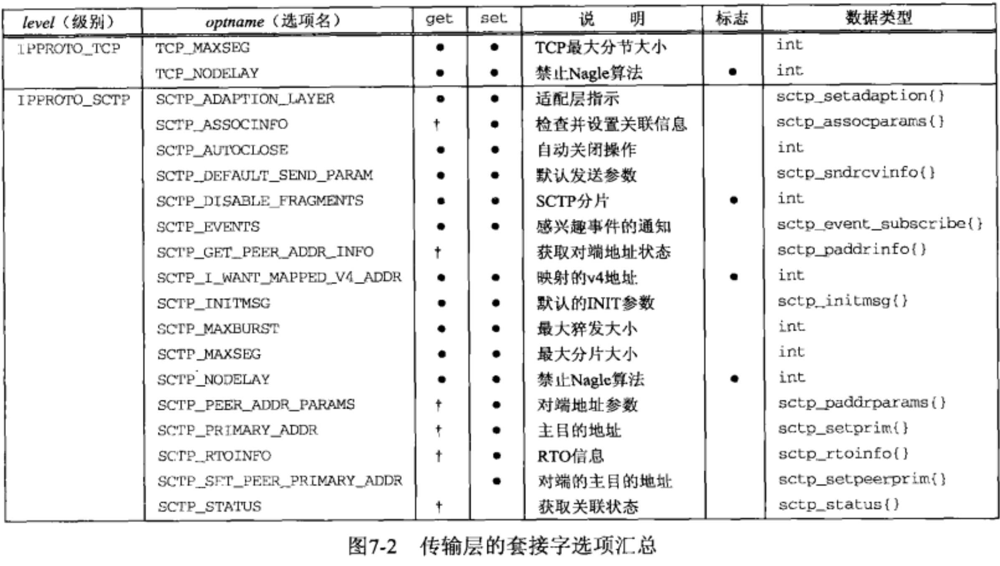
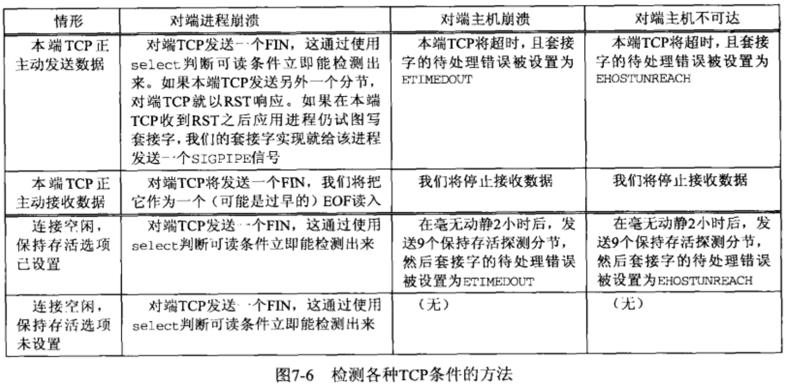

# 套接字选项

- [获取套接字设置和选项的方法](#获取套接字设置和选项的方法)
- [getsockopt 和 setsockopt 函数-仅用于套接字](#getsockopt和setsockopt函数-仅用于套接字)
- [默认套接字选项可开启的状态和值](#默认套接字选项可开启的状态和值)
- [套接字状态](#套接字状态)
- [通用套接字选项 SOL_SOCKET](#通用套接字选项)
  - [SO_BROADCAST 套接字选项](####SO_BROADCAST套接字选项)
  - [SO_DEBUG 套接字选项](###SO_DEBUG套接字选项)
  - [SO_DONTROUTE 套接字选项](###SO_DONTROUTE套接字选项)
  - [SO_ERROR 套接字选项](####SO_ERROR套接字选项)
  - [SO_KEEPALIVE 套接字选项](####SO_KEEPALIVE套接字选项)
  - [SO_LINGER 套接字选项](####SO_LINGER套接字选项)
  - [SO_OOBINLINE 套接字选项](####SO_OOBINLINE套接字选项)
  - [SO_RCVBUF 和 SO_SNDBUF 套接字选项](####SO_RCVBUF和SO_SNDBUF套接字选项)
  - [SO_RCVLOWAT 和 SO_SNDLOWAT 套接字选项](####SO_RCVLOWAT和SO_SNDLOWAT套接字选项)
  - [SO_RCVTIMEO 和 SO_SNDTIMEO 套接字选项](####SO_RCVTIMEO和SO_SNDTIMEO套接字选项)
  - [SO_REUSEADDR 和 SO_REUSEPORT 套接字选项](####SO_REUSEADDR和SO_REUSEPORT套接字选项)
  - [SO_TYPE 套接字选项](####SO_TYPE套接字选项)
  - [SO_USELOOPBACK 套接字选项](####SO_USELOOPBACK套接字选项)
- [IPv4 套接字选项 IPPROTO_IP](#IPv4套接字选项)
  - [IP_HDRINCL 套接字选项](####IP_HDRINCL套接字选项)
  - [IP_OPTIONS 套接字选项](####IP_OPTIONS套接字选项)
  - [IP_RECVDSTADDR 套接字选项](####IP_RECVDSTADDR套接字选项)
  - [IP_RECVIF 套接字选项](####IP_RECVIF套接字选项)
  - [IP_TOS 套接字选项](####IP_TOS套接字选项)
  - [IP_TTL 套接字选项](####IP_TTL套接字选项)
- [ICMPv6 套接字选项 IPPROTO_ICMPV6](#ICMPv6套接字选项)
  - [ICMP6_FILTER 套接字选项](####ICMP6_FILTER套接字选项)
- [IPv6 套接字选项  IPPROTO_IPV6](#IPv6套接字选项)
  - [IPV6_CHECKSUM 套接字选项](####IPV6_CHECKSUM套接字选项)
  - [IPV6_DONTFRAG 套接字选项](####IPV6_DONTFRAG套接字选项)
  - [IPV6_NEXTHOP 套接字选项](####IPV6_NEXTHOP套接字选项)
  - [IPV6_PATHMTU 套接字选项](####IPV6_PATHMTU套接字选项)
  - [IPV6_RECVDSTOPTS 套接字选项](####IPV6_RECVDSTOPTS套接字选项)
  - [IPV6_RECVPATHMTU 套接字选项](####IPV6_RECVPATHMTU套接字选项)
  - [IPV6_RECVPKTINFO 套接字选项](####IPV6_RECVPKTINFO套接字选项)
  - [IPV6_RECVRTHDR 套接字选项](####IPV6_RECVRTHDR套接字选项)
  - [IPV6_RECVTCLASS 套接字选项](####IPV6_RECVTCLASS套接字选项)
  - [IPV6_UNICAST_HOPS 套接字选项](####IPV6_UNICAST_HOPS套接字选项)
  - [IPV6_USE_MIN_MTU 套接字选项](####IPV6_USE_MIN_MTU套接字选项)
  - [IPV6_V6ONLY 套接字选项](####IPV6_V6ONLY套接字选项)
  - [IPV6_XXX 套接字选项](####IPV6_XXX套接字选项)
- [TCP套接字选项](##TCP套接字选项)
  - [TCP_MAXSEG套接字选项](#TCP_MAXSEG套接字选项)
  - [TCP_NODELAY套接字选项](#TCP_NODELAY套接字选项)
- [SCTP套接字选项](#SCTP套接字选项)
  - [SCTP_ADAPTION_LAYER套接字选项](#SCTP_ADAPTION_LAYER套接字选项)
  - [SCTP_ASSOCINFO套接字选项](#SCTP_ASSOCINFO套接字选项)
  - [SCTP_AUTOCLOSE套接字选项](#SCTP_AUTOCLOSE套接字选项)
  - [SCTP_DEFAULT_SEND_PARAM套接字选项](#SCTP_DEFAULT_SEND_PARAM套接字选项)
  - [SCTP_DISABLE_FRAGMENTS套接字选项](#SCTP_DISABLE_FRAGMENTS套接字选项)
  - [SCTP_EVENTS套接字选项](#SCTP_EVENTS套接字选项)
  - [SCTP_GET_PEER_ADDR_INFO套接字选项](#SCTP_GET_PEER_ADDR_INFO套接字选项)
  - [SCTP_I_WANT_MAPPED_V4_ADDR套接字选项](#SCTP_I_WANT_MAPPED_V4_ADDR套接字选项)
  - [SCTP_INITMSG套接字选项](#SCTP_INITMSG套接字选项)
  - [SCTP_MAXBURST套接字选项](#SCTP_MAXBURST套接字选项)
  - [SCTP_MAXSEG套接字选项](#SCTP_MAXSEG套接字选项)
  - [SCTP_NODELAY套接字选项](#SCTP_NODELAY套接字选项)
  - [SCTP_PEER_ADDR_PARAMS套接字选项](#SCTP_PEER_ADDR_PARAMS套接字选项)
  - [SCTP_PRIMARY_ADDR套接字选项](#SCTP_PRIMARY_ADDR套接字选项)
  - [SCTP_RTOINFO套接字选项](#SCTP_RTOINFO套接字选项)
  - [SCTP_SET_PEER_PRIMARY_ADDR套接字选项](#SCTP_SET_PEER_PRIMARY_ADDR套接字选项)
  - [SCTP_STATUS套接字选项](#SCTP_STATUS套接字选项)
- [fcntl函数](#fcntl函数)
- [小结](#小结)


#### 获取套接字设置和选项的方法

- 获取和设置套接字选项的方法:
  - 可以通过 `getsockopt` 和 `setsockopt`  函数
  - `fcntl` 函数
    - 把套接字设置为非阻塞式I/O型 或信号驱动式I/O型  以及设置套接字属主的POSIX方法.
  - `ioctl` 函数


## getsockopt和setsockopt函数-仅用于套接字

- **套接字选项 粗分为两大基本类型:**
  - **启用或禁止某个特性的二元选项 (称为标志选项)**
  - **取得并返回可以设置或检查的特定值的选项 (称为值选项)**
- **这两个函数可以设置 `套接字层` 和 `IP层` 以及 `传输层` 的选项**
- **使用 `int` 的 `1` 或 `0` 来表示开启和关闭,  或者是使用指定的数据结构来进行开启和关闭**

```c
#include <sys/socket.h>
int  getsockopt( int sockfd, int level, int optname, void* optval, socklen_t* optlen);
int  setsockopt( int sockfd, int level, int optname, const void* optval, socklen_t optlen);

/*参数:
 *  sockfd : 必须指向一个打开的套接字描述符.(socket()函数创建套接字之后就是已打开状态)
 *  level  : 指定系统中解释选项的代码或通用套接字代码,或为某个特定于协议的代码(IPv4/6, TCP或SCTP)
 *  optname: 每个套接字的选项标志。(选项名)
 *  optval : 指向某个变量的指针,这个变量用于设置开启或关闭选项标志, 大小由 optlen 参数指定.
 	           setsockopt 从 *optval 中取得选项待设置的新值. (传入)  0禁止,不为0则开启.
 	           getsockopt 则把已获取的选项当前值存放到 *optval 中.(传出) 0表示关闭,1开启
 *  optlen : 指定 optval 参数的大小, 传出时 使用都需要进行验证.(与标准类型大小进行验证)
                setsockopt 中是传入参数.
                getsockopt 中是传出参数.
 * 返回值:   成功返回0, 失败返回-1 ,并设置errno 
  
 */
范例和常用
  int fd = Socket(AF_INET, SOCK_STREAM, 0);
  int  flag = 1;   // 1表示开启, 0表示关闭
	socklen_t flag_len= sizeof(flag);
	setsockopt(fd, SOL_SOCKET, SO_BROADCAST, &flag, sizeof(flag)); //开启广播权限
//---
  size_t  flag_len = sizeof(flag);
  getsockopt(fd, SOL_SOCKET, SO_ERROR, &flag, &flag_len);  //获取待处理错误并清除
//---
  setsockopt(fd, SOL_SOCKET, SO_KEEPALIVE, &flag, sizeof(flag)); //周期性测试链接是否存活(心跳包)
//---  
  struct  linger  optl;  
  optl.l_onoff  = 1;  // 开启
  optl.l_linger = 5;  // 延迟保留时间为 5秒
  setsockopt(fd, SOL_SOCKET, SO_LINGER, &optl, sizeof(optl)); // 若有数据待发送 则延迟关闭
//---
  int  buflen = 4096;  //缓冲区大小(字节)
  setsockopt(fd, SOL_SOCKET, SO_RCVBUF, &buflen, sizeof(buflen)); // 设置接收缓冲区大小
  setsockopt(fd, SOL_SOCKET, SO_SNDBUF, &buflen, sizeof(buflen)); // 设置发送缓冲区大小
//---
  setsockopt(fd, SOL_SOCKET, SO_RCVLOWAT, &buflen, sizeof(buflen)); // 接收缓冲区低水位标记
  setsockopt(fd, SOL_SOCKET, SO_SNDLOWAT, &buflen, sizeof(buflen)); // 发送缓冲区低水位标记
*/
```




- **列表中的   标志位,  有点 ,表示 选项用于在用户进程与系统之间传递所指定数据类型的值.**
- **列表 SCTP中,  get位, 带有十字图标的 选项, 说明可能要使用 `sctp_opt_info()` 函数来进行, 以便移植.**
  - **`sctp_opt_info()`  函数内部封装的就是 `getsocketopt` 函数**
- **数据类型 后面有 {} 的表示是结构体.**
- **使用不受支持的套接字选项名字的时候, 会返回一个 `ENOPROTOOPT` 的 `errno` 的值**

### 默认套接字选项可开启的状态和值

```c
#include <errno.h>
#include <string.h>
#include <stdio.h>
#include <sys/socket.h>
#include <netinet/in.h>
#include <netinet/tcp.h>

void err_quit(char* str);


union val {
    int            i_val;
    long           l_val;
    struct linger  linger_val;
    struct timeval timeval_val;
}val;

static char* sock_str_flag(union val* ,int);
static char* sock_str_int(union val* ,int);
static char* sock_str_linger(union val* ,int);
static char* sock_str_timeval(union val* ,int);
struct sock_opts{
    const char*    opt_str;
    int            opt_level;
    int            opt_name;
    char* (*opt_val_str) (union val* ,int);
}sock_opts[] = {
        { "SO_BROADCAST",        SOL_SOCKET,    SO_BROADCAST,    sock_str_flag },
        { "SO_DEBUG",            SOL_SOCKET,    SO_DEBUG,        sock_str_flag },
        { "SO_DONTROUTE",        SOL_SOCKET,    SO_DONTROUTE,    sock_str_flag },
        { "SO_ERROR",            SOL_SOCKET,    SO_ERROR,        sock_str_int },
        { "SO_KEEPALIVE",        SOL_SOCKET,    SO_KEEPALIVE,    sock_str_flag },
        { "SO_LINGER",            SOL_SOCKET,    SO_LINGER,        sock_str_linger },
        { "SO_OOBINLINE",        SOL_SOCKET,    SO_OOBINLINE,    sock_str_flag },
        { "SO_RCVBUF",            SOL_SOCKET,    SO_RCVBUF,        sock_str_int },
        { "SO_SNDBUF",            SOL_SOCKET,    SO_SNDBUF,        sock_str_int },
        { "SO_RCVLOWAT",        SOL_SOCKET,    SO_RCVLOWAT,    sock_str_int },
        { "SO_SNDLOWAT",        SOL_SOCKET,    SO_SNDLOWAT,    sock_str_int },
        { "SO_RCVTIMEO",        SOL_SOCKET,    SO_RCVTIMEO,    sock_str_timeval },
        { "SO_SNDTIMEO",        SOL_SOCKET,    SO_SNDTIMEO,    sock_str_timeval },
        { "SO_REUSEADDR",        SOL_SOCKET,    SO_REUSEADDR,    sock_str_flag },
    #ifdef    SO_REUSEPORT
        { "SO_REUSEPORT",        SOL_SOCKET,    SO_REUSEPORT,    sock_str_flag },
    #else
        { "SO_REUSEPORT",        0,            0,                NULL },
    #endif
        { "SO_TYPE",            SOL_SOCKET,    SO_TYPE,        sock_str_int },
        { "SO_USELOOPBACK",        SOL_SOCKET,    SO_USELOOPBACK,    sock_str_flag },
        { "IP_TOS",                IPPROTO_IP,    IP_TOS,            sock_str_int },
        { "IP_TTL",                IPPROTO_IP,    IP_TTL,            sock_str_int },
    #ifdef    IPV6_DONTFRAG
        { "IPV6_DONTFRAG",        IPPROTO_IPV6,IPV6_DONTFRAG,    sock_str_flag },
    #else
        { "IPV6_DONTFRAG",        0,            0,                NULL },
    #endif
    #ifdef    IPV6_UNICAST_HOPS
        { "IPV6_UNICAST_HOPS",    IPPROTO_IPV6,IPV6_UNICAST_HOPS,sock_str_int },
    #else
        { "IPV6_UNICAST_HOPS",    0,            0,                NULL },
    #endif
    #ifdef    IPV6_V6ONLY
        { "IPV6_V6ONLY",        IPPROTO_IPV6,IPV6_V6ONLY,    sock_str_flag },
    #else
        { "IPV6_V6ONLY",        0,            0,                NULL },
    #endif
        { "TCP_MAXSEG",            IPPROTO_TCP,TCP_MAXSEG,        sock_str_int },
        { "TCP_NODELAY",        IPPROTO_TCP,TCP_NODELAY,    sock_str_flag },
    #ifdef    SCTP_AUTOCLOSE
        { "SCTP_AUTOCLOSE",        IPPROTO_SCTP,SCTP_AUTOCLOSE,sock_str_int },
    #else
        { "SCTP_AUTOCLOSE",        0,            0,                NULL },
    #endif
    #ifdef    SCTP_MAXBURST
        { "SCTP_MAXBURST",        IPPROTO_SCTP,SCTP_MAXBURST,    sock_str_int },
    #else
        { "SCTP_MAXBURST",        0,            0,                NULL },
    #endif
    #ifdef    SCTP_MAXSEG
        { "SCTP_MAXSEG",        IPPROTO_SCTP,SCTP_MAXSEG,    sock_str_int },
    #else
        { "SCTP_MAXSEG",        0,            0,                NULL },
    #endif
    #ifdef    SCTP_NODELAY
        { "SCTP_NODELAY",        IPPROTO_SCTP,SCTP_NODELAY,    sock_str_flag },
    #else
        { "SCTP_NODELAY",        0,            0,                NULL },
    #endif
        { NULL,                    0,            0,                NULL }
    };
int main(int argc, char ** argv){
    int        fd;
    socklen_t  len;
    struct sock_opts* ptr;
    
    for (ptr = sock_opts; ptr->opt_str != NULL; ptr++){
        printf("%s: ",ptr->opt_str);
        if (ptr->opt_val_str == NULL)    // 函数指针
            printf("(undefined)\n");
        else{
            switch (ptr->opt_level){
                case SOL_SOCKET :      /* 套接字层 */
                case IPPROTO_IP:       /* TCP层 */
                case IPPROTO_TCP:      /* IPv4层套接字 */
                    fd = Socket(AF_INET, SOCK_STREAM, 0); // IPv4 TCP
                    break;
#ifdef IPV6
                case IPPROTO_IPV6:
                    fd = Socket(AF_INET6, SOCK_STREAM, 0);  // IPv6 TCP
                    break;
#endif
#ifdef IPPROTO_SCTP
                case IPPROTO_SCTP:
                    fd = Socket(AF_INET, SOCK_SEQPACKET, IPPROTO_SCTP); //IPv4 SCTP
                    break;
#endif
                default:
                    err_quit("Can`t create fd for level %d\n", ptr->opt_level);
            }
            
            len = sizeof(val);
            if (getsockopt(fd, ptr->opt_level, ptr->opt_name, &val, &len) == -1){
                if( errno == ENOPROTOOPT)
                    printf("出现错误 errno 值为:%d ,宏值为:%s \n", errno,ptr->opt_str);
                else
                    err_ret("getsockopt error");
            }
            else
                printf("default = %s\n", (*ptr->opt_val_str)(&val,len));
            close(fd);
        }
    }
    exit(0);
}


static char strres[128];

static char*
sock_str_flag(union val* ptr, int len){
    if (len != sizeof(int))
        snprintf(strres,sizeof(strres), "size (%d) not sizeof(int)", len);
    else
        snprintf(strres, sizeof(strres), "%s", (ptr->i_val == 0)? "off" : "on" );
    return (strres);
}

static char*
sock_str_int(union val* ptr, int len){
    if (len != sizeof(int))
        snprintf(strres,sizeof(strres), "size (%d) not sizeof(int)", len);
    else
        snprintf(strres, sizeof(strres), "%s", (ptr->i_val == 0)? "off" : "on" );
    return (strres);
}


static char    *
sock_str_linger(union val *ptr, int len)
{
    struct linger    *lptr = &ptr->linger_val;

    if (len != sizeof(struct linger))
        snprintf(strres, sizeof(strres),
                 "size (%d) not sizeof(struct linger)", len);
    else
        snprintf(strres, sizeof(strres), "l_onoff = %d, l_linger = %d",
                 lptr->l_onoff, lptr->l_linger);
    return(strres);
}

static char    *
sock_str_timeval(union val *ptr, int len)
{
    struct timeval    *tvptr = &ptr->timeval_val;

    if (len != sizeof(struct timeval))
        snprintf(strres, sizeof(strres),
                 "size (%d) not sizeof(struct timeval)", len);
    else
        snprintf(strres, sizeof(strres), "%ld sec, %d usec",
                 tvptr->tv_sec, tvptr->tv_usec);
    return(strres);
}

void 
err_quit(char* str){
	fprintf(stderr, "%s",str);
  exit(erron);
}
```


## 套接字状态

- **套接字选项的设置与获取是有时间上的考虑的**
  - 下面的套接字选项是由 TCP `已连接套接字`从 `监听套接字` 继承来的
  - **`SO_DEBUG, SO_DONTROUTE, SO_KEEPALIVE, SO_LINGER, SO_OOBINLINE, SO_RCVBUF, SO_RCVLOWAT, SO_SNBUF, SO_SNDLOWAT, TCP_MAXSEG, TCP_NODELAY`**
    - 这些对TCP很重要, `accept` 需要一直到 三次握手完成后才会给服务器返回已连接套接字
    - **如果想在三次握手完成时 确保这些套接字选项中的某一项是给已连接套接字设置的,那么必须先给`监听套接字` 设置该选项. **


## 通用套接字选项

- 通用套接字选项是和协议无关的 (由内核中的协议无关代码处理)
  
  - 其中有些选项只能应用到某些特定类型的套接字中.
- **级别是 `SOL_SOCKET`, 是 `getsockopt 和 setsockopt` 的第二个参数**

####SO_BROADCAST套接字选项

- ***开启或禁止进程发送广播消息的能力.***
- **只有数据报套接字支持广播, 并且还必须是在支持广播消息的网络上 (以太网,令牌环网) .**
  - 不可以在点对点链路上进行广播
  - 不可以在基于连接的传输协议(TCP和SCTP) 之上进行广播.
  - **只可以在 UDP 传输协议上进行广播**

#### SO_DEBUG套接字选项

- ***套接字调试和信息记录, 只有 TCP 协议支持***
- 开启后,内核为TCP在该套接字发送和接受的所有分组保留详细跟踪信息.
  - 信息存在保存在 某个环形缓冲区中.
    - **使用 `trpt` 程序可以进行检查**


#### SO_DONTROUTE套接字选项

- ***外出的分组将绕过底层协议的正常路由机制***
  - 只可以进行 子网内部的通信, 数据报将不会通过 默认网关 转发到其他子网或外网, 也就是无法和外部通讯.


#### SO_ERROR套接字选项

- *发接字发生错误时, 源自内核的协议模块将套接字的名为 `so_error` 的变量设为标准的 Unix exxx 值中的一个, 这就是 **该套接字的待处理错误***
- **一旦套接字上出现的待处理错误返回给用户进程,那么 `so_error` 会被复位为0**
  - **内核能够以下面两种方式之一来通知进程这个错误**
    - **进程阻塞在 `select` 调用**
      - **无论检查可读条件还是可写条件, `select` 均返回并设置其中一个或所有两个条件.**
    - **进程使用 信号驱动式I/O模型**
      - **给进程或进程组产生一个 `SIGIO` 信号.**
- **处理错误的方式:**
  - **进程访问 `SO_ERROR` 套接字选项 获取 `so_error` 的值.**
    - **由 `getsockopt` 返回的整数值就是该套接字的待处理错误.** `(optval 参数就是返回值)`
      - **`so_error` 随后由内核复位为0 ,  (或者手动复位为0)**
- ***进程调用 `read` 并没有数据返回时:***
  - 如果 `so_error` 为非0值, 那么 `read` 返回 -1 , 且 `errno` 被置为 `so_error` 的值.
- ***如果套接字上有数据在排队等待读取, 那么 `read` 返回那些数据而不是错误条件***
- **如果在进程调用 `srite` 时 `so_error` 为非0 值, 那么 `write` 返回-1  且`errno`被设为 `so_error`的值,  `so_error` 随后被复位为0.**


#### SO_KEEPALIVE套接字选项

- ***保持存活选项***

  - 2小时内已连接的套接字的任一方向都没有数据交换, TCP就会自动给对端发送一个**保持存活探测分节**

    - **这一个 对端必须响应的 TCP分节, 他会导致以下三种情况之一的发生**

      - ```ruby
        1. 对端以期望的 ACK 响应. (表示一切正常)
        2. 对端已 RST 响应, 它告知本端TCP : 对端已崩溃且已重新启动. 该套接字的待处理错误( so_error )被置为 ECONNRESET, 套接字本身则被关闭.
        3. 对端 对保持存活探测分节没有任何响应. 这个时候 TCP将另外发送8个探测分节, 每个分节间隔75秒,  如果在发送第一个 探测分节后的11分15秒内 没有任何响应则放弃. 待处理错误被设置为 ETIMEOUT ,套接字本身关闭.
              如果套接字收到一个 ICMP错误 作为某个探测分节的响应,那么返回相应的错误, 套接字本身也被关闭
              最常见的是返回 IMCP 错误是 host unreachable(主机不可达) , so_error 被设置为EHOSTUNREACH , 原因是网络故障,但是对端主机没有崩溃
        ```

      - 
  
- **用于自动终止一个半开连接**

- 优点:  它由TCP层处理, 不需要一个应用级休眠状态定时器.

- 缺点:  无法区别客户的主机崩溃和到客户主机联通性的暂时丢失.

#### SO_LINGER套接字选项

- ***改变 `close` 函数对面向连接的协议(`tcp, sctp`) 的操作.***

  - `close` 默认行为是立即返回, 将残留在套接字发送缓冲区中的数据发送给对端.

- 设置 这个套接字选项后, `close` 的成功返回代表先前发送的数据(和FIN) 已由对端TCP确认, 但却不知道应用进程是否已读取到数据.

- 使用这个套接字选项应该改用 `shutdown` 来进行关闭套接字,并设置 `SHUT_WR` 避免数据丢失

- **应该使用应用级的 ACK 确认通信,( 1字节的确认标志)**

- 这个选项要求在用户进程与内核进程之间传递 `linger`结构,

  - ```c
     #include <sys/socket.h>
      
      struct linger{ 
        int l_onoff;	 /* 0 = off,  nonzero=on /
        int l_linger;  / 持续时间，POSIX将单位指定为秒 */
      };
     ```
     
  - **`setsockopt` 调用将根据两个结构成员的值 想成下列三种情况之一:**
  
     - `l_onoff为0` : 关闭本选项. `l_linger` 的值被忽略,  默认的 TCP下的`close`设置生效.
     - `l_onoff为非0值, l_linger为0` :  当`close` 关闭某个 TCP连接时,丢弃套接字发送和接收缓冲区的所有数据, 并发送 RST给对端 , 而没有通常的四次挥手序列.
        - SCTP 会发送一个 ABORT块 给对端, 并终止性的关闭关联.
     - `l_onoff为非0, l_linger为非0` : 当套接字关闭时,内核将拖延一段时间:
        - 发送套接字缓冲区残留数据,进程进入睡眠, 直到数据发完并得到对端确认,或 延迟时间到.
        - 如果套接字是非阻塞 : 不等待`close` 完成(忽略`l_linger` 参数). 此时 `close` 返回值很重要. 延迟时间到达时数据没有发送完毕`close` 将返回 `EWOULDBLOCK `错误,套接字发送缓冲区数据将会丢弃.

#### SO_OOBINLINE套接字选项

- ***让 外带数据 留在正常的输入队列中( 在线存留 ), 接收函数的 `MSG_OOB` 标志不能用来读外带数据.***
  - 接收外带数据函数包括  `recv` , 发送外带数据函数 `send` . 都需要使用 `MSG_OOB` 标签来进行.

#### SO_RCVBUF和SO_SNDBUF套接字选项

- ***改变 未连接的 套接字接收(RCV) 和发送(SND)缓存区的默认大小.***

- **在TCP中, 客户端必须在调用 `connect` 之前进行设置,服务器必须在调用 `listen` 之前给 监听套接字设置.**
  
  - 已连接套接字的缓冲区是由监听套接字继承而来.
  - **这步所修改的就是  SYN 分节, 也就是浮动窗口**
  
- **默认发送缓冲区大小是 131072 字节或更大, 至少是 MSS值(最大分节大小默认1460字节) 的四倍.**

  - 为了激活 TCP快速恢复算法的工作机制
  - 这个倍数也必须是偶数倍, 也必须符合 当前网络的 MSS值的偶数倍.
  - ==**MAXOS 最大的UDP接收缓冲区是7Mb**==
  - ==**MAXOS 最大的UDP一次性发送的字段长度为 65507字节,一次性接收也是这么多**==

- **管道的容量称为 带宽-延迟积, RTT(往返时延)可以通过 ping 命令来得到.**

  - $链路带宽(bit/s) / 8 * RTT(ms/s)/1000 = 缓冲区大小 $

- ```c
  getsockopt(fd,SOL_SOCKET, SO_RCVBUF,&len,&optlen);
  printf("接收缓冲区大小 %d \n", len);
  getsockopt(fd,SOL_SOCKET, SO_SNDBUF,&len,&optlen);
  printf("发送缓冲区大小 %d \n", len);
  ```


#### SO_RCVLOWAT和SO_SNDLOWAT套接字选项

- ***接收低水位标记和发送低水位标记***
  - **它们由 `select` 函数使用**
    - **接收低水位标记是让 `select` 返回 *可读* 时套接字接收缓冲区中所需的数据量.`(对于TCP,UDP,SCTP套接字 默认值为1)`**
    - **发送低水位标记是让 `select` 返回 *可写* 时套接字发送缓冲区中所需的可用空间.`(对于TCP套接字 默认值为2048)`**
      - **UDP没有发送缓冲区, 只有发送缓冲区大小这个属性,而且可用空间字节数从不改变. 只要发送缓冲区大小  大于  套接字的低水位标记, 那么UDP套接字总是可写的.**

#### SO_RCVTIMEO和SO_SNDTIMEO套接字选项

- ***给套接字的接收和发送设置一个超时值***
  - **使用`select` 相同的时间结构 `timeval` 来设置超时**
    - **结构体的值都为0 时, 代表禁止超时. (这个是默认值)**
- **接收超时影响的5个输入函数  : `read, readv, recv, recvfrom, recvmsg`**
- **发送超时影响的5个输出函数  : `write, writev, send, sendto, sendmsg`** 


#### SO_REUSEADDR和SO_REUSEPORT套接字选项

- ***端口复用***
- **在所有TCP服务器上, 调用 `bind` 之前设置 `SO_REUSEADDR` 选项.**
- **同一时刻 在同一主机  同时运行多次  同一个 多播应用程序时, 应该设置`SO_REUSEADDR` 选项, 并将所参加多播组的地址作为本地IP地址捆绑.**
- **指定特定的本地地址套接字 和 通用套接字, 如果收到指定本地地址的 数据报,那么会送给指定本地地址的套接字,而不是通用套接字.`(这两个套接字指定的端口相同)`**
- **同一时刻 , 两个进程同时绑定同一个IP和端口,那么会在`bind` 的时候返回 `EADDRINUSE`错误.(处理方法: 第二个进程多次调用 `bind` 直到成功即可)**
  
  - 一旦某个进程已连接成功, 那么第二个进程就会正常工作.
- **`SO_REUSEADDR`和 `SO_REUSEPORT` 套接字选项能够起到4个不同的功能:**
  
  - **端口复用**
    
    - 防止服务器重启时之前绑定的端口还未释放.
      - 主动断开连接的一方, 会在程序结束后, 占用他所用来通讯的端口一分钟,一分钟之后自动释放.
      - 被动断开的一方, 会直接结束,释放端口.
                
                    - 程序突然退出 而系统没有释放端口.
                
                  - **让多地址(多网卡) 可以绑定同一个 端口**
     - **允许单个进程捆绑同一个端口到多个套接字上,每次捆绑指定不同的本地IP地址才可以**
                    
                    
                    
                       - 一般是UDP使用, 为了得到客户的请求目的IP地址(也就是对方请求的我主机的哪个地址).
     - **允许UDP套接字的完全重复捆绑**
                    
                    
                    
                       - **一个程序,可以 同时运行多份.`(接收到多播或广播数据报时,每个进程都会得到一个副本, 单播则随机指定)`**
   - **`SO_REUSEPORT`能够完成的功能基本上与 `SO_REUSEADDR` 相同,只不过是设置端口.**

#### SO_TYPE套接字选项

   - ***返回套接字的类型, 返回的整数值是一个 `SOCK_STREAM(TCP)`, `SOCK_DGRAM(UDP)` ,`SOCK_SEQPACKET(SCTP`之类的.***
        - 本选项通常由启动时即成了套接字的进程使用.

#### SO_USELOOPBACK套接字选项

   - ***仅对路由套接字有效`(AF_ROUTE)`。确定发送套接字是否收到其自身消息的副本。***
   - **仅用于 `AF_ROUTE(回环路由)` 的套接字, 默认是打开的.**
   - **可以使用 `shutdown` 函数, 并设置 `SHUT_RD` 参数来禁止这些环回副本.**


## IPv4套接字选项

下面这些套接字选项由 IPv4 处理, 级别是 `IPPROTO_IP` ,是`getsockopt, setsockopt` 的第二个参数.

#### IP_HDRINCL套接字选项

- ***对原始套接字编写自己需要的的IP数据包首部***
- **只可对 原始IP套接字使用`(int fd=socket(AF_INET, SOCK_RAW,0 );)`**
  - 原始套接字读取数据包含了传输层协议包头。用原始套接字发送数据，是否自动增加传输层协议包头是可选的.
  - 必须为所有在该原始套接字上发送的数据报构造自己的IP首部.
- **选项开启时,必须构造完整的IP首部, 不过以下情况例外:**
  - IP 总是计算并存储 IP首部校验和
  - 如果我们将IP 标识字段置为0 , 内核将设置该字段
  - 如果源 IP地址是 `INADDR_ANY` , IP将把它设置为外出接口的主IP地址
  - 如何设置IP选项取决于实现.
  - IP首部中有些字段必须以主机字节序填写, 有些字段必须以网络字节序填写, 具体取决于实现. (不便于移植)

#### IP_OPTIONS套接字选项

- ***本选项允许我们在 IPv4 首部中设置 IP选项,(这要求我们熟悉IP首部中的IP选项的格式)***

#### IP_RECVDSTADDR套接字选项

- ***收到的UDP 数据报的目的IP地址由 `recvmsg` 函数作为辅助数据返回***

#### IP_RECVIF套接字选项

- ***收到的UPD 数据报的接收接口索引由 `recvmsg` 函数作为辅助数据返回***

#### IP_TOS套接字选项

- ***允许为 `TCP, UDP, SCTP` 套接字 设置 IP首部中的服务类型字段`(该字段包含 DSCP和ECN子字段)`***

#### IP_TTL套接字选项

- ***设置或获取 系统用在从某个给定套接字发送的单播分组上的默认 `TTL` 值.`(TTL默认64)`***
  - `多播 TTL值使用 IP_MULTICAST_TTL 套接字选项设置 `


## ICMPv6套接字选项

**这个唯一的套接字选项由 ICMPv6 处理, 级别 `IPPROTO_ICMPV6`, 是 `getsockopt 和 setsockopt` 的第二个参数**

#### ICMP6_FILTER套接字选项

- **允许获取或设置一个 `icmp6_filter` 结构**
  - 该结构指出256个可能的ICMPv6 消息类型中 那些经由某个原始套接字传递给锁在进程.


## IPv6套接字选项

- **这些套接字选项由 IPv6 处理**
- **级别是 `IPPROTO_IPV6`,是 `getsockopt 和 setsockopt` 的第二个参数**** 

#### IPV6_CHECKSUM套接字选项

- ***指定用户数据中 校验和  所处位置的字节偏移.***
  - 如果该值为非负, 那么内核将:
    - 给所有外出分组计算并存储 校验和;
    - 验证外来分组的校验和, 丢弃所有校验和无效的分组
  - 如果该值为 -1  (默认值):
    - 内核不会在相应的原始套接字上计算并存储外出分组的校验和,也不会验证外来分组的校验和.
- **这个选项影响 除IMCPv6 原始套接字以外的所有 IPv6原始套接字.( 内核总是给ICMPv6的原始套接字计算并存储校验和**
- **可能已废弃**

#### IPV6_DONTFRAG套接字选项

- ***开启本选项将禁止为 UDP套接字或原始套接字自动插入分片首部,外出分组中大小超过发送接口MTU的那些分组将被丢弃.***
  - 发送分组的系统调用不会为此返回错误, 因为已发送出去仍在途中的分组也可能因为超过路径MTU而被丢弃.
- **应用进程应该开启 `IPV6_RECVPATHMTU` 选项以获悉路径 MTU 的变动.**

#### IPV6_NEXTHOP套接字选项

- ***将外出数据的下一跳地址指定为一个套接字地址结构.(这是一个特权操作)***
- **可能已废弃**

#### IPV6_PATHMTU套接字选项

- ***本选项不能设置,只能获取,  返回由路径MTU 发现功能确定的当前 MTU***
- **可能已废弃**

#### IPV6_RECVDSTOPTS套接字选项

- ***开启该选项表明: 任何接收到的IPv6目的地址都将由 `recvmsg` 作为辅助数据返回. (默认是关闭的)***
- **可能已废弃**

#### IPV6_RECVPATHMTU套接字选项

- ***开启本选项表明, 某条路径的路径MTU 在发生变化时将由 `recvmsg` 作为辅助数据返回(不伴随任何数据)***
- **可能已废弃**

#### IPV6_RECVPKTINFO套接字选项

- ***开启本选项表明, 接收到的IPv6数据报的以下两条信息将由 `recvmsg` 作为辅助数据返回:***
  - **目的IPv6地址**
  - **到达接口索引**
- **可能已废弃**

#### IPV6_RECVRTHDR套接字选项

- ***开启本选项表明, 接收到的IPv6路由首部将由 `recvmsg` 作为辅助数据返回 (默认关闭)***
- **可能已废弃**

#### IPV6_RECVTCLASS套接字选项

- ***开启本选项表明, 接收到的流通类型(包括DSCP和ECN字段) 将作为 `recvmsg` 作为辅助数据返回.(默认关闭)***

#### IPV6_UNICAST_HOPS套接字选项

- ***类似于 IPv4的 `IP_TTL` 套接字选项, 设置本选项会给在相应套接字上发出的外出数据报指定默认跳限, 获取本选项会返回内核用于相应套接字的跳限值.***
- **来自接收到的 IPv6 数据报中跳限字段的实际值通过使用 `IPV6_RECVHPLIMIT` 套接字选项取得**

#### IPV6_USE_MIN_MTU套接字选项

- ***设置使用 IPv6 路径发现功能MTU 所发现的 最小 MTU 进行发送数据报***
- **本选项设置为 1 表明: 路径 MTU 发现功能不必执行, 为避免切片, 分组就使用 IPv6 的最小 MTU 发送**
- **本选项设置为 0 表明: 路径MTU 发现公共对于所有目的地都得执行.**
- **本选项设置为 -1 表明: 路径MTU 发现功能仅对单播目的地执行, 对于多播目的地就是使用最小MTU.(默认值)**

#### IPV6_V6ONLY套接字选项

- ***在一个 `AF_INET6` 的套接字上开启本选项将限制它只执行IPv6 通信. (默认关闭)***

#### IPV6_XXX套接字选项

- **大多数用于 修改协议首部的 IPv6 选项假设:**
  - **就UDP套接字而言, 信息由 `recvmsg` 和 `sendmsg` 作为辅助数据在内核和应用进程之间传递**
  - **就TCP套接字而言, 同样的信息改用 `getsockopt` 和 `setsockopt` 获取和设置.**
- **套接字选项和辅助数据的类型一致, 并且访问套接字选项的缓冲区所含的信息和辅助数据中存放的信息也一致**
- **可能已废弃**


## TCP套接字选项

**TCP只有两个套接字选项, 级别是 `IPPROTO_TCP` .  是 `getsockopt 和 setsockopt` 的第二个参数**

#### TCP_MAXSEG套接字选项

- ***允许或设置 TCP连接的最大分节大小 (MSS), 返回值是我们 TCP 可以发送给对端的最大数据量,它通常是由对端使用 SYN 分节通告的MSS , 除非我们的 TCP 选择使用一个比对端通告的MSS小些的值***
- **该选项应该在 `listen` 和 `connect` 之前设置**


#### TCP_NODELAY套接字选项

- ***开启本选项将禁止TCP 的 Nagle 算法.可降低 小分组数据的网络延迟,但却有损于网络. `(默认情况下Nagle算法是启用的)`***
- **nagle 算法的目的在于减少 广域网(WAN)  上小分组的数目.**
  - 某个连接上有待确认数据`(发送出去了但是没有收到ACK的数据)`,那么后续的数据会进行等待,直到ACK到达.
    - 如果后面的数据分组很小, 会将多个小分组连接到最大 MSS 的长度,然后再发送.
      - 但是该算法可能会导致广域网 或 因特网(Inetnet) 的延迟增加.
- **nagle 算法 常常与另一个TCP算法联合使用:  ACK延滞算法.**
  - ACK延迟算法 使得 TCP在收到数据后不立即发送 ACK, 而是等待一小段时间(50-200ms), 然后才发送ACK
    - TCP 期待在这一小段时间内自身有数据发送回对端, 被延滞的ACK就可以把这些数据捎带, 从而省掉一个 TCP分节.


## SCTP套接字选项

- **SCTP套接字提供控制 较细粒度的控制能力**
- **级别是 `IPPROTO_SCTP`**
- **有的套接字选项需要使用 `sctp_opt_info` 函数.**
  - **`sctp_opt_info` 内部封装的是 `getsockopt` 函数**


#### SCTP_ADAPTION_LAYER套接字选项

- ***获取或设置 将由本端提供给对端的适配层指示***
  - **在初始化期间, 任何一个端点都可以指定一个 `适配层指示`**
    - **这个 指示 是一个32位无符号整数. 可由两端的应用进程来协调任何本地应用适配层**
- **获取和初始化的都是本地套接字将提供给未来对端的值**
- **想要获取对端的适配层指示, 应用进程必须预定适配层事件**

#### SCTP_ASSOCINFO套接字选项

- ***适配层指示***

- **该套接字选项用于以下三个目的:**

  - 获取关于某个现有关联的信息
    - 获取关联的信息时应该使用 `sctp_opt_info` 函数.
  - 改变某个已有关联的参数
  - 为未来的关联设置默认信息

- 这个选项的输入结构是 `sctp_assocparams`

  - ```c
    
    struct sctp_assocparams {
      sctp_assoc_t sasoc_assoc_id;
      u_int16_t    sasoc_asocmaxrxt;
      u_int16_t    sasoc_number_peer_destinations;
  u_int32_t    sasoc_peer_rwnd;
      u_int32_t    sasoc_local_rwnd;
      u_int32_t    sasoc_coole_life;
    };
    ```
    
    - `sasoc_assoc_id`  : 待访问关联的标识( 即关联ID).
      - 本字段在调用`setsockopt` 时设置为0 , `sassy_asocmaxrxt和sasoc_sookie_life` 字段将作为默认信息设置在相应套接字上的值.
      - 在调用 `getsockopt` 时 提供关联ID, 返回的就是特定于该关联的信息, 
        - 如果置0本字段再调用 `getsockopt` ,返回的就是默认的端点设置信息.
    - `sasoc_saocmaxrxt` : 某个关联在已经发送数据 没有得到确认的情况下尝试重传的最大次数. 达到次数后 SCTP放弃重传. **报告用户对端不可用,然后关闭该连接**
    - `sasoc_number_peer_destinations` : 对端的地址数 (只能获取,不能设置).
    - `sasoc_peer_rwnd` : 对端的当前接收窗口.该值表示还能发送给对端的数据字节总数,是动态变化的. (只能获取,不能设置)
      - **本地端发送数据  这个值就减小, 对端已接收到数据  这个值就增大.**
    - `sasoc_local_rwnd` : 本地 SCTP协议栈当前通过对端的接收窗口. 是动态变化的.(只能获取,不能设置)
      - 本字段会受到 `SO_SNDBUF` 套接字选项影响.(套接字接收缓冲区大小字段)
    - `sasoc_coole_life` : 给对端的状态 cookie 以毫秒位单位的有效期.
      - 每个随 INIT-ACK 块 送给对端的状态 cookie 都关联有一个生命期. (默认60000毫秒)
      - 建议降低该值,不要增加该值

#### SCTP_AUTOCLOSE套接字选项

- ***获取或设置一个SCTP端点的自动关闭时间.(默认禁止)***
  - **自动关闭: 关联的两个端点在设定的时间内没有通信的话,就会本端的套接字会关闭.**

#### SCTP_DEFAULT_SEND_PARAM套接字选项

- **可选的发送参数, 通常作为 辅助数据传递, 或由`sctp_sendmsg(替用户传递辅助数据)` 函数使用.**

#### SCTP_DISABLE_FRAGMENTS套接字选项

- ***开启后会禁止  SCTP把发送的消息分隔成多个data数据块,再发送.***
  - 如果发送的消息过大, 会向用户返回 `EMSGSIZE` 错误.

#### SCTP_EVENTS套接字选项

- ***获取, 开启或禁止各种 SCTP 通知.***
  - SCTP通知 是由SCTP协议栈发送给应用进程的消息.
- 作为输入和输出的是 `sctp_event_subscribe` 结构体

#### SCTP_GET_PEER_ADDR_INFO套接字选项

- ***获得某个给定对端地址的相关信息, 包括拥塞窗口, 平滑化后的RTT和MTU等***
- 作为输出的是 `sctp_paddrinfo` 结构体
- **两种很有意思的用途:**
  - 可以把一个IP地址结构 转换成一个可用于其他调用的关联标识.
  - 由应用进程跟踪一个多宿对端主机每个地址的性能, 并把相应关联的 主目的地址 更新为 其性能最佳的一个.(这些值同样有利于日志记录和程序调试)

#### SCTP_I_WANT_MAPPED_V4_ADDR套接字选项

- ***用于将 AF_INET6 类型的套接字开启或禁止IPv4映射地址, 默认是开启(也就是允许映射)***
- 开启: 所有IPv4的地址在送往应用进程之前将被影射称为一个IPv6 地址.
- 禁止: 套接字不会对IPv4 地址进行映射, 而是作为`sockaddr_in` 结构 直接传递.

#### SCTP_INITMSG套接字选项

- ***设置或获取 某个SCTP套接字在发送 INIT 消息时所有的默认初始参数.***
- 本选项的输入输出是 `sctp_initmsg` 结构

#### SCTP_MAXBURST套接字选项

- ***设置或获取 用于分组发送的 最大猝发大小***
- **当SCTP向对端发送数据时, 一次不能发送多于这个数目的分组, 以免网络被分组淹没**

#### SCTP_MAXSEG套接字选项

- ***设置或获取 用于SCTP分片的最大分段大小.(所有路径的中的MTU的最小值)***

#### SCTP_NODELAY套接字选项

- ***开启或禁止 SCTP 的 Nagle算法 .(默认关闭)***

#### SCTP_PEER_ADDR_PARAMS套接字选项

- ***设置或获取 关于某个关联的对端地址的各种参数.***
- 输入输出参数是 `sctp_paddrparams` 结构
  - **必须填写  关联标识  和/或  一个对端地址**

#### SCTP_PRIMARY_ADDR套接字选项

- ***设置或获取 本地端点所有的主目的地址.***
  - 主目的地址 是本端发送给对端的所有消息的默认目的地址
- 输入输出是 `sctp_setprim` 结构
  - 必须填写 关联标识
    - 如果设置主目的地址, 则再填写一个将用作主目的地址的对端地址.

#### SCTP_RTOINFO套接字选项

- ***设置或获取 各种RTO信息.***
  - **可用于给某个给定关联的设置**
  - **用于本地端点的默认设置**
- 输入输出是 `sctp_rtoinfo` 结构
  - 时间单位是 毫秒

#### SCTP_SET_PEER_PRIMARY_ADDR套接字选项

- **该选项只能设置, 不能获取**
- **设置这个套接字将导致发送一个消息:**
  - **请求对端把所有指定的本地 地址作为它的主目的地址.**
- 输入输出是 `sctp_setpeerprim` 结构
  - 必须填写 关联标识 和一个请求对端标为其主目的地址的本地地址.
    - 这个本地地址必须已经绑定再本地端点
- 该选项必须通信的两端都支持才可以,
  - 本地端不支持会返回 `EOPNOTSUPP` 错误.
  - 对端不支持会返回 `EINVAL` 错误.

#### SCTP_STATUS套接字选项

- ***获取 某个SCTP关联的状态***
- 输入输出是 `sctp_status` 结构
  - 必须填写关联标识

| SCTP状态 常值                | 说明                         |
| ---------------------------- | ---------------------------- |
| **`SCTP_CLOSED`**            | 关联已关闭                   |
| **`SCTP_COOKIE_WATI`**       | 关联已发送 INT               |
| **`SCTP_COOKIE_ECHOED`**     | 关联以回射 COOKIE            |
| **`SCTP_ESTABLISHED`**       | 关联已建立                   |
| **`SCTP_SHUTDOWN_PENDING`**  | 关联期待发送 SHUTDOWN        |
| **`SCTP_SHUTDOWN_SENT`**     | 关联已发送 SHUTDOWN          |
| **`SCTP_SHUTDOWN_RECEIVED`** | 关联已收到 SHUTDOWN          |
| **`SCTP_SHUTDOWN_ACK_SENT`** | 关联在等待 SHUTDOWN-COMPLETE |


## fcntl函数

**`fcntl` 函数可以执行各种描述符控制操作.**

| 操作                           | fcntl               | ioctl                  | 路由套接字 | POSIX推荐使用的函数 |
| ------------------------------ | ------------------- | ---------------------- | ---------- | ------------------- |
| 设置套接字为非阻塞式I/O型      | F_SETFL, O_NONBLOCK | FIONBIO                | -          | fcntl               |
| 设置套接字为信号驱动式I/O型    | F_SETFL, O_ASYNC    | FIOASYNC               | -          | fcntl               |
| 设置套接字属主                 | F_SETOWN            | SIOCSPGRP 或 FIOSETOWN | -          | fcntl               |
| 获取套接字属主                 | F_GETOWN            | SIOCGPGRP 或 FIOGETOWN | -          | fcntl               |
| 获取套接字接收缓冲区中的字节数 | -                   | FIONREAD               | -          | -                   |
| 测试套接字是否处于外带标志     | -                   | SIOCATMARK             | -          | sockatmark          |
| 获取接口列表                   | -                   | SIOCGIFCONF            | sysctl     | -                   |
| 接口操作                       | -                   | SIOCGIFFLAGS           | -          | -                   |
| ARP高速缓存操作                | -                   | SIOCARPIPLL            | RTM_xxx    | -                   |
| 路由表操作                     | -                   | SIOCxxxRT              | RTM_xxx    | -                   |

- fcntl 提供于网络编程相关的特性:
  - 非阻塞式I/O
    - 使用 F_SETFL 命令设置 O_NONBLOCK 文件状态标志, 可以把套接字设置为非阻塞型
  - 信号驱动式I/O
    - 使用 F_SETFL 命令设置 O_ASYNC 文件状态标志, 可以把套接字设置成 **一旦其状态发生变化,内核就产生一个SIGIO信号**
  - F_SETOWN 命令允许我们指定用于接收 SIGIO和SIGURG信号的套接字属主(进程ID或进程组ID). SIGIO信号是套接字被设置为信号驱动式I/O型 后 产生的.
    - 属主 的实现称为 套接字的进程组ID或进程ID, 存放该属主ID的变量是 socket结构的 so_pgid成员
- **信号 SIGLIO和SIGURG 仅在已使用F_SETOWN 命令给相关套接字指派了属主之后才会产生.**

```c
#incldue <fcntl.h>
int fcntl(int fd, int cmd, ... /*int arg */);
	参数: fd : 套接字或其他描述符
       cmd : 	命令参数
	    			复制一个已有的文件描述符
               int ret = fcntl(fd, F_DUPFD);
            获取/设置  文件状态标志, F_GETFL 查询文件描述符指向的文件的状态,也就是open函数时候的状态.
             (open 函数的 flags 参数), 设置某个文件状态标志时,要取得标志,然后再进行逻辑修改,并写回.
              1 获取文件状态标识
                  int flag = fcntl(fd, F_GETFL);
                         // 得到fd 这个描述符的 open文件时候参数,16位的八进制数字
	            2 设置文件状态标识
			            flag = flag | O_APPEND;       // 变更状态
      			      fcntl(fd, F_SETFL, flag);     // 固定格式,  除了 flag
                     可以更改的几个标识: O_APPEND , O_NONBLOCK 
             		     绝对不可以将open的 O_RDONLY   ,变更为 O_RDWR .
             3  开启非阻塞式I/O典型代码:
                  int flags;
									if( (flags = fcntl(fd, F_GETFL, 0)) < 0)
                       exit(1);
                  flags |= O_NONBLOCK;
                  if ( fcntl(fd, F_SETFL, flags) < 0)
                       exit(1);
             4 关闭非阻塞式I/O 标志:
                  flags &= ~O_NONBLOCK;
                  fcntl( fd, F_SETFL, flags)
             5 清除所有文件状态标志, 只设置非阻塞:
                   fcntl( fd, F_SETFL, NONBLOCK);
             6 设置套接字的一个属主 为一个进程ID(124):
                   fcntl( fd, F_SETOWN, 124);
             6 设置套接字的一个属主 为一个进程组ID(112,负数除-1以外,其绝对值就是进程组):
                   fcntl( fd, F_SETOWN, -112);

	返回值 : 成功的返回值 取决于 cmd 参数,  有时返回文件状态标识,是一个16位的八进制数字.
					出错则返回 -1  ,  有时也返回进程组ID(除-1外的负数), 正数则是某个进程ID
```


## 小结

- 常用的选项有: **`SO_KEEPALIVE, SO_RCVBUF, SO_SNDBUF, SO_REUSEADDR, SO_BROADCAST`**
- 有的TCP服务器设置 `SO_KEEPALIVE` 套接字以自动终止一个半开连接.
  - 优点:  它由TCP层处理, 不需要一个应用级休眠状态定时器.
  - 缺点:  无法区别客户的主机崩溃和到客户主机联通性的暂时丢失.
- SCTP提供了17个应用程序用来控制传输的套接字选项
  - `SCTP_NODELAY, SCTP_MAXSEG, TCP_NODELAY , TCP_MAXSEG 选项类似,有着相同的功能`
- `SO_LINGER` 套接字选项使得可以更好控制close函数返回的时机, 允许强制发送RST而不是TCP四次挥手. 这个时候 应用级 ACK 变得很必要.
- 


