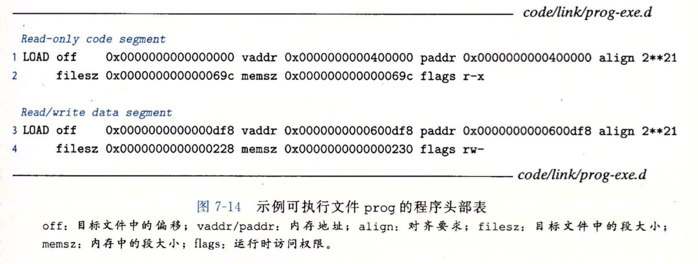

# 链接

**链接是将各种代码和数据片段手机并组合成为一个单一文件的过程, 这个文件可被加载\(复制\)到内存并执行.**

* 链接可以执行于**编译**时, 也就是在源代码被翻译成机器代码时;
* 也可以执行与加**载**时, 也就是在程序被**加载器**加载到内存并执行时.
* **运行**时, 也就是程序应用来执行.

**链接是由连接器的程序自动执行的.**

**链接**将**分离编译**成为可能.\(`多文件编译`\).

* **理解链接器的好处**
  * **有利于大型程序构造**
  * **避免危险的编程错误**
  * **理解语言的作用域的实现**
  * **理解其他重要的系统概念**
  * **利用共享库**

## 编译器驱动程序

* **gcc驱动程序**
  * **`gcc  参数和选项  文件`**
* **cpp  预处理     将 `.c` 文件翻译成  ASCII码的  `.i`   中间文件**
  * **`cpp  main.c -o main.i`**
* **ccl  编译器     将   `.i` 文件翻译成ASCII码的  `.s`  汇编文件**
  * **`ccl   main.i   -o  main.s`**
* **as  汇编器   将 `.s` 文件翻译成一个可重定位目标文件 `.o`**
  * **`as  main.s   -o  main.o`**
* **ld    链接器   将 `.o` 文件以及一些必要的`系统目标文件`组合起来,创建一个可执行目标文件.**
  * **`ld  main.s   -o  prog`**
* **shell 调用操作系统中一个叫做 `加载器的函数` , 它将可执行目标文件的代码和数据复制到内存,然后将控制转移到这个程序的开头.**
  * **`linux>   ./prog`**   

### 静态链接  **ld**

**数据节 : 可重定位目标文件\( .o \)由各种不同的代码和数据节组成, 每个节都是一个连续的字节序列.指令在一节中,初始化了的全局变量在另一节中, 未初始化的变量又在另一个节中**

* **符号解析**
  * **目标文件重定义和引用符号,\(符号对于一个函数,全局变量,或一个静态变量\).**
  * **目的是 将每个符号引用正好和一个符号定义关联起来.**
* **重定位**
  * **编译器和汇编器生成从地址0开始的代码和数据节.**
  * **链接器通过把每个符号定义于一个内存位置关联起来,从而重定位这些节.**
  * **然后修改所有对这些符号的引用, 使得它们指向那个内存位置.**

### **目标文件  \( .o \)**

* **三种目标文件形式**
  * **可重定位目标文件**
    * 就是**`.o 文件`**, 包含二进制代码和数据, 可以在编译时与其他可重定位目标文件合并起来,创建一个可执行文件.
    * 编译器和链接器 可以生成重定位目标文件. **`(ccl 和 as)`**
  * **可执行目标文件**
    * 包含二进制代码和数据, 可以直接复制到内存并执行. 也就是  **`.out 文件`**
    * 链接器可以生存执行目标文件.  \(**`ld )`**
  * **共享目标文件**
    * 一种特殊类型的可重定位目标文件, 可以在加载或运行时被动态地加载进内存并链接. 也就是 **`.dll 或 .so 动态库文件`**
    * gcc 可以生成这种文件

**一个`目标模块` 是一个`字节序列`, `目标文件`是以文件形式存放在磁盘中的`目标模块.`**

**Linux和Unix 系统使用可执行链接格式 `ELF`.**

### **可重定位目标文件**


**夹在 ELF 头和节头部表之间的都是节. 一个典型的ELF可重定位文件包含下面几个节:**

* **.text**
  * **已编译程序的机器代码**
* **.rodata**
  * **只读数据, 比如 printf 语句中的格式串和开关语句的跳转表.**
* **.data**
  * **已初始化的全局和静态C变量.     局部的C变量在运行时被保存在栈中,既不出现在.data节中,也不会出现在.bss 节中.**
* **.bss**
  * **未初始化的全局和静态C变量, 以及所有被初始化为0的全局或静态变量. 在目标文件中这个节不占据实际的空间,它仅仅是一个占位符.**
* **.symtab**
  * **一个符号表, 它存放 在程序中定义和引用的函数和全局变量信息.**
* **.rel.text**
  * **一个 .text 节中位置的列表, 当链接器把这个目标文件和其他文件组合时,需要修改这些位置. 一般而言,任何调用外部函数或者引用全局变量的指令都修改修改, 而调用本地函数的指令则不需要修改.**
* **.rel.data**
  * **被模块引用或定义的所有全局变量的重定位信息. 一般而言,任何已初始化的全局变量, 如果它的初始值是一个全局变量地址 或者 外部定义函数的地址, 都需要被修改.**
* **.debug**
  * **一个调试符号表, 七条牧师程序中定义的局部变量和类型定义,程序中定义和引用的全局变量,以及原始的C文件.  \(`只有 -g 选项调用编译器驱动程序时,才会得到这张表`\)**
* **.line**
  * **原始C源程序中的行号和 .text 节中机器指令之间的映射. `(只有以 -g 选项调用编译器驱动程序时,才会得到这张表)`**
* **.strtab**
  * **一个字符串表, 其内容包括  .symtab 和 .debug 节中的符号表,以及头部中的节名字. \(字符串表就是以 null 结尾的字符串序列\).**

### **符号和符号表** 

**\*\*\*\*\*\*!!!!    局部变量眉头符号表条目   !!!!\*\*\*\*\*\***

**每个可重定位目标模块 m 都有一个符号表, 它包含m定义和引用的符号的信息.在链接器的上下文中,有三种不同的符号:**

* **由模块 m 定义并能被其他模块引用的`全局符号`, 对应于 非静态的C函数和全局变量.**
  * `就是在本文件内普通全局变量和函数`
* **由其他模块定义并被模块m引用的全局符号.  这些符号被称为`外部符号`, 对应于 其他模块中定义的非静态C函数和全局变量.**  
  * `在其他文件内的 非static 的函数和全局变量`
* **只被模块m定义和引用的`局部符号`. 对应于 带 static属性的C函数和全局变量, 这些符号在模块m中任何位置都可见, 但是不能被其他模块引用.**
  * `就是本文件内的  static 函数和全局变量`

```c
int f(){     static int x = 0;    return x }
int g(){     static int x = 0;    return x }
上面两个函数的静态变量名称相同,但是编译器会向汇编器输出两个不同名字的局部链接符号,比如,它们可以用
    f_x  和 g_x 来分别定义的 f函数的x  和  g函数的x   
```

#### **符号表   是由汇编器构造的, 使用汇编器输出到汇编语言.s 文件中的符号.**

  **!!!!!!   .symtab 节中包含了 ELF符号表.      !!!!!!**

```c
typedef struct { 
    int   name;      /* 字符串表中的字节偏移量,只想符号的以null结尾的字符串名字 */ 
    char  type:4,    /* 表明是函数还是数据*/ 
	  binding:4;     /* 表明符号是本地(局部)的还是全局的*/ 
    char  reserved;  /* 无用 */  
    short section;   /* 每个符号的索引,被分配到文件的某个节 */
    long  value;     /* 对于COMMON符号的  部分偏移或绝对地址 */ 
    long  size;      /* 对象大小（字节) */ 
} Elf64_Symbol; 

伪节: 在节头部表中是没有条目的.
    ABS     代表不该被重定位的符号;
    UNDEF   代表未定义的符号,也就是在本目标模块中引用.但却在其他地方定义的符号; (extern int a)
    COMMON  代表还未被分配位置的未初始化的数据目标,就是未初始化的全局变量.
            而 .bss 是  未初始化的静态变量, 以及初始化为0的全局或静态变量.
```

**GUN  的 `readelf` 程序是一个查看目标文件内容很方便的工具. \(就是命令\)     `linux> readelf -a x.o  >   file.txt     #把结果放到文本内,方便查看`**

\*\*\*\*

### **链接器解析多重符号的全局符号**

* **在编译时,编译器向汇编输出每个全局符号, 或者是强 或者弱,而汇编器把这个信息隐含在编码在可重定位的目标文件的符号表里.**
  * **强符号是 :  `函数和已初始化的全局变量`**
  * **弱符号是:   `未初始化的全局变量`**

**根据强弱符号的定义, Linux 链接器使用下面的规则来处理多重定义的符号名:**

* **规则1:  `不允许有多个同名的强符号.` \(**`不可以出现同名函数或者同名已初始化的全局变量`**\)**
* **规则2:  `如果有一个强符号和多个弱符号同名, 那么选择强符号 (`**`选择初始化的全局变量,放弃未初始化的`**`)`**
* **规则3:  `如果有多个弱符号同名, 那么从这些弱符号中任意选择一个(`**`在未初始化的全局变量中任意选择一个`**`)`**

```text
下面是规则2的规范代码, 声明一次全局变量x,定义一次x,修改一次x,  bar3.c 的int x; 会失效.
    linux>  gcc -Wall  foo3.c  bar3.c 

/* 这是文件 foo3.c 的源代码内容 */
#include <stdio.h>
void f(void);

int x = 15213;        // x 在这里会被定义为 15213;

int main(void){
    f();
    printf("%d\n",x);
    return 0;
}
/*  文件  foo3.c  源代码结束 */
------------------------------
/*  这下面是文件 bar3.c 的源代码内容*/
int x ;            // 此定义失效.

void f(){
    x  = 2;        // 运行时 ,会修改x=2
}
/*  文件 bar3.c  源代码结束 */


##如果假设 foo3.c 中没有将 x定义为15213, 而是没有进行定义,那么x的值是随机的,有可能是 foo3.c也有
    可能是 bar3.c的, 也就是个随机的垃圾值.  这也就是规则3的问题.
```

```text
最不容易发现的错误. 规则2和规则3
  下面代码的错误非常严重,而且不易发现, 首先定义了int类型的x,然后x又被声明成了double类型.导致
      y的值被覆盖,x的值也不正常.而且编译器不会报错,只是警告.(调试非常难)
          linux>  gcc -Wall  foo4.c  bar4.c 

/* 这是文件 foo4.c 的源代码内容 */
#include <stdio.h>
void f(void);

int y = 15;            // 这里是 int 的y
int x = 20;            // 这里是 int 的x

int main(void){
    f();
    printf(" x= 0x%x,y=0x%x \n",x,y );            //%x是 十六进制输出
    return 0;
}
/*  文件  foo4.c  源代码结束 */
------------------------------
/*  这下面是文件 bar4.c 的源代码内容*/
double   x;            // 这里的 x变成了double类型,因为是小端表示,所以把y的值也覆盖掉了.

void f(void){
    x = -0.0;
}
/*  文件 bar4.c  源代码结束 */
```

\*\*\*\*

### **静态库链接**

```text
MAC OS 和 linux  下的静态库生成,打包,链接
 macos>  gcc -c add.c  mul.c                     #这里会生成两个 add.o 和 mul.o 文件
 macos>  ar rcs libvector.a  add.o  mul.o        #生成一个libvector.a 的静态库文件
 macos>  gcc -c  main.c                          #生成main.o 文件
 macos>  gcc -o a.out  main.o -L. -lvector       #-L选择当前路径, -l静态库简写,链接完成 
```

**将所有相关的目标模块打包成为一个单独的文件, 称为静态库, 它可以做链接器的输出.**

在Linux系统中, 静态库以一种称为存档的特殊文件格式存放在磁盘中. 存档文件是一组链接起来的可重定位目标文件的集合,有一个头部用来描述每个成员目标文件的大小和位置, 存档文件以后戳 .a 标示.

**`ISO C99 中的,  标准I/O,字符串操作和整数数学函数 他们在 libc.a库中, (例如, atoi, printf, scanf, strcpy和rand),   还在 libm.a库中定义了一组广泛的浮点数学函数 (例如 sin, cos 和 sqrt).`**

**符号解析阶段,链接器从左到右按照他们在编译器驱动程序命令行出现的顺序来扫描可重定位目标文件和存档文件.**

* **在这次扫描中,链接器维护一个可重定位目标文件的集合 E  .\(这个集合的文件会被合并起来形成可执行文件.**
  * **对于命令行上每个输入文件, 链接器会判断是目标文件\(.o\) 还是存档文件\(.a\),如果是目标文件\(.o\),那么链接器会把这个文件添加到E, 修改 U 和 D 来反应文件中的符号定义和引用,并继续下一个输入文件.**
* **一个未解析的符号\( 即引用了但是尚未定义的符号\) 集合 U**
  * **如果是一个文档文件\(.a\), 那么链接器会尝试匹配 U 中为解析的符号和由存档文件成员定义的符号.**
  * **当链接器完成对命令行上输入文件的扫描后, U是非空的, 那么链接器就会输出一个错误并终止.**
* **以及一个在前面输入文件中已定义的符号结合 D**
  * **当在某个存档文件或目标文件中寻找到了 U 中的定义符号, 那么这个符号就会被放入D中, 表示完成了一个符号解析.**

```text
关于库的一般准则是将它们放在命令行的结尾.
    但是如果库不是相互独立,而是相互引用和关联,那么必须对出现在命令行的顺序进行排序.
        (也可以将相互依赖的.o目标文件,集体打包成一个 .a存档文件 )
    如果满足依赖要求,可以在命令行上重复库.

p.o 依赖于  libx.a  ,而 libx.a 依赖于 licx.a
    Linux>  gcc p.o ./libx.a  ./licx.a

a.o 依赖于 libaa.a 和libbb.a, 
          libaa.a 依赖于 libbb.a 和 a.o ,
                        libbb.a 依赖于libaa.a 和 a.o
    Liunx>  gcc a.o libaa.a  libbb.a
```

\*\*\*\*

### 重定位条目

无论何时汇编器遇到对最终位置未知的目标引用, 它就会生成一个重定位条目,告诉链接器在将目标文件合并成可执行文件时如何修改这引用.

代码的重定义条目放在  **`.rel.text`**  中, 以初始化数据的重定位条目放在 **`.rel.data`** 中.

```c
ELF重定位条目, 每个条目标示一个必须被重定位的引用,并指明如何计算被修改的引用.
typedef struct { 
    long offset;   /* 需要被修改的引用的节偏移量 */ 
    long type:32,  /* 迁移的类型,告知链接器如何修改新的引用 */ 
	 symbol:32;    /* 符号表索引,标识符被修改引用应该指向的符号 */ 
    long addend;   /*重定位表达式的常量部分,一些类型的重定位要使用它对被修改引用的值作偏移调整*/
} Elf64_Rela; 

ELF定义了32种不同的重定位类型, 但是只关心两个基本的重定位类型就可以了.
    R_X86_64_PC32   重定位一个使用32位PC相对地址的引用.(PC+指令编码的32位值,得到下条指令地址)
    R_X86_64_32     重定位一个使用32位绝对地址的引用,通过绝对寻址,CPU直接使用在指令中编码的32位
                        值作为有效地址, 不需要进一步修改
 上面这两个重定位类型支持 x84-64 小型代码模型, 可执行目标文件的代码和数据中体大小 小于2GB .
     GCC 默认使用小型代码模型.
 大于 2GB的程序可以用 -mcmodel=medium  中型代码模型, 或者 -mcmodel=large 大型代码模型来编译.
```

### **重定位符号引用**

**链接器的重定位算法, 就是函数地址和数据地址计算.**

```text
两种算法.  相对地址 和 绝对地址

相对地址:
   下面是一个源程序的反汇编代码. objdump.  main函数调用了另一个函数 sum  的过程
0000000000000000 <main>:
  地址   字节序列                 对应的汇编代码
   0:	48 83 ec 08          	sub    $0x8,%rsp
   4:	be 02 00 00 00       	mov    $0x2,%esi
   9:	bf 00 00 00 00       	mov    $0x0,%edi
			a: R_X86_64_32	array
   e:	e8 00 00 00 00       	callq  b <main+0xb>
			f: R_X86_64_PC32	sum-0x4
  13:	48 83 c4 08          	add    $0x8,%rsp
  17:	c3                   	retq   
  1e:   从这里开始就是 sum 函数的范围

计算e地址处的 call 调用 sum函数的地址的运算. 填补 bf 后面的四字节的 00
 这个是相对地址计算.
  假设  main地址被定义为 0x400010.    sum 地址被定义为   0x40002e
   相对应的重定位条目由四个字段组成
       r.offset = oxf                  #这个字段指明 它的地址在main中的第f字节处指明
       r.symbol = sum                  #表明函数名是 sum
       r.type   = R_X86_64_PC32        #表明是相对地址
       r.addend = -4                   #表明偏移量,32位就-4, 64位就-8,(就是call 后面占用的字节数)

  根据上面条件进行计算
   main地址加上 r.offset  得到存储 sum 函数的偏移量数据.
      0x400010 + 0xf = 0x40001f
   然后根据偏移量和sum地址得到相对地址的偏移量
      adds(sum) = 0x40002e + (-4) - 0x40001f        #0x40002e是sum的地址
                = 0x40002a - 0x40001f
                = 0xb
      得到的结果就是 call  相对地址的参数,然后将各个位置的地址进行带入:
      
0000000000400010 <main>:
  地址   字节序列                 对应的汇编代码
   400010:	48 83 ec 08          	sub    $0x8,%rsp
   400014:	be 02 00 00 00       	mov    $0x2,%esi
   400019:	bf 00 00 00 00       	mov    $0x0,%edi
			a: R_X86_64_32	array
   40001e:	e8 0b 00 00 00       	callq  b <main+0xb>   #这里变化了
			f: R_X86_64_PC32	sum-0x4
  400023:	48 83 c4 08          	add    $0x8,%rsp
  400027:	c3                   	retq   
  40002e:   从这里开始就是 sum 函数的范围

 PC调用的过程是   1)将PC值入栈
                2) PC <- PC+0xb = 0x400023 + 0xb = 0x40002e
 
 
绝对地址:
   4004d9:  vf 18 10 60 00     mov   $0x601018,%edi      #立即数是一个数组 array 地址
   
    假设 array 的地址是  0x601018 
  计算绝对地址
       r.offset = 0x1             #表明在.text 代码段的位置
       r.symbol = array           #数组的名字
       r.type   = R_X86_64_32     #表明是绝对地址
       r.addend = 0               #表明无偏移量
  因为 array 的地址是 0x601018 ,偏移量也是0 , 而且 type 标记也是绝对地址
      ADDR(r.symbol) = ADDR(array) = 0x01018
   因为是绝对地址引用, 所以 mov 后面的直接给 arrya 的地址地就可以了,无需进行运算.
```

### **可执行目标文件**


**因为可执行文件是完全链接的\(已被重定位\), 所以它不再需要 .rel.text 和 .rel.data  节.**

**ELF 可执行文件 被设计为很容易加载到内存, 可执行文件的连续的片被映射到连续的内存段.程序头部表 描述了这种映射关系.**



这个程序头部表描述了 可执行文件的内容初始化的两个内存段

* 第一行和第二行
  * 说明 第一个段\(代码段\) 有读/执行 访问权限    \( **flags r-x\)**
  * 开始于内存地址 0x400000  处  \( **vaddr 0x0....040000** \)
  * 总共的内存大小是  0x69c  字节    \(**filesz  0x0....069c** \)
  * 被初始化为可执行目标文件的头 0x69c 个字节, 其中包括 ELF 头,程序头部表 以及 .init , .text 和 .rodata 节    **\(memsz  0x0...069c  \)**
  * 内存对齐标准是  2的21次方 = 200000    **\(align  2\*\*21\)**
* 第三行和第四行
  * 说明 第二个段\(数据段\)  有 读/写 访问权限  **\(flags rw- \)**
  * 开始于内存地址 0x600df8 处  \(**vaddr  0x0...600df8** \)
  * 总共的内存大小是  0x230 字节  **\(filesz  0x0...228 \),** 并且从目标文件中偏移  0xdf8 处开始的.data节中的 0x228个字节初始化.
  * 该段中剩下的8个字节对应于运行时被初始化为0的  .bss 数据 \(  **memsz  -  filesz  = 0x8** \)

**对于任何段 s , 链接器必须选择一个起始地址 vaddr , 使得   `vaddr mod align = off mod align`**

这里,  **`off`**  是目标文件中段的第一个字节偏移量, align 是程序头部指定的对齐\(2的21次方 = 0x200000 \)

```text
例如 : 
       vaddr  mod  align = 0x600df8  mod  0x200000 = 0xdf8   
以及    off    mod  align = 0xdf8 mod  0x200000 = 0xdf8
```

**这个对齐要求是一种优化, 使得当程序执行时,目标文件中的段能够很有效率的传送到内存中.\(虚拟内存\)**

### **加载可执行目标文件**


**shell通过驻留在内存中称为`加载器`的操作系统代码来运行程序.**

**任何 Linux程序都可以通过调用 `execve` 函数来调用加载器.**

**加载器 : 可以讲执行目标文件中的代码和数据从磁盘复制到内存中,然后通过跳转到程序的第一条指令或 入口点来允许该程序.   这个将程序复制到内存并运行的过程叫做加载.**

* **每个Linux 程序都有一个运行时的内存映像.**
  * **代码段总是从地址 0x400000 处开始, 后面是数据段**
  * **运行时 堆 在数据段之后, 通过调用 malloc库往上增长.**
  * **对后面的区域是为共享模块保留的.**
  * **用户栈总是从最大的合法用户地址 \(2的48次方 - 1\)开始,  向较小内存地址增长.**
  * **栈上的区域, 从地址 2的48 次方  开始,  是为内核中的代码和数据保留的**
    * **内核  就是操作系统驻留在内存的部分.**
* **当加载器运行时, 它创建如图所示的内存映像, 在程序头部表的引导下加载器将可执行文件的片复制到代码段和数据段**
  * **接下来, 加载器跳转到程序的入口点, 也就是 `_start`  函数的地址.**
    * **这个函数是在系统目标文件  `ctrl.o` 中定义的,对所有的C程序都是一样的.**
  * **start 函数调用系统启动函数**  _****_**`__libc_start_main ,` 该函数定义在 `libc.so` 中.**
    * **它初始化执行环境, 调用 用户层的 `main` 函数,处理`main`函数的返回值, 并且在需要的时候把控制返回给内核.**

\*\*\*\*

### **动态连接共享库  \(.so\)**


**共享库是致力于解决静态库缺陷的一个现代创新产物.**

**共享库的主要目的就是允许多个正在运行的进程共享内存中相同的库代码,因而节约宝贵的内存资源.**

**共享库是一个目标模块\(字节序列\), 在运行或加载时,可以加载到任意的内存地址, 并和一个在内存中的程序链接起来, 这个过程称为`动态链接`, 是由一个叫做`动态链接器`的程序来执行的.**

**动态库也称为`共享目标`,在 Linux 系统中常用 `.so`   后缀来表示.**

* **共享库是以两种不同的方式来 "共享" 的**
  * **在任何给定的文件系统中, 对于一个库只有一个 .so 文件, 所有引用该库的可执行目标文件共享这个 .so 文件中的代码和数据, 而不是向静态库的内容那样被复制和嵌入到引用它们的可执行文件中.**
  * **其次, 在内存中,一个共享库的  .text 节 的一个副本可以被不同的正在运行的进程共享. \(虚拟内存实现的\)**
* **给编译器和链接器如下指令来生成动态库**
  * **`linux>  gcc  -shared  -fpic  -o   libxx.so    a.c  b.c`**  
    * **`-fpic`**        指示编译器生成与位置无关的代码
    * **`-shared`**   指示链接器创建一个共享目标文件.
* **创建动态库之后, 就要将它连接到执行代码文件中**
  * **`linux>  gcc   main.c    -L.  -lxx.so     -o  a.out`**     
  * **`linux>  gcc   main.c    ./libxx.so       -o  a.out`**     
    * 上面两种命令都可以进行链接和生成可执行文件
    * 这样创建一个可执行目标文件 **`a.out`** 之后,这个文件的形式使得它在运行时可以和 **`libxx.so`** 链接.
    * **基本思路是: 当创建可执行文件时, `静态`执行一些链接, 然后在程序加载时,`动态`完成链接过程.**
      * **此时没有任何的 libxx.so 的代码和数据真的被复制到可执行文件 a.out 中, 繁殖, 链接器复制了一些重定位和符号表信息, 它们使得运行时可以解析对 libxx,so 中代码和数据的引用.**
* **当加载器 加载和运行 可执行文件 a.out 时,  加载部分链接的可执行文件 a.out. 接着它\(加载器\) 发现 a.out 包含一个 .interp节, 这一节包含动态链接器的路径名,  动态链接器本身就是一个共享目标.** 
  * **加载器会加载和运行 动态链接器, 然后,动态链接器执行下面的重定位完成链接任务.**
    * **`重定位  libc.so  的文本和数据到某个内存段.`**
    * **`重定位  libxx.so 的文本和数据到另一个内存段.`**
    * **`重定位 a.out 中所有对 libc.so 和 libxx.so 定义的符号的引用.`**
  * **`最后,动态链接器将控制传递给引用程序, 从这个时刻开始, 共享库的位置就固定了, 并且在程序执行的过程中都不会改变.`**

\*\*\*\*

### **从应用程序中加载和链接共享库**

**程序可以在运行时要求动态链接器加载和链接某个共享库, 而无需在编译时将那些库连接到应用中.**

* **动态链接是一项强大而有用的技术**
  * **分发软件,   `实现了软件在线更新, 也就是更新动态库. 进行动态库版本的迭代.`**
  * **构建高性能Web服务器 ,   `使用基于动态链接得更有效和完善的方法来生成动态内容.`**
    * **`其思路是将每个生成动态内容的函数打包在共享库中. 当Web浏览器的请求到达时, 服务器能动态地加载和链接适当的函数,然后直接调用他,而不是使用 fork 和  execve 在紫荆城的上下文中运行函数. 函数会一直缓存在服务器的地址空间中,所以只要一个简单的函数调用的开销就可以处理随后的请求了.`**
    * **`这对网站的效率是有很大的影响的. (开销也会大大降低)`**
    * **`可在服务器运行时, 就可以更新已存在的函数,以及添加新的函数.`**

```c
Linux和MAC OS 系统都为 动态链接器 提供了一个简单的接口,允许应用程序在运行时加载和链接共享库.
       编译命令是   linux>  gcc -rdynamic -o a.out  main.c -ldl

#include <dlfcn.h>        
                /* 所有的函数都在这个头文件中声明 */

void* dlopen(const char* filename, int flag);
      该函数的作用是 运行时 加载和链接 共享库和动态库.
                filename 参数是动态库的 路径和文件名;
                flag  参数有两个选项:
                   RLTD_LAZY 表示 :告诉链接器延迟外部符号解析,直到执行来自库中的代码.
                   RTLD_NOW  表示 :告诉链接器立即解析对外部符号的引用.
      返回值: 如果 dlopen()函数调用出错 就会返回NULL, 否则就返回指向句柄的指针;
             错误信息可以调用 dlerror() 函数的返回值来获取.


void* dlsym(void* handle, char* symbol);
      获取 参数handle所指向的句柄中的某个函数指针;
                 handle 参数 是 dlopen()函数打开的某个动态库的返回值句柄;
                 symbol 参数 是 想要从动态库中调用的函数的名字; 
    返回值: 如果该函数调用出错 就会返回NULL, 否则就返回指向符号的指针(函数指针)


int dlclose(void* handle);
       如果没有其共享库还在使用 handle 所指向的这个共享库,那么这个函数就可以关闭这个库.
              handle 参数就是 调用dlopen() 函数所返回的句柄指针.
       返回值:  关闭成功返回0,  错误或失败则返回  -1 


const char* dlerror(void);
     返回上面三个函数发生的错误信息, 如果没有出错,就返回NULL.
     
////////////////////////////////////////////////////////////////////////////////
一份调用示例:    
       编译命令    linux>  gcc -rdynamic -o a.out  main.c -ldl
       假设有个名为 libvector.so 的动态库,内部有名为addvec()的函数,并且和示例文件在同级目录.
              动态库的编译命令是 linux> gcc -fpic -shared -o  libvector.so  a.c b.c

文件名 main.c:

#include <stdio.h>
#include <dlfcn.h>
#include <stdlib.h>

int x[2] = {1,2};
int y[2] = {3,4};
int z[2];

int main(int argc, const char * argv[]) {
    void *handle;
    void (*addvec)(int* ,int* ,int*, int);      /* 定义一个函数指针, 指向动态库libvector.so中的函数 */
    char *error;
    
    /* 下面这段代码表示 :  动态加载包含addvec的共享库 */
    handle = dlopen("./libvector.so", RTLD_LAZY);
                /*RLTD_LAZY表示 : 告诉链接器延迟外部符号解析,直到执行来自库中的代码 */
                /*另一个参数: RTLD_NOW  表示 告诉链接器立即解析对外部符号的引用.*/
                /*如果 dlopen()函数调用出错 就会返回NULL, 否则就返回指向句柄的指针 */
    if(!handle){
        /*如果 dlopen() 函数调用出错, 就会进入到这里 */
        fprintf(stderr, "%s\n",dlerror());     /* dlerror() 是错误信息函数,它返回 dl族函数调用 的错误字符串*/
        exit(1);
    }
    
    
    /* 下面代码表示 : 获取一个指向我们刚刚加载的addvec（）函数的指针, 这个函数在 libvector.so 动态库中 */
    addvec = dlsym(handle, "addvec");
            /*如果 dlsym()函数调用出错 就会返回NULL, 否则就返回指向符号的指针(函数指针)*/
    if( (error=dlerror())  != NULL){
        fprintf(stderr, "%s\n",error);
        exit(1);
    }
    
    /* 像任何其他函数一样调用从动态库 libvector.so  中加载过来的 addvec（） 函数 */
    addvec(x,y,z,2);
    printf("z = [%d,%d]\n",z[0],z[1]);

    
    /* 如果 libvector.so 动态库不再使用,那么就执行卸载共享库 */
    if( dlclose(handle) < 0 ){      /*dlclose() 如果没有其他共享库还在使用这个共享库, 那么就卸载该共享库 */
                                    /*  成功卸载返回 0,   卸载失败返回 -1 */
        fprintf(stderr, "%s\n",dlerror());
        exit(1);
    }
    
    return 0;
}
```

\*\*\*\*

### 位置无关代码

**共享库的主要目的就是允许多个正在运行的进程共享内存中相同的库代码,因而节约宝贵的内存资源.**

**位置无关代码使得他们可以加载到任意内存位置而无需重定位链接器修改, 无限多个进程可以共享一个共享模块的代码的单一副本.\(每个进程仍然会有它自己的读/写 数据块\).**

**可以加载而无需重定位的代码称为位置无关代码 \(PIC\). 使用 `gcc -fpic` 参数来生成PIC代码, 共享库的编译必须总是使用这个选项.**

```text
linux> gcc -rdynamic -o a.out  main.c -ldl        #生成一个会使用动态库或共享库的执行文件
linux> gcc -fpic -shared -o  libvector.so  a.c    #生成一个动态库或共享库( -fpic 表示位置无关代码)
```

* **PIC  数据引用**
  * **无论在内存中的何处加载一个目标模块, 数据段和代码段之间的距离总是保持保持不变的.**
    * **代码段中任何指令和数据段中任何变量之间的巨鹿都是运行时常量,与代码段和数据段的绝对内存位置是无关的.**
  * **生成PIC引用的编译器在数据段开始的地方创建了一个表, 叫做`全局偏移量表( GOT)`**
    * **在 GOT 中,每个被这个目标模块引用的全局数据目标都有一个 8字节条目.**
    * **GOT 相对引用中的偏移量是一个运行时常量.**
* **PIC 函数调用**
  * **绑定延迟:**   将过程地址的绑定推迟到第一次调用该过程时, 虽然第一次调用开销很大,但是其后的每次调用都只会花费一条指令和一个间接的内存引用.
    * 延迟绑定是用过两个数据结构之间简洁但又有些复杂的交互实现的.**这两个数据结构是:**
      * **PLT \(过程链接表\)**
        * 代码段的一部分
        * 每个条目是 16字节代码
          * PLT\[0\]  是一个特殊条目, 他跳转到**动态链接器**中.
          * PLT\[1\] 调用系统启动函数 \( ————libc\_start\_main\) ,他初始化执行环境,调用 main函数并处理其返回值.
          * 从 PLT\[2\] 开始的条目调用   用户代码调用的函数.
        * 每个被可执行程序调用的库函数都有它自己的 PLT 条目.
          * 每个条目都负责调用一个具体的函数
      * **GOT \(全局偏移量表\)**
        * 数据段的一部分
        * 每个条目是8个字节地址.
        * 和PLT联合使用时:
          * GOT\[0\] 和 GOT\[1\] 包含动态链接器在解析函数地址时会使用的信息
          * GOT\[2\]  是动态链接器 `ld-linux.so`  模块中的入口点
          * 其余的每个条目对应于一个被调用的函数,其地址需要在运行时被解析.
          * 每个条目都有一个相匹配的 PLT 条目.
          * 初始时, 每个GOT 条目都指向对应 PLT 条目的第二条指令.
    * 如果一个目标模块调用定义在共享库中的任何函数, 那么它就有自己的GOT 和 PLT .


## 库打桩机制

Linux  链接器支持 **库打桩** 技术.可以截获对共享库函数的调用,取而代之执行自己的代码,

使用打桩机制, 可以追踪某个特殊函数的调用次数, 验证和追踪它的输入和输出值, 或者甚至把它替换成一个完全不同的实现.

**基本思想 : 给定一个需要打桩的`目标函数`, 创建一个`包装函数`, 他的原型于目标函数完全一样. 使用某种特殊的打桩机制, 就可以欺骗系统调用包装函数而不是目标函数.**

**打桩可以发生在编译时, 链接时 或 当程序被加载和执行的运行时.**

### **编译时打桩**

**编译时打桩需要能够访问程序的源代码** \(.c文件\)

```c
使用  C预处理器 在编译时打桩.
liunx>  gcc -D宏定义  -c mymalloc.c      #宏定义是关键, 这个宏应该是 #ifdef XXX  #endif
linux>  gcc  -I.  mymalloc.o  int.c    #-I 是关键,告诉预处理器在搜索系统目录之前,先搜索.目录

#代码范例
---------------------------------------------
/* 这个文件是  stdlib.h    */
#define malloc(size) mymalloc(size)    //这两个宏很重要, 它替换了在 int.c 中的代码
#define free(ptr) myfree(ptr)            //将 malloc(size) 当成宏,替换成mymalloc(size)
                                          //从而导致执行了 mymalloc 和 myfree 函数.
void *mymalloc(size_t size);
void myfree(void *ptr);

---------------------------------------------
/* 这个文件是  mymaclloc.c    */
#ifdef COMPILETIME
#include <stdio.h>
#include <stdlib.h>

/* malloc wrapper function */
void *mymalloc(size_t size)            //会执行这里的代码.
{
    void *ptr = malloc(size); 
    printf("malloc(%d)=%p\n", 
           (int)size, ptr); 
    return ptr;
} 

/* free wrapper function */
void myfree(void *ptr)
{
    free(ptr); 
    printf("free(%p)\n", ptr); 
}
#endif
---------------------------------------------
/* 这个文件是  int.c    */
#include <stdio.h>
#include <stdlib.h>    /*通过编译的 -I 命令,将这头文件修改成了 . 目录的, 而不是系统目录 */

int main()
{
    int *p = malloc(32);
    free(p);
    return(0); 
}
---------------------------------------------

编译命令:       #mac 使用的是 brew 安装的 gcc-9 , 所以有区别
macos> gcc-9  -DCOMPILETIME -c mymalloc.c    #COMPILETIME是mymaclloc.c文件的判别宏
macos> gcc-9 -I. -o intc int.c mymalloc.o

```

### **链接时打桩**

**链接时打桩需要能够访问程序的可重定位对象文件. \(.o文件\)**

* **Linux静态链接器支持用 --wrap\_f  标志进行链接时打桩**
  * **这个标志告诉链接器**
    * **把对符号 f 的引用解析成 \_\_wrap\_f \(前面是两个下划线\),**
    * **还要把对符号 \_\_real\_f\(前面还是两个下划线\) 的引用解析成f**
* **编译命令:**
  * **`linux> gcc  -D宏定义  -c mymalloc.c`** 
    * **首先创建一个  包装函数    mymalloc.o**
  * **`linux> gcc  -c  int.c`**
    * **再创建一个 int.o 的执行函数\(main 在这个文件里 \)**
  * **`linux> gcc  -Wl,--wrap,malloc  -Wl,--wrap,free   -o int   int.o  mymalloc.o`**
    * **然后把文件链接成可执行文件,**
      * **参数  -Wl,option    标志把 option 传递给链接器. option 中的每个逗号都要替换成一个空格\(**`但是不包括  -Wl,option  中间的那个逗号`**\)**
        * **所以** `-Wl,--wrap,malloc` **就把**`--wrap malloc` **这个参数传递给链接器, \(free 同理\)**
          * 将文件内的  **`malloc 变成 __wrap_malloc`** 
          * 然后将文件内的 **`__real_malloc 变成 malloc`**

```c
也是在编译时 进行打桩;

/* 这个文件是  stdlib.h    */
#define malloc(size) mymalloc(size)    //这两个宏很重要, 它替换了在 int.c 中的代码
#define free(ptr) myfree(ptr)            //将 malloc(size) 当成宏,替换成mymalloc(size)
                                          //从而导致执行了 mymalloc 和 myfree 函数.
void *mymalloc(size_t size);
void myfree(void *ptr);

---------------------------------------------
/* 这个文件是  mymaclloc.c    */
#ifdef LINKTIME
#include <stdio.h>
#include <stdlib.h>

void *__real_malloc(size_t size);       /*这个会被修改为 void* malloc(size_t size);
void __real_free(void *ptr);            /*这个会被修改为 void  free (void* ptr);

/* malloc wrapper function */
void *__wrap_malloc(size_t size)        /*这个函数名不会被修改*/
{
    void *ptr = __real_malloc(size);    /*这个函数会被修改为 malloc(size),调用的是系统函数*/ 
    printf("malloc(%d) = %p\n", (int)size, ptr);
    return ptr;
}

/* free wrapper function */
void __wrap_free(void *ptr)
{
    __real_free(ptr);                 /* 也是调用的系统函数,前面的__real_ 会被删除,变成free*/
    printf("free(%p)\n", ptr);
}
#endif
---------------------------------------------
/* 这个文件是  int.c    */
#include <stdio.h>
#include <stdlib.h>    

int main()
{
    int *p = malloc(32);
    free(p);
    return(0); 
}
---------------------------------------------

编译命令:   macos 不支持 --wrap 参数(ld不支持)
linux> gcc -DLINKTIME -c mymalloc.c      #生成 mymaclloc.o 并启用代码段
linux> gcc  -c  int.c                     #生成 main函数的 int.o 文件
linux> gcc  -Wl,--wrap,malloc -Wl,--wrap,free -o intl int.o mymalloc.o   #生成可执行文件

```

### 运行时打桩

**运行时打桩只需要能够访问可执行目标文件.\( .out可执行文件\)**

**运行时打桩这个机制 基于 `动态链接器`的 `LD_PRELOAD` 环境变量.**

**`LD_PRELOAD` 被设置为一个共享路径名的列表\(以空格或分号分隔\), 那么当你加载和执行一个程序,需要解析未定义的引用时,动态链接器\(`LD_LINUX.SO`\)会先搜索 `LD_PRELOAD 库`,然后才搜索其他的库.\(有了机制, 当加载和执行 任意可执行文件时,可以对任何共享库中的任何函数打桩, 包括 libc.so \).**

* 同样需要包装函数和共享库
  * **`linux>  gcc -D宏定义  -shared  -fpic  -o  mymalloc.so  mymalloc.c  -ldl`** 
    * 这里面封装了包装函数,然后打包成共享库

```c
假设主程序中调用了 malloc 和 free 两个标准库函数. 可执行主程序名为 intr 

/* mymaoolc.c */
#ifdef RUNTIME            /* 判断定义宏*/
#define _GNU_SOURCE      /*这个宏,  在下面有详细说明 */
#include <stdio.h>
#include <stdlib.h>
#include <dlfcn.h>

/* malloc wrapper function */
void *malloc(size_t size)
{
    void *(*mallocp)(size_t size);
    char *error;

    mallocp = dlsym(RTLD_NEXT, "malloc"); /* Get address of libc malloc */
    if ((error = dlerror()) != NULL) {
        fputs(error, stderr);
        exit(1);
    }
    char *ptr = mallocp(size); /* Call libc malloc */
    printf("malloc(%d) = %p\n", (int)size, ptr);
    return ptr;
}

/* free wrapper function */
void free(void *ptr)
{
    void (*freep)(void *) = NULL;
    char *error;

    if (!ptr)
        return;

    freep = dlsym(RTLD_NEXT, "free"); /* Get address of libc free */
    if ((error = dlerror()) != NULL) {
        fputs(error, stderr);
        exit(1);
    }
    freep(ptr); /* Call libc free */
    printf("free(%p)\n", ptr);
}
#endif

---------------------------------------------


_GNU_SOURCE  说明:
  定义_GNU_SOURCE与许可证和与编写(非)可移植代码有关的一切无关。如果你定义_GNU_SOURCE，你会得到：
     >访问大量非标准GNU / Linux扩展功能  
     >访问POSIX标准中省略的传统函数(通常有很好的理由，例如替换为更好的替代方案，或者绑定到特定的传统实现)
     >访问不能移植的低级功能，但是您有时需要实现像mount，ifconfig等系统实用程序。
     >很多POSIX指定函数的破坏行为，其中GNU人们不同意标准委员会如何功能应该行为和决定做自己的事情。

编译和运行:    (运行命令和shell 版本不同而有所区别, 命令 printenv SHELL  查看shell版本)
    linux> gcc -DRUNTIME -shared -fpic -o mymalloc.so mymalloc.c -ldl    #编译共享库
    linux> LD_PRELOAD="./mymalloc.so" ./intr         #进行运行 (bash 版本, MAC无法运行)

    linux> ( setenv LD_PRELOAD "./mymalloc.so" ; ./intr ; unsetenv LD_PRELOAD )
                                                    #运行程序  (csh 或 tcsh 版本)
可以使用 LD_PRELOAD 对任何可执行程序的库函数调用打桩.
```

## 处理目标文件工具

```bash
Linux 系统中有大量可用的工具来处理目标文件, GUN binutils 包是最有用的.可以运行在每个linux 平台上

     ar : 创建动态库,  插入, 删除, 列出  和提取成员. ($ ar rcs libxx.a  add.o sub.o )
strings : 列出一个目标文件中所有可打印的字符串.
  strip : 从目标文件中删除符号表信息
   nm   :  列出一个目标文件的符号表中定义的符号.
   size : 列出目标文件中节的名字和大小.
readelf :  显示一个目标文件的完整结构, 包括ELF头中编码的所有信息.包含 size 和nm 的功能.
objdump : 所有二进制工具之母. 能够显示一个目标文件中所有的信息. 他最大的作用是反汇编 .text节中的二进制指令.
    ldd : 列出一个可执行文件在运行时所需要的共享库.
```

